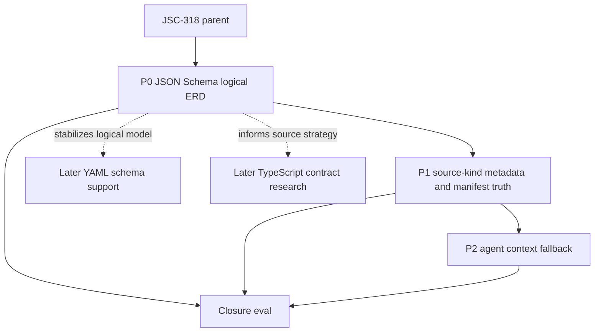

# JSC-318 Linear Execution Plan

## Table of Contents
- [Command Summary](#command-summary)
- [Executive Linear Routing Summary](#executive-linear-routing-summary)
- [Linear Delta Capture Gate](#linear-delta-capture-gate)
- [Linear Work Item Contract](#linear-work-item-contract)
- [Linear / Spec / Plan / PR Traceability](#linear--spec--plan--pr-traceability)
- [Target Linear Destination](#target-linear-destination)
- [Existing Project Match](#existing-project-match)
- [Proposed Milestones](#proposed-milestones)
- [Proposed Parent Issues](#proposed-parent-issues)
- [Proposed Sub-Issues](#proposed-sub-issues)
- [Now / Next / Later / Do Not Create](#now--next--later--do-not-create)
- [Dependency Map](#dependency-map)
- [Eval Gate Map](#eval-gate-map)
- [Human vs Agent Execution Map](#human-vs-agent-execution-map)
- [Story / Value Basis](#story--value-basis)
- [Recommended Labels](#recommended-labels)
- [Repo / Location Label](#repo--location-label)
- [Priority Mapping](#priority-mapping)
- [Project / Cycle Justification](#project--cycle-justification)
- [Project Reactivation Recommendation](#project-reactivation-recommendation)
- [Portfolio Ops Items](#portfolio-ops-items)
- [Dev Portfolio Impact](#dev-portfolio-impact)
- [GitHub PR Tracking](#github-pr-tracking)
- [Delivery Evidence](#delivery-evidence)
- [Evidence & Traceability Matrix](#evidence--traceability-matrix)

## Command Summary

BLUF: Route the next spec to `JSC-321` and keep `JSC-318` open because local `JSC-319` and `JSC-320` proof exists, but live Linear closure, PR evidence, and context fallback remain incomplete.

Decision Needed: No further approval is needed for the applied parent/child topology. Future scope changes, cycle assignment, label taxonomy changes, or YAML/TypeScript expansion still need explicit approval.

Top Risks: Creating duplicate parent issues; over-filing YAML and TypeScript before P0 proves the logical contract model; moving `JSC-318` out of Backlog without current-cycle commitment; using a preferred repo label name that does not yet exist in Linear.

Next Action: Create the spec for `JSC-321`, the P2 context fallback slice, using the JSC-320 metadata/degraded-state contract now proven locally.

## Executive Linear Routing Summary

Keep `JSC-318` as the existing parent issue, update it only after explicit confirmation, and create three execution children now: JSON Schema logical ERD extraction, source-kind/manifest truth, and agent context fallback for unavailable ERDs.

Decision Needed: No further approval is needed for the applied parent/child topology. Future scope changes, cycle assignment, label taxonomy changes, or YAML/TypeScript expansion still need explicit approval.

Top Risks: Creating duplicate parent issues; over-filing YAML and TypeScript before P0 proves the logical contract model; moving `JSC-318` out of Backlog without current-cycle commitment; using a preferred repo label name that does not yet exist in Linear.

Next Action: Create the spec for `JSC-321`, the P2 context fallback slice, using the JSC-320 metadata/degraded-state contract now proven locally.

Live Linear read on 2026-05-13:

- `JSC-318` title: Generate useful ERDs from contract schemas, not only SQL/Prisma.
- Status: Backlog.
- Priority: High.
- Project: Diagram product surface and analysis workflow.
- Labels: `diagram-cli`, `Drift-Risk`, `Eval`, `Roadmap: Now`, `Agent`, `Improvement`.
- Existing child issues after application: `JSC-319`, `JSC-320`, `JSC-321`.
- Duplicate search result: no duplicate parent found for the exact contract-schema ERD lane.

## Linear Delta Capture Gate

Gate run: 2026-05-13.

Live Linear inputs:

- Project: `Diagram product surface and analysis workflow`.
- Project milestones: none.
- Parent issue: `JSC-318`.
- Live parent status: Backlog.
- Live parent priority: High.
- Live child issues under `JSC-318`: `JSC-319`, `JSC-320`, `JSC-321`.
- Local proof inputs: `.harness/evals/2026-05-13-jsc-319-json-schema-logical-erd-diagram-cli-eval.md`, `.harness/evals/2026-05-13-jsc-320-erd-source-kind-manifest-truth-diagram-cli-eval.md`, `.harness/solutions/2026-05-13-jsc-319-json-schema-logical-erd-reinforcement.md`, `.harness/solutions/2026-05-13-jsc-320-erd-source-kind-manifest-truth-validation-reinforcement.md`, `src/schema/erd-extractor.js`, `src/core/analysis-generation-diagrams-erd.js`, `test/erd-extractor.test.js`, `test/generate-output-json.test.js`, and `test/fixtures/erd/contract-schema-json*/`.

Delta classification:

| Item | Live Linear State | Local Harness State | Classification | Queue Impact |
| --- | --- | --- | --- | --- |
| Project | Exists as `Diagram product surface and analysis workflow`; no milestones returned | Matches planned destination | unchanged | Keep project; do not create milestones. |
| `JSC-318` parent | Backlog, High, labels include `diagram-cli`, `Drift-Risk`, `Eval`, `Roadmap: Now`, `Agent`, `Improvement` | Parent remains open until P0/P1/P2 and closure eval | changed-metadata-captured | Update local label snapshot; do not close parent. |
| `JSC-319` P0 | Backlog, High, parent `JSC-318`, project assigned | Local implementation/eval/reinforcement proof exists and is accepted locally | local-proof-ready-for-pr-linear-update | Include in PR and update Linear with proof; do not choose as next spec slice. |
| `JSC-320` P1 | Backlog, High, parent `JSC-318`, project assigned | Local implementation/eval/reinforcement proof exists and is accepted locally | local-proof-ready-for-pr-linear-update | Include in PR and update Linear with proof; do not choose as next spec slice. |
| `JSC-321` P2 | Backlog, Medium, parent `JSC-318`, project assigned | Planned after P1 because context fallback needs truthful source-kind/unavailable metadata; P1 proof now exists locally | approved-next-spec-slice | Move to next spec creation after PR/Linear update. |
| YAML schema support | No child under `JSC-318` | Deferred in strategy/refactor plan | unchanged-deferred | Do not create or spec now. |
| TypeScript contract surfaces | No child under `JSC-318` | Deferred as separate strategy/spec decision | unchanged-deferred | Do not create or spec now. |

Approved next slice queue:

| Rank | Slice | Linear Issue | Queue Status | Spec Status | Reason |
| --- | --- | --- | --- | --- | --- |
| 0 | P0 JSON Schema logical ERD extraction | `JSC-319` | implementation-proof-ready; Linear closure pending | spec/plan/eval exist | Local proof exists; remaining work is closure steering, PR/commit evidence, and Linear mutation, not another spec. |
| 1 | P1 source-kind metadata and unavailable-state truth | `JSC-320` | local-proof-ready-for-pr-linear-update | spec/plan/eval/reinforcement exist | Generated manifests now distinguish useful, degraded, and unavailable ERDs locally; delivery evidence still needs PR/Linear linkage. |
| 2 | P2 ERD unavailable fallback guidance in agent context | `JSC-321` | approved-next | missing | Context guidance can now consume P1 metadata instead of scraping comments or inventing state. |
| 3 | Parent closure eval | `JSC-318` | blocked | missing parent eval | Parent cannot close until P0/P1/P2 evidence is complete or explicitly deferred. |

Next spec target:

```yaml
selected_issue: JSC-321
selected_slice: "P2 ERD unavailable fallback guidance in agent context"
spec_path: ".harness/specs/2026-05-13-JSC-321-erd-unavailable-context-fallback-spec.md"
source_linear_plan: ".harness/linear/2026-05-13-JSC-318-contract-schema-erd-linear-plan.md"
depends_on:
  - "JSC-319 local implementation proof"
  - ".harness/evals/2026-05-13-jsc-319-json-schema-logical-erd-diagram-cli-eval.md"
  - "JSC-320 local implementation proof"
  - ".harness/evals/2026-05-13-jsc-320-erd-source-kind-manifest-truth-diagram-cli-eval.md"
must_not_include:
  - "YAML schema parsing"
  - "TypeScript contract extraction"
  - "manifest schema-breaking migration unless separately approved"
  - "public CLI behavior changes outside additive metadata"
```

Stop conditions for JSC-321 spec:

- If JSC-319 proof is challenged or rework is requested, pause JSC-321 and return to P0.
- If JSC-320 proof is challenged or rework is requested, pause JSC-321 and return to P1.
- If context fallback requires a breaking machine-output schema migration, stop for owner decision before implementation planning.
- If JSC-321 cannot consume JSC-320 metadata without broad context-pack rewrite, split the context work before implementation.

## Linear Work Item Contract

| Field | Value |
| --- | --- |
| Parent Linear issue | `JSC-318` |
| Parent status | Backlog |
| Parent project | Diagram product surface and analysis workflow |
| Parent priority | High |
| Child issue sequence | `JSC-319` P0 -> `JSC-320` P1 -> `JSC-321` P2 |
| Approved next spec slice | `JSC-321` |
| Milestone status | No project milestones returned by live Linear read |
| Closure rule | `JSC-318` stays open until P0/P1/P2 evidence exists and a parent closure eval is written |
| External mutation status | No Linear mutation was performed by this delta capture gate |

## Linear / Spec / Plan / PR Traceability

| Linear issue | Source acceptance IDs | Plan units | Acceptance IDs | PR evidence |
| --- | --- | --- | --- | --- |
| `JSC-318` | Parent acceptance: useful contract-schema ERD, truthful manifest/degraded state, context fallback guidance, SQL/Prisma preservation | P0 `JSC-319`; P1 `JSC-320`; P2 `JSC-321`; parent closure eval | P0/P1 local proof exists; P2 and parent closure blocked | blocked: no parent PR/closure evidence yet |
| `JSC-319` | JSON Schema logical ERD extraction; local refs; diagnostics; SQL/Prisma preservation | Completed local implementation and eval proof | JSC-319 eval says local implementation proof is satisfied | pending PR/Linear linkage |
| `JSC-320` | Source-kind metadata; useful/degraded/unavailable manifest truth; additive machine-output compatibility | Completed local implementation and eval proof | JSC-320 eval says local implementation proof is satisfied | pending PR/Linear linkage |
| `JSC-321` | Context-pack unavailable ERD fallback guidance | Approved next spec slice | pending spec | not started |

## Target Linear Destination

- Team: Jscraik.
- Existing parent: `JSC-318`.
- Existing project: Diagram product surface and analysis workflow.
- Preferred repo label: `Repo › diagram-cli`.
- Live-compatible repo label: `diagram-cli`.
- Status target before implementation: leave parent in Backlog or move to Todo only when the first child is admitted.
- Cycle target: unset until Jamie explicitly admits the work into the current cycle.

Do not create a new project for this work. The existing project is the correct bounded deliverable because the work changes Archscope diagram generation and analysis workflow behavior.

## Existing Project Match

`JSC-318` already belongs to `Diagram product surface and analysis workflow`, which matches the scope:

- It changes the diagram product surface by making ERD output useful for contract-heavy repositories.
- It changes analysis workflow truth by separating successful ERDs from unavailable/degraded ERDs.
- It changes agent-facing generated context by preventing empty ERDs from looking complete.

No reactivation is needed if the project is active. If the project is stale or paused, reactivate only the JSC-318 slice with a status update that names the P0/P1/P2 sequence and says YAML/TypeScript are deferred.

## Proposed Milestones

| Milestone | Linear representation | Status | Exit evidence |
| --- | --- | --- | --- |
| M0 planning topology | This `.harness/linear` artifact | complete locally | Strategy/refactor/Linear evidence aligned; no live mutation without approval |
| M1 JSON Schema proof | Child issue: JSON Schema logical ERD extractor | ready to create | JSON Schema fixture produces non-placeholder ERD; SQL/Prisma tests still pass |
| M2 Artifact truth | Child issue: ERD source-kind metadata and manifest truth | ready to create | Generate-all manifest distinguishes useful/degraded/unavailable ERDs additively |
| M3 Agent context fallback | Child issue: ERD unavailable guidance in context pack | ready to create | `AI/context/diagram-context.md` gives actionable fallback guidance |
| M4 Deferred contract expansion | Later child or future issue: YAML schema support | defer | JSON Schema model contract is stable and YAML parser policy is chosen |
| M5 TypeScript contract strategy | Later research issue | defer | Separate AST/type-resolution strategy approved before implementation |
| M6 Closure eval | Parent closeout evidence | not a separate child by default | Eval artifact proves acceptance criteria and deferred scope is explicit |

## Proposed Parent Issues

### Existing Parent Update: JSC-318

Template: Feature.

Mutation status: applied.

Recommended update:

- Keep title unchanged.
- Keep project `Diagram product surface and analysis workflow`.
- Keep priority High.
- Add or preserve labels: `diagram-cli`, `Agent`, `Improvement`, `Roadmap: Now`, `Eval`, `Drift-Risk`.
- Do not add `Feature` to the parent while `Improvement` is present; Linear treats them as mutually exclusive type labels.
- Add plan links:
  - `.harness/strategy/2026-05-12-JSC-318-contract-schema-erd-strategy.md`
  - `.harness/refactors/2026-05-12-JSC-318-contract-schema-erd-refactor.md`
  - `.harness/linear/2026-05-13-JSC-318-contract-schema-erd-linear-plan.md`
- Add parent closeout rule: Parent is not Done until P0/P1/P2 are complete, closure eval exists, and YAML/TypeScript/configured-source scope is either implemented or explicitly deferred.

Ready-to-update payload:

```yaml
id: JSC-318
title: Generate useful ERDs from contract schemas, not only SQL/Prisma
team: Jscraik
project: Diagram product surface and analysis workflow
priority: 2
labels:
  - diagram-cli
  - Agent
  - Improvement
  - Roadmap: Now
  - Eval
  - Drift-Risk
state: Backlog
description_patch: |
  Add execution plan links:
  - .harness/strategy/2026-05-12-JSC-318-contract-schema-erd-strategy.md
  - .harness/refactors/2026-05-12-JSC-318-contract-schema-erd-refactor.md
  - .harness/linear/2026-05-13-JSC-318-contract-schema-erd-linear-plan.md

  Parent closeout rule:
  JSC-318 is not complete until JSON Schema logical ERDs, source-kind/manifest truth, and agent-context unavailable guidance are implemented and validated. YAML, TypeScript, and configured contract sources must be either implemented with evidence or explicitly deferred.
```

## Proposed Sub-Issues

### Child 1: JSON Schema Logical ERD Extractor

Template: Feature.

Timing: Now.

Mutation status: applied as `JSC-319`.

Ready-to-create payload:

```yaml
title: "JSC-318 P0: Add JSON Schema logical ERD extraction"
team: Jscraik
parentId: JSC-318
project: Diagram product surface and analysis workflow
priority: 2
labels:
  - diagram-cli
  - Agent
  - Feature
  - Roadmap: Now
  - Eval
  - Drift-Risk
description: |
  ## Goal
  Add the smallest reversible logical-contract ERD source path by supporting JSON Schema files without changing SQL or Prisma ERD behavior.

  ## Scope
  - Add `json-schema` as a source kind after `prisma` and `sql`.
  - Discover `**/*.schema.json` through the existing ignore pipeline.
  - Parse object definitions into ERD entities and attributes.
  - Mark required properties as non-nullable where the current model can carry it.
  - Extract explicit relationships from local `$ref` and array `items.$ref`.
  - Add a minimal contract-heavy fixture with no `.sql` or `schema.prisma`.
  - Preserve existing SQL/Prisma extractor tests.

  ## Non-goals
  - YAML parsing.
  - TypeScript AST/type extraction.
  - Remote JSON Schema reference resolution.
  - Renderer rewrite.
  - Fake database schema files in consumer repos.

  ## Validation
  - `npm test -- test/erd-extractor.test.js`
  - Existing SQL/Prisma ERD fixture assertions remain passing.

  ## Closeout Evidence
  Record generated fixture ERD output, exact command outcomes, and any deferred schema dialect limitations.
```

### Child 2: ERD Source-Kind Metadata and Manifest Truth

Template: Feature.

Timing: Next, after Child 1.

Mutation status: applied as `JSC-320`.

Ready-to-create payload:

```yaml
title: "JSC-318 P1: Make ERD source-kind and unavailable state truthful"
team: Jscraik
parentId: JSC-318
project: Diagram product surface and analysis workflow
priority: 2
labels:
  - diagram-cli
  - Agent
  - Feature
  - Roadmap: Now
  - Eval
  - Drift-Risk
description: |
  ## Goal
  Make generated ERD metadata and generate-all manifest entries distinguish useful, degraded, and unavailable ERDs without a breaking machine-output schema change.

  ## Scope
  - Preserve additive metadata only.
  - Expose source-kind truth such as database schema, JSON Schema contract schema, mixed source, or none.
  - Ensure contract-heavy JSON Schema output is not classified as a placeholder.
  - Ensure no-source ERDs remain visibly degraded/unavailable.
  - Keep SQL/Prisma metadata behavior compatible.

  ## Non-goals
  - New public config fields.
  - Manifest schema migration unless separately admitted.
  - YAML or TypeScript support.

  ## Validation
  - `npm test -- test/evidence-manifest-parity.test.js test/erd-extractor.test.js`
  - Focused `generate-all` fixture command for the contract-heavy fixture.

  ## Closeout Evidence
  Record manifest snippets or paths that show useful JSON Schema ERD metadata and no-source degraded/unavailable truth.
```

### Child 3: ERD Unavailable Guidance in Agent Context

Template: Feature.

Timing: Next, after Child 2.

Mutation status: applied as `JSC-321`.

Ready-to-create payload:

```yaml
title: "JSC-318 P2: Add ERD unavailable fallback guidance to agent context"
team: Jscraik
parentId: JSC-318
project: Diagram product surface and analysis workflow
priority: 3
labels:
  - diagram-cli
  - Agent
  - Improvement
  - Roadmap: Next
  - Eval
  - Drift-Risk
description: |
  ## Goal
  Make `AI/context/diagram-context.md` tell agents when the ERD is unavailable and point them to better fallback diagrams or contract artifacts.

  ## Scope
  - Detect degraded/unavailable ERD state from generated artifact metadata.
  - Add concise context-pack guidance for no-schema or no-contract-source repositories.
  - Preserve normal context output when ERD generation succeeds.
  - Add focused context-pack test coverage.

  ## Non-goals
  - Broad rewrite of context-pack layout.
  - More contract parsers.
  - Claiming ERD completeness when the artifact only contains comments.

  ## Validation
  - `npm test -- test/context-pack.test.js`
  - Relevant focused ERD/manifest tests from P0/P1 if shared behavior changes.

  ## Closeout Evidence
  Record context output path and exact fallback copy behavior for unavailable ERDs.
```

### Deferred Child Candidate: YAML Schema Contracts

Template: Feature.

Timing: Later.

Mutation status: do-not-create-now.

Create only if JSON Schema semantics are stable and YAML support remains needed after P0-P2.

### Deferred Child Candidate: TypeScript Contract Surfaces

Template: Research.

Timing: Later.

Mutation status: do-not-create-now.

Create only as a separate strategy/spec issue because TypeScript likely needs AST parsing, project-aware type resolution, or explicit configured source policy.

## Now / Next / Later / Do Not Create

Now:

- `JSC-318` has a Linear comment linking the strategy, refactor, and linear plan artifacts.
- Child 1 was created as `JSC-319` for JSON Schema logical ERD extraction.
- Keep P0 narrow and reversible.

Next:

- Child 2 was created as `JSC-320` for source-kind metadata and manifest truth.
- Child 3 was created as `JSC-321` for agent context unavailable guidance.
- Add closure eval evidence before parent completion.

Later:

- YAML schema contracts once JSON Schema establishes the logical model contract.
- TypeScript contract strategy as research/spec, not implementation-by-accident.
- Configured contract source globs only if fixture and repo evidence prove discovery defaults are insufficient.

Do Not Create:

- A duplicate parent for JSC-318.
- A new project for this issue.
- A fake `schema.prisma` workaround issue.
- Separate child issues for every JSON Schema dialect edge case before the P0 fixture proves the path.
- A TypeScript implementation ticket without a prior AST/type-resolution decision.
- A cycle assignment without explicit current-cycle commitment.

## Dependency Map



Hard dependency: P1 should not start before P0 has a real JSON Schema fixture, because manifest truth needs a useful contract-heavy ERD to prove.

Soft dependency: P2 can start with no-source behavior, but it should wait for P1 if the context-pack needs source-kind metadata rather than comment inspection.

## Eval Gate Map

| Gate | Owning Linear issue | Required evidence | Closeout rule |
| --- | --- | --- | --- |
| JSON Schema fixture emits useful ERD | `JSC-319` | `npm test -- test/erd-extractor.test.js`; fixture output path/snippet | Must pass before P0 Done |
| SQL/Prisma behavior preserved | `JSC-319` | Existing ERD tests pass unchanged or changes are explicitly justified | Must pass before P0 Done |
| Manifest distinguishes useful/degraded/unavailable | `JSC-320` | `npm test -- test/evidence-manifest-parity.test.js test/erd-extractor.test.js`; focused generate-all output | Must pass before P1 Done |
| Agent context gives fallback guidance | `JSC-321` | `npm test -- test/context-pack.test.js`; context artifact path/snippet | Must pass before P2 Done |
| Parent acceptance closure | JSC-318 | `.harness/evals/2026-05-12-JSC-318-diagram-cli-contract-schema-erd-eval.md` or successor | Must exist before parent Done |

## Human vs Agent Execution Map

Agent-suitable:

- P0 fixture creation, parser implementation, focused tests.
- P1 additive metadata tests and manifest behavior checks.
- P2 context-pack guidance and tests.
- Closure eval drafting from command evidence.

Human review required:

- Whether JSON Schema dialect coverage is acceptable.
- Whether unavailable/degraded metadata changes are additive enough for machine-output consumers.
- Whether YAML should enter the same parent scope after P0-P2.
- Whether TypeScript contract extraction is worth the parser/runtime cost.
- Whether to move parent or children into the current cycle.

## Story / Value Basis

User story:

As a user of Archscope on contract-heavy repositories, I want ERD output to model logical contract entities when SQL/Prisma schemas do not exist, so generated architecture packs tell agents and humans the truth about the repository instead of producing an empty-but-present ERD.

Business value:

- Improves trust in generated architecture evidence.
- Makes Archscope more useful on agent/governance/control-plane repositories.
- Prevents artifact completeness drift in `generate-all`.
- Gives reviewers and agents a clearer fallback path when ERD is unavailable.

## Recommended Labels

Existing labels to preserve:

- `diagram-cli`
- `Agent`
- `Improvement`

Recommended labels to add where available:

- `Feature` for parent, P0, and P1.
- `Roadmap: Now` for parent, P0, and P1.
- `Roadmap: Next` for P2.
- `Eval` for parent and children.
- `Drift-Risk` for parent and children.

Do not use `Blocked` unless mutation approval, dependency selection, or implementation evidence becomes unavailable.

## Repo / Location Label

Preferred contract label: `Repo › diagram-cli`.

Live Linear label discovered: `diagram-cli` with parent `Repo`.

Decision:

- Use `diagram-cli` for immediately createable payloads because it exists.
- Record `Repo › diagram-cli` as the preferred display name in local planning artifacts.
- Do not create or rename labels without separate confirmation; label taxonomy changes are portfolio operations, not JSC-318 implementation.

## Priority Mapping

| Work item | Priority | Reason |
| --- | --- | --- |
| JSC-318 parent | High | Live issue already High; acceptance criteria affect product trust |
| P0 JSON Schema extractor | High | Smallest proof-producing slice and direct acceptance criterion |
| P1 Manifest truth | High | Prevents empty artifacts from looking successful |
| P2 Agent context fallback | Medium | Important agent UX, but depends on source-kind/degraded truth |
| YAML schema support | Medium later | Valuable but not needed to prove first source-kind path |
| TypeScript contract strategy | Medium later | Potentially high value, but higher design/runtime risk |

## Project / Cycle Justification

Project assignment:

- Keep parent in `Diagram product surface and analysis workflow`.
- Assign children to the same project only if created as children of `JSC-318`.
- Do not create a new project because the work is a bounded issue slice inside an existing diagram product workflow project.

Cycle assignment:

- Leave unset now.
- Assign P0 to a cycle only when Jamie explicitly says JSC-318 is current work.
- Do not cycle-assign P1/P2 until P0 is admitted or underway.

## Project Reactivation Recommendation

If the existing project is inactive or stale, post a project status update rather than creating new structure:

```markdown
JSC-318 is ready to reactivate as a staged contract-schema ERD lane.

Now: JSON Schema logical ERD extraction.
Next: source-kind/manifest truth and agent context fallback.
Deferred: YAML support, TypeScript contract extraction, and configured contract source discovery until P0-P2 evidence exists.
```

No project status mutation has been applied.

## Portfolio Ops Items

Recommended, not part of JSC-318 implementation:

- Decide whether repo labels should display as `Repo › diagram-cli` or current `diagram-cli` parented under `Repo`.
- Consider a reusable `Drift-Risk` plus `Eval` label pattern for generated-artifact truth issues.
- Keep parent issue descriptions short and link repo-local plans instead of duplicating full implementation contracts into Linear.

## Dev Portfolio Impact

This issue improves the product claim that Archscope can produce useful architecture evidence across real repositories, not only database-backed apps. The strongest portfolio signal is not broader ERD marketing; it is truthful evidence packs:

- Useful when contract entities exist.
- Explicitly degraded when no supported source exists.
- Clear to agents when ERD should not be trusted.

The work should stay small enough that `diagram-cli` remains reliable for current SQL/Prisma users while opening the logical-contract path for governance-heavy repos.

## GitHub PR Tracking

- Branch recommendation for parent-level implementation: `jscraik/jsc-318-generate-useful-erds-from-contract-schemas-not-only`.
- If children are created, prefer child-specific branches that include the child identifier once Linear assigns it.
- PR title should mention the owning Linear issue.
- PR description should link:
  - `JSC-318`
  - this linear plan
  - strategy artifact
  - refactor artifact
  - closure eval when created
- Do not close Linear issues from PR existence alone; require validation evidence and artifact paths.

## Delivery Evidence

Planning evidence already available:

- `bash scripts/codex-preflight.sh --mode optional` passed with a local-memory status warning but REST health/smoke passed.
- Linear fetch for `JSC-318` succeeded on 2026-05-13.
- Linear child issue search for `parentId=JSC-318` returned none before creation, then `JSC-319`, `JSC-320`, and `JSC-321` after application.
- Linear label listing found live `diagram-cli`, `Agent`, `Improvement`, `Feature`, `Roadmap: Now`, `Roadmap: Next`, `Eval`, and `Drift-Risk` labels.
- Parent label update initially rejected `Feature` plus `Improvement` because those labels are mutually exclusive; parent was applied with `Improvement` and without `Feature`.
- Linear comment `a8198add-3c48-4aeb-97b9-c39ade12e401` was created on `JSC-318`.
- Strategy and refactor artifacts both exist locally.

Implementation evidence required later:

- Exact command outcomes for focused extractor tests.
- Exact command outcomes for manifest/context tests.
- Generated ERD artifact path for the JSON Schema fixture.
- Manifest artifact path showing source-kind/degraded truth.
- Context artifact path showing unavailable fallback guidance.
- Closure eval artifact before parent completion.

## Evidence & Traceability Matrix

| Claim | Evidence | Confidence | Linear impact |
| --- | --- | --- | --- |
| JSC-318 already exists and should remain parent | Live Linear fetch for `issue:JSC-318` | High | Update existing parent, do not create duplicate |
| Parent had no child issues before application | Live Linear list with `parentId=JSC-318` returned empty | High | Children were safe to create |
| Child topology was applied | Linear created `JSC-319`, `JSC-320`, and `JSC-321` under `JSC-318` | High | Work is now live-trackable |
| Project assignment already matches | Live Linear project is `Diagram product surface and analysis workflow` | High | Keep project |
| Parent priority is High | Live Linear priority value 2 | High | Keep parent/P0/P1 High |
| Current labels are `diagram-cli`, `Agent`, `Improvement` | Live Linear fetch | High | Preserve labels |
| Preferred repo-label style is not live as named | Live label list contains `diagram-cli` under `Repo`, not `Repo › diagram-cli` | Medium | Use live label now; record preferred label as portfolio ops |
| P0 should be JSON Schema only | Strategy/refactor artifacts | High | Create first child as JSON Schema source-kind proof |
| YAML and TypeScript should be deferred | Strategy/refactor artifacts | High | Do not create now |
| Live mutation was authorized | Jamie said "apply to linear" | High | `linear_mutation_status: applied` |
