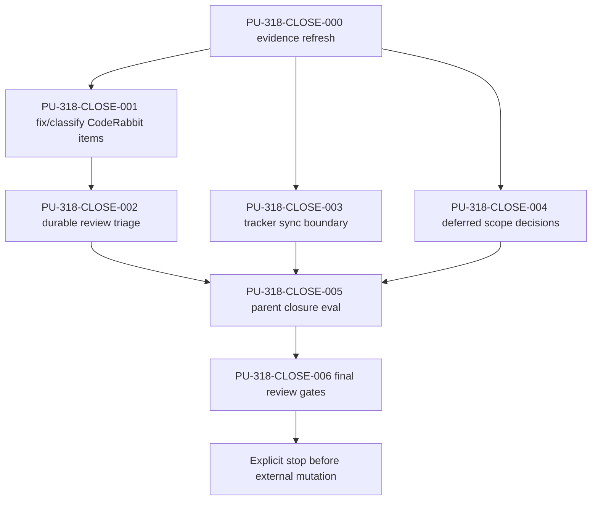

# JSC-318 Contract Schema ERD Parent Closure Readiness Plan

## Table of Contents
- [Command Summary](#command-summary)
- [Status Block](#status-block)
- [Objective](#objective)
- [Source Contract](#source-contract)
- [Scope and Boundaries](#scope-and-boundaries)
- [Current State / Evidence](#current-state--evidence)
- [Implementation Strategy](#implementation-strategy)
- [Work Units](#work-units)
- [Dependencies and Sequencing](#dependencies-and-sequencing)
- [Ownership and Approval Boundaries](#ownership-and-approval-boundaries)
- [Parent Closure Eval Output Contract](#parent-closure-eval-output-contract)
- [Validation Gates](#validation-gates)
- [Review Plan](#review-plan)
- [Rollback Plan](#rollback-plan)
- [Risk Register](#risk-register)
- [Observability and Evidence](#observability-and-evidence)
- [Visual References / Diagrams](#visual-references--diagrams)
- [Accessibility and Operator Ergonomics](#accessibility-and-operator-ergonomics)
- [Open Questions](#open-questions)
- [Professional Confidence Review](#professional-confidence-review)
- [Evidence Pack](#evidence-pack)
- [Iterative Re-review Loop](#iterative-re-review-loop)
- [Final Decision](#final-decision)
- [Linear Work Item Contract](#linear-work-item-contract)
- [Linear / Spec / Plan / PR Traceability](#linear--spec--plan--pr-traceability)
- [Appendix A. Harness Metadata / Traceability](#appendix-a-harness-metadata--traceability)
- [Appendix B. Linear / Tracker Handoff](#appendix-b-linear--tracker-handoff)
- [Appendix C. Review Outcomes](#appendix-c-review-outcomes)

## Command Summary

BLUF: This plan is for the operator, developer, or agent closing the JSC-318 parent after JSON Schema ERD extraction, manifest truth, and context fallback proof already landed on PR #93. This document's job is to prevent parent closure from becoming a false completion signal, because live evidence still shows PR #93 as draft, CodeRabbit has four actionable artifact comments, JSC-321 tracker state is stale, and the original parent scope still needs explicit YAML, TypeScript, and configured-source decisions. The plan changes only closure artifacts and review/tracker evidence unless a valid review comment exposes a narrow artifact fix; it does not add ERD runtime scope. The main blocker is any unresolved `CR-318-*` item, missing Linear approval, or absent parent closure eval. The next action is `he-work` or equivalent artifact-work execution for `PU-318-CLOSE-000` through `PU-318-CLOSE-006`, followed by an explicit stop before any Linear/GitHub mutation.

Decision Needed: Decide during execution whether YAML schema support, TypeScript contract extraction, and configured contract source globs are explicitly deferred from JSC-318 or admitted as separate follow-up child issues before parent closure.

Top Risks: Treating green checks as review completion; closing JSC-318 while JSC-321 remains stale in Linear; allowing absolute workstation paths or brittle negative smoke commands to remain in reusable harness artifacts; widening into YAML, TypeScript, configured-source, parser, renderer, or CLI behavior.

Next Action: Start `PU-318-CLOSE-000` with live evidence refresh, then fix or classify `CR-318-001` through `CR-318-004` before tracker sync, deferred-scope decisions, and the parent closure eval.

## Status Block

| Field | Value |
| --- | --- |
| `interactive_status` | ready_for_he_work_after_user_authorization |
| `selection_evidence` | JSC-318 closure spec, JSC-318 technical review, local Linear plan, live PR #93 read |
| `route` | he-plan -> explicit_stop |
| `stage` | closure_readiness_plan |
| `scope` | review-comment artifact fixes, tracker reconciliation payload, deferred-scope decision capture, parent closure eval |
| `source` | `.harness/specs/2026-05-13-JSC-318-contract-schema-erd-parent-closure-readiness-spec.md` |
| `plan_path` | `.harness/plan/2026-05-13-JSC-318-contract-schema-erd-parent-closure-readiness-plan.md` |
| `traceability` | `JSC-318` parent, children `JSC-319`/`JSC-320`/`JSC-321`, PR #93, CodeRabbit `CR-318-001` through `CR-318-004` |
| `validation` | plan artifact gates now; closure execution gates during `he-work`; PR review state must be re-read after artifact fixes |
| `safe_to_continue` | true for artifact-work execution; false for external mutation until approval |
| `blocked_reason` | none for the plan; parent closure remains blocked by execution gates |
| `linear_action_required` | yes, confirmation required before JSC-321 sync or JSC-318 closeout |
| `linear_mutation_status` | confirmation_required |
| `post_plan_handoff` | explicit_stop |
| `technical_review_status` | complete for this plan; go with conditions |
| `evidence_freshness` | PR #93 and Linear state were refreshed during plan review; execution must refresh again before mutation or closeout |
| `known_dirty_files_boundary` | preserve `.codex/hooks.json`, `.harness/linear/2026-05-13-JSC-318-contract-schema-erd-linear-plan.md`, `artifacts/policy/environment-attestation.json`, and `scripts/check-environment.sh` unless a later approved lane owns them |
| `confidence` | 93%; strong candidate with validation gaps because local spec/review/PR/Linear evidence is current and the plan is validator-backed, but review fixes, tracker mutation, and parent closure eval are still future evidence |

## Objective

Convert the deepened JSC-318 parent closure specification into an executable closure-readiness path.

The plan must:

- Fix or classify the four current PR #93 CodeRabbit items.
- Preserve the distinction between local proof, PR proof, review proof, tracker proof, and parent closure proof.
- Prepare but not silently perform Linear/GitHub mutations.
- Record deferred-scope decisions for YAML, TypeScript, and configured-source work.
- Produce a parent closure eval that maps original JSC-318 acceptance to child evidence, deferrals, or blockers.

## Source Contract

| Source ID | Requirement / Acceptance | Plan Mapping |
| --- | --- | --- |
| `SA-318-CLOSE-001` | Closure readiness spec exists and passes HE validators. | `PU-318-CLOSE-000`, `PU-318-CLOSE-006` |
| `SA-318-CLOSE-002` | Live Linear state for parent and children is current in the closure plan. | `PU-318-CLOSE-000`, `PU-318-CLOSE-003` |
| `SA-318-CLOSE-003` | `JSC-321` live state is synced with PR #93 or recorded as a blocker. | `PU-318-CLOSE-003` |
| `SA-318-CLOSE-004` | PR #93 check, draft, commit, and review state are recorded. | `PU-318-CLOSE-000`, `PU-318-CLOSE-002` |
| `SA-318-CLOSE-005` | CodeRabbit actionable comments are resolved, skipped with evidence, or blockers. | `PU-318-CLOSE-001`, `PU-318-CLOSE-002` |
| `SA-318-CLOSE-006` | Original parent acceptance maps to child proof, deferrals, or blockers. | `PU-318-CLOSE-005` |
| `SA-318-CLOSE-007` | YAML schema support has a deferred/admitted/blocked decision. | `PU-318-CLOSE-004`, `PU-318-CLOSE-005` |
| `SA-318-CLOSE-008` | TypeScript contract extraction has a deferred/admitted/blocked decision. | `PU-318-CLOSE-004`, `PU-318-CLOSE-005` |
| `SA-318-CLOSE-009` | Configured contract source globs have a deferred/admitted/blocked decision. | `PU-318-CLOSE-004`, `PU-318-CLOSE-005` |
| `SA-318-CLOSE-010` | Parent is not moved to Done unless closure eval recommends it and mutation approval is explicit. | `PU-318-CLOSE-003`, `PU-318-CLOSE-005`, `PU-318-CLOSE-006` |
| `SA-318-CLOSE-011` | `CR-318-001` through `CR-318-004` are fixed, skipped with evidence, or blockers. | `PU-318-CLOSE-001`, `PU-318-CLOSE-002` |
| `FR-318-CLOSE-013` | Parent closeout must resolve or explicitly block the four CodeRabbit items. | `PU-318-CLOSE-001`, `PU-318-CLOSE-002` |
| `FR-318-CLOSE-014` | Reusable commands and artifacts should avoid hard-coded workstation paths. | `PU-318-CLOSE-001`, `PU-318-CLOSE-002` |
| `FR-318-CLOSE-015` | Negative smoke commands under `set -euo pipefail` must encode expected no-match success explicitly. | `PU-318-CLOSE-001`, `PU-318-CLOSE-002` |

## Scope and Boundaries

Allowed paths and areas:

- `.harness/plan/2026-05-13-JSC-318-contract-schema-erd-parent-closure-readiness-plan.md`
- `.harness/plan/2026-05-13-JSC-321-erd-unavailable-context-fallback-plan.md`
- `.harness/solutions/2026-05-13-jsc-321-context-pack-smoke-path-contract.md`
- `.harness/evals/2026-05-13-jsc-318-contract-schema-erd-parent-closure-readiness-diagram-cli-eval.md`
- `.harness/linear/2026-05-13-JSC-318-contract-schema-erd-linear-plan.md` only for local tracker evidence after explicit live-state refresh or approved mutation
- PR #93 review evidence captured in harness artifacts

Forbidden paths and areas unless a later approved review-fix phase explicitly reopens scope:

- `src/**`
- `test/**`
- public CLI behavior
- manifest schema migration
- JSON/YAML parser changes
- TypeScript extraction
- configured contract source globs
- renderer or Mermaid syntax behavior
- `.diagram/**` generated runtime artifacts
- Linear/GitHub mutation without explicit approval
- unrelated dirty files such as `.codex/hooks.json`, `artifacts/policy/environment-attestation.json`, or `scripts/check-environment.sh`

Stop conditions:

- Any CodeRabbit item is still valid and cannot be fixed inside allowed artifact paths.
- Live Linear or PR state changes materially from the evidence captured here.
- JSC-321 cannot be synced to PR #93 without approval.
- YAML, TypeScript, or configured-source decision is missing.
- Parent closure eval cannot map original JSC-318 acceptance to evidence, deferral, or blocker.
- Implementation source changes become necessary.
- Unrelated dirty files would be touched, staged, or committed.

## Current State / Evidence

| Evidence | Current State | Planning Impact |
| --- | --- | --- |
| `.harness/specs/2026-05-13-JSC-318-contract-schema-erd-parent-closure-readiness-spec.md` | Deepened closure spec exists and passed HE validators. | Authoritative source contract for this plan. |
| `.harness/review/2026-05-13-JSC-318-contract-schema-erd-parent-closure-readiness-technical-review.md` | Technical review records CodeRabbit and scope-decision blockers. | Carries adversarial findings into execution. |
| PR #93 live read | PR is open, draft, checks successful, CodeRabbit status successful, latest CodeRabbit review reports four actionable comments. | Green checks are insufficient; review triage is required. |
| `.harness/plan/2026-05-13-JSC-321-erd-unavailable-context-fallback-plan.md` | Contains the three plan-side CodeRabbit targets: absolute validator paths, bare negative `rg`, and path-policy contradiction. | Artifact fixes are required before parent closure. |
| `.harness/solutions/2026-05-13-jsc-321-context-pack-smoke-path-contract.md` | Contains absolute workstation links called out by CodeRabbit. | Artifact portability fix is required before parent closure. |
| `.harness/linear/2026-05-13-JSC-318-contract-schema-erd-linear-plan.md` | Records JSC-321 as stale in Linear and parent closure readiness as the approved next slice. | Tracker sync remains approval-gated. |
| Child evals for JSC-319/JSC-320/JSC-321 | Local P0/P1/P2 proof exists. | Parent eval can map local proof, but cannot skip review/tracker gates. |
| Linear live read during review | `JSC-318` is In Progress; `JSC-319` and `JSC-320` are In Review; `JSC-321` is Backlog. The project milestone list is empty. | Parent closure remains blocked until `JSC-321` tracker state is synced or explicitly blocked. |
| PR #93 live read during review | PR #93 is open and draft with successful checks; latest CodeRabbit review reports four actionable comments. | Checks are green, but review completion is not proven. |
| Git worktree during review | Unrelated dirty files exist outside this plan's allowed scope. | Execution must preserve unrelated user changes and avoid broad staging. |

## Implementation Strategy

Use a closure-first sequence:

1. Refresh evidence before editing.
2. Fix narrow artifact-quality issues from CodeRabbit, with no runtime code edits.
3. Validate artifact shape, BLUF, traceability, and review-comment resolution.
4. Prepare tracker-sync evidence and mutation payload, but stop before mutation unless Jamie approves.
5. Record explicit deferred/admitted/blocked scope decisions, with missing owner decisions treated as blockers rather than implicit deferrals.
6. Write the parent closure eval with one of four outcomes: `Complete`, `Complete with follow-up`, `Blocked`, or `Rework`.
7. Run final review gates and stop with a clear handoff.

Artifact fixes must be small, local, and reversible. If any review item requires source behavior changes, stop and route back to the owning child slice rather than smuggling implementation into parent closure.

Do not treat a local artifact edit as proof that a PR review item is resolved. After local fixes, execution must re-read PR #93 review state or classify live thread verification as blocked. If CodeRabbit reports new or continuing actionable feedback after the artifact fix, parent closure remains blocked until that feedback is triaged.

## Work Units

### PU-318-CLOSE-000: Refresh Closure Evidence

Objective: Re-read the live and local state needed to avoid closing JSC-318 from stale evidence.

Source trace: `SA-318-CLOSE-001`, `SA-318-CLOSE-002`, `SA-318-CLOSE-004`, `FR-318-CLOSE-009`.

Allowed paths or areas:

- Read-only repo state.
- `.harness/plan/2026-05-13-JSC-318-contract-schema-erd-parent-closure-readiness-plan.md` if evidence notes must be refreshed.
- `.harness/linear/2026-05-13-JSC-318-contract-schema-erd-linear-plan.md` only if live delta capture evidence is refreshed locally.

Forbidden paths or areas:

- Runtime source code.
- Tests.
- Linear/GitHub mutation.
- Unrelated dirty files.

Steps:

1. Run `git status --short --branch`.
2. Confirm this plan path, source spec, and technical review exist.
3. Refresh PR #93 with `gh pr view 93 --json number,title,state,isDraft,reviewDecision,latestReviews,statusCheckRollup,commits,url`.
4. Refresh live Linear parent/child state through the approved Linear route or record the blocker if unavailable.
5. Compare refreshed evidence against the current local Linear plan.

Validation:

- Required: PR state and review evidence recorded as `pass`, `fail`, or `blocked`.
- Required: Linear refresh recorded as `pass`, `fail`, or `blocked`.
- Required: dirty-file inventory recorded before any edit.

Stop condition: Stop if PR #93 has new review feedback, failed checks, or a branch state that changes the closure sequence.

Rollback: No rollback needed for read-only evidence; revert any local evidence-note edit if the refresh was wrong.

Handoff: Continue to `PU-318-CLOSE-001` only when evidence is fresh or blockers are explicit.

### PU-318-CLOSE-001: Fix or Classify CodeRabbit Artifact Comments

Objective: Resolve the four current CodeRabbit items in harness artifacts or classify them as blockers with evidence.

Source trace: `SA-318-CLOSE-005`, `SA-318-CLOSE-011`, `FR-318-CLOSE-013`, `FR-318-CLOSE-014`, `FR-318-CLOSE-015`.

Allowed paths or areas:

- `.harness/plan/2026-05-13-JSC-321-erd-unavailable-context-fallback-plan.md`
- `.harness/solutions/2026-05-13-jsc-321-context-pack-smoke-path-contract.md`
- This plan path if the closure plan needs a resolution note.

Forbidden paths or areas:

- `src/**`
- `test/**`
- `.diagram/**`
- Linear/GitHub mutation.
- Broad rewrite of JSC-321 plan or solution text beyond the review-comment targets.

Steps:

1. Fix `CR-318-001`: replace the stale `/private/tmp`-only risk row with the harness-approved tmp path contract that explicitly references `/private/tmp`, `.harness/tmp`, and `.diagram/**`.
2. Fix `CR-318-002`: replace machine-specific validator command paths with portable repo-relative commands or an agreed wrapper reference while preserving flags and behavior.
3. Fix `CR-318-003`: replace the bare negative `rg` command under `set -euo pipefail` with an explicit conditional that fails only when forbidden guidance labels are found.
4. Fix `CR-318-004`: replace absolute workstation markdown links in the solution artifact with repo-relative paths.
5. If any item cannot be fixed safely, record `blocked` with exact evidence and stop parent closure.

Validation:

- Required: `if rg -n '/Users/jamiecraik' .harness/plan/2026-05-13-JSC-321-erd-unavailable-context-fallback-plan.md .harness/solutions/2026-05-13-jsc-321-context-pack-smoke-path-contract.md; then exit 1; else exit 0; fi` passes, or every remaining match is classified as local-only evidence and not reusable guidance.
- Required: a targeted check proves the stale `/private/tmp`-only path-policy text has been replaced with the corrected `.harness/tmp` plus `.diagram/**` exclusion contract.
- Required: a targeted check proves negative no-match smoke commands are encoded as explicit conditionals rather than bare `rg` under `set -euo pipefail`.
- Required: BLUF, artifact identity, and Linear traceability validators pass for any edited JSC-321 plan or solution artifact when those validators support the artifact type; unsupported validators must be recorded as `not applicable`, not silently skipped.

Stop condition: Stop if a CodeRabbit item requires runtime source changes or broader plan rewrite.

Rollback: Revert only the artifact edits made for the specific CodeRabbit item.

Handoff: Continue to `PU-318-CLOSE-002` after all four items are fixed or explicitly classified.

### PU-318-CLOSE-002: Record Review Comment Triage Evidence

Objective: Create a durable triage record showing how `CR-318-001` through `CR-318-004` were resolved.

Source trace: `SA-318-CLOSE-005`, `SA-318-CLOSE-011`, Review Comment Triage Contract.

Allowed paths or areas:

- `.harness/evals/2026-05-13-jsc-318-contract-schema-erd-parent-closure-readiness-diagram-cli-eval.md`
- This plan path if execution evidence must be appended after closeout.
- PR #93 review evidence read-only.

Forbidden paths or areas:

- Source code.
- Tests.
- Linear/GitHub mutation.

Steps:

1. For each `CR-318-*`, record `review_source`, `location`, `classification`, `resolution_evidence`, and `parent_closeout_impact`.
2. If the PR review thread API cannot prove thread state, record the latest review body as the source and classify thread-state verification as blocked.
3. Re-read PR #93 after the local artifact fixes and record whether CodeRabbit still reports actionable comments.
4. Keep all unresolved, newly discovered, or unverified items blocking parent closure.

Validation:

- Required: Every `CR-318-*` item has exactly one classification.
- Required: Parent closure eval later carries the same classifications.
- Required: No item is marked allowed without diff, command, or blocker evidence.
- Required: PR review freshness evidence is newer than the artifact-fix diff or thread-state verification is explicitly `blocked`.

Stop condition: Stop if any current CodeRabbit item remains unclassified.

Rollback: Remove the triage record if it cites incorrect evidence.

Handoff: Continue to `PU-318-CLOSE-003` after review evidence is durable.

### PU-318-CLOSE-003: Prepare Tracker Sync and Mutation Boundary

Objective: Reconcile or block the stale JSC-321 Linear state without silently mutating external systems.

Source trace: `SA-318-CLOSE-002`, `SA-318-CLOSE-003`, `SA-318-CLOSE-010`, `FR-318-CLOSE-001`, `FR-318-CLOSE-002`.

Allowed paths or areas:

- `.harness/linear/2026-05-13-JSC-318-contract-schema-erd-linear-plan.md`
- `.harness/evals/2026-05-13-jsc-318-contract-schema-erd-parent-closure-readiness-diagram-cli-eval.md`
- Linear read operations.

Forbidden paths or areas:

- Linear mutation without explicit approval.
- GitHub PR state changes.
- Source or test edits.

Steps:

1. Read live `JSC-318`, `JSC-319`, `JSC-320`, and `JSC-321` state.
2. If `JSC-321` remains Backlog/no PR link, prepare the exact mutation payload needed to move/link it and classify parent closure as blocked until approval or explicit owner acceptance of stale tracker state exists.
3. Stop for approval before applying mutation.
4. If mutation is approved and performed later, update local evidence with exact before/after state.
5. Keep `JSC-318` parent open unless the parent closure eval later recommends closure and explicit approval exists.

Validation:

- Required: live tracker read evidence or exact blocker.
- Required: `linear_mutation_status` remains `confirmation_required` until approval.
- Required: no parent Done recommendation before parent closure eval.

Stop condition: Stop if Linear state cannot be read or mutation approval is unavailable.

Rollback: For local artifact updates, revert the evidence note. For approved Linear mutation, record the previous state and required manual revert action.

Handoff: Continue to `PU-318-CLOSE-004` when tracker state is current or explicitly blocked.

### PU-318-CLOSE-004: Record Deferred Scope Decisions

Objective: Decide whether YAML, TypeScript, and configured-source support are deferred, admitted into new child scope, or blocking.

Source trace: `SA-318-CLOSE-007`, `SA-318-CLOSE-008`, `SA-318-CLOSE-009`, `FR-318-CLOSE-006`, `FR-318-CLOSE-007`, `FR-318-CLOSE-008`.

Allowed paths or areas:

- `.harness/evals/2026-05-13-jsc-318-contract-schema-erd-parent-closure-readiness-diagram-cli-eval.md`
- `.harness/linear/2026-05-13-JSC-318-contract-schema-erd-linear-plan.md` if local queue evidence needs updating.

Forbidden paths or areas:

- New parser implementation.
- New issue creation without approval.
- Public CLI/config changes.

Steps:

1. Fill the Deferred Scope Decision Contract for `yaml-schema-support`.
2. Fill the Deferred Scope Decision Contract for `typescript-contract-extraction`.
3. Fill the Deferred Scope Decision Contract for `configured-contract-source-globs`.
4. If any item is admitted, stop and create a new child spec/plan path before parent closure.
5. If deferred, record the follow-up issue state as `not_created` unless Jamie approves live issue creation.
6. If no owner decision is available for an item, record `decision: blocked`, not `decision: deferred`.

Validation:

- Required: all three scope items have `decision`, `decision_source`, `reason`, `owner`, `follow_up_issue`, `parent_acceptance_impact`, `parent_closeout_impact`, and `evidence`.
- Required: no parent closure if any `parent_closeout_impact` is `blocked`.

Stop condition: Stop if Jamie/spec-owner decision is required and unavailable.

Rollback: Revise the decision table if the owner changes the scope decision.

Handoff: Continue to `PU-318-CLOSE-005` after scope decisions are explicit.

### PU-318-CLOSE-005: Write Parent Closure Eval

Objective: Produce the parent closure eval that maps original JSC-318 acceptance to child proof, review evidence, tracker state, and deferred scope.

Source trace: `SA-318-CLOSE-006`, `SA-318-CLOSE-010`, all closure evidence conformance rules.

Allowed paths or areas:

- `.harness/evals/2026-05-13-jsc-318-contract-schema-erd-parent-closure-readiness-diagram-cli-eval.md`
- Child spec/plan/eval artifacts as read-only evidence.
- PR #93 and Linear read evidence.

Forbidden paths or areas:

- Runtime implementation edits.
- External mutation.
- Closing review threads.

Steps:

1. Map original JSC-318 acceptance to `JSC-319`, `JSC-320`, `JSC-321`, explicit deferral, or blocker.
2. Include the `CR-318-*` triage table with fresh PR review recheck evidence.
3. Include live PR #93 state, checks, draft status, latest review state, and commit list.
4. Include live Linear parent/child state or exact blocker.
5. Recommend one outcome: `Complete`, `Complete with follow-up`, `Blocked`, or `Rework`.
6. If recommending anything stronger than `Blocked`, explain why unresolved YAML/TypeScript/configured-source work does not invalidate parent closure.

Validation:

- Required: eval BLUF validator.
- Required: eval artifact identity and Linear traceability lint.
- Conditional: implementation tests only if source or test files changed during closure.

Stop condition: Stop if the eval cannot map any original acceptance criterion to evidence, deferral, or blocker.

Rollback: Revert the eval artifact or downgrade its recommendation if later evidence contradicts it.

Handoff: Continue to `PU-318-CLOSE-006` for final review gates.

### PU-318-CLOSE-006: Run Final Review and Handoff Gates

Objective: Verify artifacts and produce the final handoff without overclaiming closure.

Source trace: `SA-318-CLOSE-001` through `SA-318-CLOSE-011`.

Allowed paths or areas:

- Edited harness artifacts from this plan.
- Read-only git, PR, and validation outputs.

Forbidden paths or areas:

- Source code unless a prior unit explicitly reopened implementation scope.
- External mutation without approval.
- Commit/push unless separately authorized.

Steps:

1. Run plan/spec/eval BLUF and artifact-shape validators.
2. Run artifact identity and Linear traceability lints for all edited HE artifacts.
3. Run `git diff --check` for edited files.
4. Run a stop-hook marker scan over edited artifacts.
5. Record simplify review over the artifact diff.
6. Run bug-fix review only if failing validation evidence exists.
7. Run code review only if source/test code changed; otherwise mark not applicable.
8. Set final handoff to `blocked`, `awaiting_user_choice`, or `explicit_stop` unless the user explicitly authorizes mutation and closure execution.

Validation:

- Required: all edited HE artifact validators pass.
- Required: exact pass/fail/blocked outcomes are recorded.
- Conditional: `npm test`, `npm run test:deep`, and `bash scripts/verify-work.sh --fast` only if runtime source, tests, validators, or command behavior changed.

Stop condition: Stop if any validator fails twice with the same deterministic blocker.

Rollback: Revert only the final artifact changes from this closure run.

Handoff: Default to `explicit_stop`; route to live Linear/GitHub update only with explicit approval.

## Dependencies and Sequencing

| Unit | Depends On | Unlocks |
| --- | --- | --- |
| `PU-318-CLOSE-000` | Existing closure spec and review artifact | Fresh evidence for all later units |
| `PU-318-CLOSE-001` | `PU-318-CLOSE-000` | Review comments can be resolved or blocked |
| `PU-318-CLOSE-002` | `PU-318-CLOSE-001` | Durable CodeRabbit triage for parent eval |
| `PU-318-CLOSE-003` | `PU-318-CLOSE-000` | Tracker sync payload and approval boundary |
| `PU-318-CLOSE-004` | `PU-318-CLOSE-000` | Explicit deferred/admitted/blocked parent scope |
| `PU-318-CLOSE-005` | `PU-318-CLOSE-002`, `PU-318-CLOSE-003`, `PU-318-CLOSE-004` | Parent closure recommendation |
| `PU-318-CLOSE-006` | `PU-318-CLOSE-005` | Final validated handoff |

## Ownership and Approval Boundaries

| Area | Owner | Approval Boundary |
| --- | --- | --- |
| Artifact fixes | Implementing agent | Safe if scoped to allowed harness files. |
| Deferred scope decisions | Jamie / spec owner | Required before parent closure. |
| Linear mutation | Jamie approval required | No unattended mutation. |
| GitHub PR state changes | Jamie approval required | No unattended ready-for-review, merge, or review-thread closure. |
| Runtime implementation changes | Owning child slice | Stop and route back to child work if needed. |

## Parent Closure Eval Output Contract

The parent closure eval must be structured enough for a later operator to decide whether JSC-318 can move without rereading every child artifact.

Required fields:

| Field | Required Values / Content | Closure Rule |
| --- | --- | --- |
| `closure_state` | `complete`, `complete_with_follow_up`, `blocked`, or `rework_required` | Must match the narrative recommendation. |
| `parent_recommendation` | `Complete`, `Complete with follow-up`, `Blocked`, or `Rework` | `Complete` is forbidden while review, tracker, or deferred-scope blockers remain. |
| `acceptance_map` | Original JSC-318 acceptance -> child proof, explicit deferral, or blocker | Every original acceptance item must appear once. |
| `review_triage` | `CR-318-001` through `CR-318-004`, plus any newly discovered PR review items | Unfixed or unverified items block closure. |
| `tracker_state` | Fresh `JSC-318`/`JSC-319`/`JSC-320`/`JSC-321` status and PR linkage evidence | Stale or unreadable tracker state blocks closure unless owner explicitly accepts the blocker. |
| `deferred_scope_decisions` | YAML, TypeScript, and configured-source rows with decision source and parent impact | Missing decisions are blockers. |
| `validation` | Exact command outcomes using `pass`, `fail`, `blocked`, or `not applicable` | Failed required validators block closure. |
| `mutation_boundary` | What was read, what was prepared, what was approved, and what was not mutated | No external mutation may be implied by local artifact status. |
| `residual_risk` | Remaining implementation, review, tracker, and scope risks | Required even for `Complete with follow-up`. |

## Validation Gates

### Plan Artifact Validation

| Gate | Command | Required Result |
| --- | --- | --- |
| Plan BLUF | `python3 ../agent-skills/Plugins/harness-engineering/scripts/check_bluf_structure.py .harness/plan/2026-05-13-JSC-318-contract-schema-erd-parent-closure-readiness-plan.md --json` | pass |
| Plan artifact shape | `python3 ../agent-skills/Plugins/harness-engineering/scripts/check_generated_artifact_shape.py .harness/plan/2026-05-13-JSC-318-contract-schema-erd-parent-closure-readiness-plan.md --kind plan --json` | pass |
| Plan artifact identity | `python3 ../agent-skills/Infrastructure/scripts/validation-and-linting/he_artifact_identity_lint.py .harness/plan/2026-05-13-JSC-318-contract-schema-erd-parent-closure-readiness-plan.md` | pass |
| Plan Linear traceability | `python3 ../agent-skills/Infrastructure/scripts/validation-and-linting/he_linear_traceability_lint.py .harness/plan/2026-05-13-JSC-318-contract-schema-erd-parent-closure-readiness-plan.md` | pass |
| Diff hygiene | `git diff --check -- .harness/plan/2026-05-13-JSC-318-contract-schema-erd-parent-closure-readiness-plan.md` | pass |

### Closure Execution Validation

| Gate | When | Required Result |
| --- | --- | --- |
| PR #93 refresh | `PU-318-CLOSE-000` | pass or blocked with exact reason |
| Linear parent/child refresh | `PU-318-CLOSE-000`, `PU-318-CLOSE-003` | pass or blocked with exact reason |
| CodeRabbit artifact fix validation | `PU-318-CLOSE-001`, `PU-318-CLOSE-002` | all `CR-318-*` items fixed or classified |
| Scope decision validation | `PU-318-CLOSE-004` | YAML, TypeScript, and configured-source decisions recorded |
| Parent closure eval validation | `PU-318-CLOSE-005` | eval validators pass and recommendation is evidence-backed |
| Runtime validation | conditional only if source/test changes occur | `npm test`, `npm run test:deep`, and `bash scripts/verify-work.sh --fast` pass or block with reason |

### Technical Review Validation

| Gate | Command | Required Result |
| --- | --- | --- |
| Plan technical review BLUF | `python3 ../agent-skills/Plugins/harness-engineering/scripts/check_bluf_structure.py .harness/review/2026-05-13-JSC-318-contract-schema-erd-parent-closure-readiness-plan-technical-review.md --json` | pass |
| Plan technical review identity | `python3 ../agent-skills/Infrastructure/scripts/validation-and-linting/he_artifact_identity_lint.py .harness/review/2026-05-13-JSC-318-contract-schema-erd-parent-closure-readiness-plan-technical-review.md` | pass |
| Plan technical review Linear traceability | `python3 ../agent-skills/Infrastructure/scripts/validation-and-linting/he_linear_traceability_lint.py .harness/review/2026-05-13-JSC-318-contract-schema-erd-parent-closure-readiness-plan-technical-review.md` | pass |

## Review Plan

- Simplify review: required over artifact diff before final closeout.
- Bug-fix pass: run only when failing evidence exists.
- Code review: not applicable if only harness artifacts change; required if source or tests change.
- External review state: CodeRabbit comments remain blocking until fixed or classified with evidence.
- Parent readiness review: closure eval must make the final recommendation, not this plan.

## Rollback Plan

| Change Type | Rollback |
| --- | --- |
| JSC-321 plan artifact fix | Revert the specific edited rows or restore from git. |
| JSC-321 solution artifact fix | Revert the specific markdown links or restore from git. |
| Parent closure eval | Revert the eval artifact or replace with a downgraded recommendation if evidence changes. |
| Local Linear plan evidence | Revert local artifact update. |
| Approved live Linear mutation | Record previous state before mutation and manually move the issue/link back if needed. |
| Runtime source change | Stop this plan; rollback must be handled in the owning child implementation lane. |

## Risk Register

| Risk | Likelihood | Impact | Mitigation |
| --- | --- | --- | --- |
| Green checks hide unresolved CodeRabbit comments | High | High | Require `CR-318-*` triage before parent eval. |
| JSC-321 tracker state remains stale | High | High | Block parent closure until read/sync/approval evidence exists. |
| Artifact portability comments are treated as cosmetic | Medium | Medium | Treat reusable absolute paths and brittle shell examples as closure blockers. |
| Deferred scope decision is skipped | Medium | High | Require explicit YAML/TypeScript/configured-source decision contracts. |
| Closure work drifts into implementation | Medium | High | Keep source/test paths forbidden and route back to child slice if needed. |
| Linear or GitHub mutation happens without approval | Low | High | Keep `linear_mutation_status: confirmation_required` and stop before mutation. |

## Observability and Evidence

Closure evidence must use exact result words: `pass`, `fail`, `blocked`, or `not applicable`.

Required evidence outputs:

- `CR-318-*` review triage table.
- Live PR #93 state snapshot.
- Live Linear state snapshot or blocker.
- Deferred scope decision table.
- Parent closure eval recommendation.
- Validator command outcomes.
- Dirty-file inventory before staging or commit.

## Visual References / Diagrams



The text plan is authoritative if this diagram and the work-unit contracts disagree.

## Accessibility and Operator Ergonomics

- Use repo-relative paths in reusable artifacts.
- Use stable `PU-*`, `SA-*`, `FR-*`, and `CR-*` IDs.
- Use text-first status labels rather than color or icon-only status.
- Keep blockers above historical detail in the parent closure eval.
- Avoid dense copied logs when a command, result, and source path are enough.

## Open Questions

| ID | Question | Owner | Required Before |
| --- | --- | --- | --- |
| OQ-318-PLAN-001 | Should YAML schema support be deferred or admitted as a new child issue? | Jamie / spec owner | Parent closure eval |
| OQ-318-PLAN-002 | Should TypeScript contract extraction be deferred or admitted as a new child issue? | Jamie / spec owner | Parent closure eval |
| OQ-318-PLAN-003 | Should configured contract source globs be deferred or admitted as a new child issue? | Jamie / spec owner | Parent closure eval |
| OQ-318-PLAN-004 | Should JSC-321 be synced in Linear before the parent closure eval is written or recorded as a mutation blocker first? | Jamie / Linear operator | Tracker handoff |
| OQ-318-PLAN-005 | Should PR #93 leave draft state after CodeRabbit artifacts are fixed, or stay draft until parent closure eval is reviewed? | Jamie / PR owner | PR handoff |

## Professional Confidence Review

Initial confidence before this plan-deepening pass was 91%: strong candidate with validation gaps. The plan was already scoped and validator-backed, but the parent closure eval contract was implicit, PR review freshness after local artifact edits was not enforced, and missing owner decisions could be misread as harmless deferrals.

Final plan confidence is 93%: strong candidate with validation gaps. Confidence improved because the plan now requires fresh PR review rechecks after artifact fixes, explicit blocked/default handling for missing scope decisions, a concrete parent closure eval output contract, and technical-review validation for the companion review artifact.

Confidence cannot exceed 93% because the closure units have not executed, CodeRabbit items are not yet fixed or rechecked, Linear mutation remains approval-gated, and the parent closure eval does not yet exist.

## Evidence Pack

| Evidence | Result | Impact |
| --- | --- | --- |
| PR #93 live read | pass: open draft PR, successful checks, latest CodeRabbit review with four actionable comments | Review triage remains mandatory. |
| Linear parent/child live read | pass: `JSC-318` In Progress, `JSC-319` and `JSC-320` In Review, `JSC-321` Backlog | Tracker sync or explicit blocker is mandatory. |
| Local worktree read | pass: unrelated dirty files exist outside this plan's allowed scope | Execution must avoid broad staging and unrelated edits. |
| Closure spec and review artifacts | pass: source artifacts exist and define blockers | Plan can proceed as artifact-work, not implementation work. |

## Iterative Re-review Loop

| Pass | Main Issues Found | Fixes Applied | Confidence After Pass | Stop / Continue Reason |
| --- | --- | --- | --- | --- |
| 1 | Plan lacked a hard PR review freshness gate after artifact fixes; parent closure eval schema was implicit; missing deferred-scope owner decisions could be misread as deferrals. | Added review re-read rule, closure eval output contract, blocked/default scope-decision rule, and technical-review validation gates. | 93% | Stop: remaining risk requires execution evidence, owner decisions, and approved external mutation. |

## Final Decision

Proceed to artifact-work execution for this closure-readiness plan only after explicit user authorization. The default handoff for this plan pass is `explicit_stop` because execution can touch existing JSC-321 artifacts and later requires external tracker decisions.

Do not move JSC-318 to Done from this plan. Do not mutate Linear or GitHub without approval.

## Linear Work Item Contract

| Field | Value |
| --- | --- |
| Parent Linear issue | `JSC-318` |
| Parent status | In Progress at planning time |
| Parent project | Diagram product surface and analysis workflow |
| Parent priority | High |
| Child issue sequence | `JSC-319` P0 -> `JSC-320` P1 -> `JSC-321` P2 |
| Current PR | PR #93, open and draft at planning time |
| Required next stage | Artifact-work execution for `PU-318-CLOSE-000` through `PU-318-CLOSE-006` |
| Closure rule | Parent remains open until CodeRabbit triage, JSC-321 tracker sync, deferred-scope decisions, and parent closure eval pass |
| External mutation status | confirmation_required |

## Linear / Spec / Plan / PR Traceability

| Linear issue | Source artifact | Plan units | Source acceptance IDs | Acceptance IDs | PR evidence | Closure status |
| --- | --- | --- | --- | --- | --- | --- |
| `JSC-318` | `.harness/specs/2026-05-13-JSC-318-contract-schema-erd-parent-closure-readiness-spec.md` | `PU-318-CLOSE-000` through `PU-318-CLOSE-006` | `SA-318-CLOSE-001` through `SA-318-CLOSE-011` | `SA-318-CLOSE-001` through `SA-318-CLOSE-011` | PR #93 linked to parent | blocked until closure eval and approved mutation |
| `JSC-319` | `.harness/evals/2026-05-13-jsc-319-json-schema-logical-erd-diagram-cli-eval.md` | parent evidence only | `SA-318-CLOSE-006`, `SA-318-CLOSE-010` | `SA-318-CLOSE-006`, `SA-318-CLOSE-010` | PR #93 commit `f4d6c5f` | supports parent after review/tracker gates |
| `JSC-320` | `.harness/evals/2026-05-13-jsc-320-erd-source-kind-manifest-truth-diagram-cli-eval.md` | parent evidence only | `SA-318-CLOSE-006`, `SA-318-CLOSE-010` | `SA-318-CLOSE-006`, `SA-318-CLOSE-010` | PR #93 commit `f4d6c5f` | supports parent after review/tracker gates |
| `JSC-321` | `.harness/evals/2026-05-13-jsc-321-erd-unavailable-context-fallback-diagram-cli-eval.md` | `PU-318-CLOSE-001`, `PU-318-CLOSE-002`, `PU-318-CLOSE-003` | `SA-318-CLOSE-002`, `SA-318-CLOSE-003`, `SA-318-CLOSE-005`, `SA-318-CLOSE-011` | `SA-318-CLOSE-002`, `SA-318-CLOSE-003`, `SA-318-CLOSE-005`, `SA-318-CLOSE-011` | PR #93 commit `35d56df` | blocked until Linear sync and CodeRabbit artifact triage |

## Appendix A. Harness Metadata / Traceability

| Field | Value |
| --- | --- |
| `schema_version` | 1 |
| `artifact_id` | `he-plan-jsc-318-contract-schema-erd-parent-closure-readiness` |
| `artifact_type` | `he-plan` |
| `canonical_slug` | `jsc-318-contract-schema-erd-parent-closure-readiness` |
| `linear_issue` | `JSC-318` |
| `linear_parent` | `JSC-318` |
| `source_pr` | `https://github.com/jscraik/diagram-cli/pull/93` |
| `post_plan_handoff` | `explicit_stop` |
| `safe_to_continue` | true for local artifact-work execution, false for external mutation |

## Appendix B. Linear / Tracker Handoff

```yaml
schema_version: 1
linear_mutation_status: confirmation_required
recommended_linear_actions_after_review_fixes:
  - issue: JSC-321
    action: sync status and attach or reference PR #93
    approval_required: true
  - issue: JSC-318
    action: keep In Progress until parent closure eval recommends otherwise
    approval_required: true
blocked_until:
  - CR-318-001 through CR-318-004 are fixed or classified
  - JSC-321 live state is synced or explicitly blocked
  - YAML/TypeScript/configured-source decisions are recorded
  - parent closure eval exists and passes validators
```

## Appendix C. Review Outcomes

| Review Surface | Outcome |
| --- | --- |
| Canonical source | pass: deepened JSC-318 closure spec is the controlling artifact. |
| Technical review | pass: companion review artifact exists and carries remaining blockers. |
| Scope boundary | pass: closure artifact/review/tracker/eval work only. |
| Validation surface | pass for plan validators; closure execution validation remains future work. |
| Security/privacy | pass: no secrets, destructive operations, deployment, or unattended external mutation. |
| Accessibility/operator ergonomics | pass: stable IDs, text statuses, repo-relative path rule. |
| Parent closure readiness | blocked until plan units execute and parent closure eval recommends closure. |

No-Fog Gate:

- One owning issue is named: `JSC-318`.
- The next work is closure readiness, not new runtime ERD implementation.
- Current PR review comments are preserved as `CR-318-001` through `CR-318-004`.
- External mutation remains confirmation-required.
- Stable plan units `PU-318-CLOSE-000` through `PU-318-CLOSE-006` map to acceptance IDs.
- Parent Done is blocked until review, tracker, scope, and eval evidence agree.
