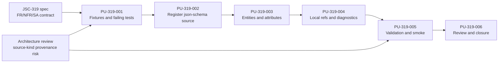
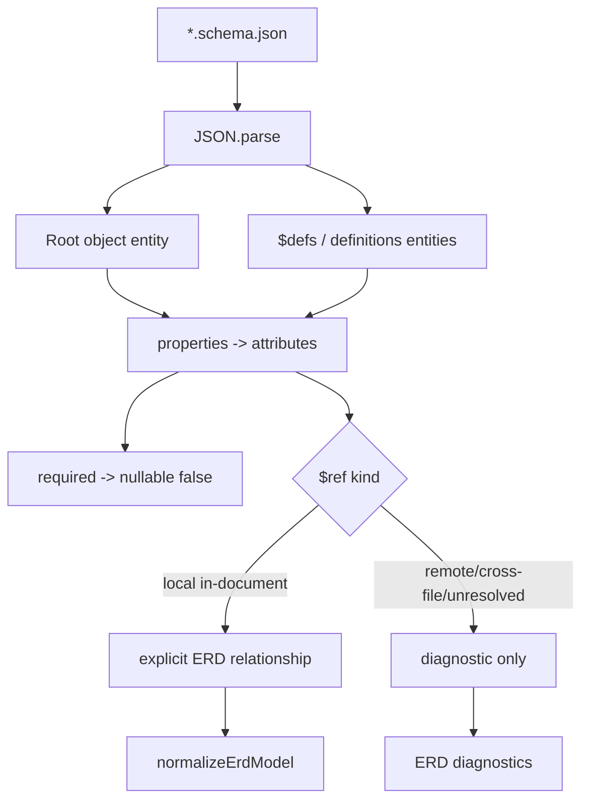

# JSC-319 JSON Schema Logical ERD Implementation Plan

## Table of Contents

- [Command Summary](#command-summary)
- [Objective](#objective)
- [Source Contract](#source-contract)
- [Scope and Boundaries](#scope-and-boundaries)
- [Current State / Evidence](#current-state--evidence)
- [Implementation Strategy](#implementation-strategy)
- [Detailed Implementation Contracts](#detailed-implementation-contracts)
- [Work Units](#work-units)
- [Dependencies and Sequencing](#dependencies-and-sequencing)
- [Ownership](#ownership)
- [Validation Gates](#validation-gates)
- [Review Plan](#review-plan)
- [Rollback Plan](#rollback-plan)
- [Risk Register](#risk-register)
- [Observability and Evidence](#observability-and-evidence)
- [Visual References / Diagrams](#visual-references--diagrams)
- [Accessibility and Operator Ergonomics](#accessibility-and-operator-ergonomics)
- [Open Questions](#open-questions)
- [Final Decision](#final-decision)
- [Appendix A. Harness Metadata / Traceability](#appendix-a-harness-metadata--traceability)
- [Appendix B. Linear / Tracker Handoff](#appendix-b-linear--tracker-handoff)
- [Appendix C. Review Outcomes](#appendix-c-review-outcomes)

## Command Summary

BLUF: Implement JSC-319 as a narrow, tests-first extension to `src/schema/erd-extractor.js` that adds `json-schema` source discovery and in-document logical ERD extraction while preserving existing Prisma/SQL behavior, source precedence, confidence semantics, and renderer contracts.

Decision Needed: none before implementation. The canonical spec already constrains P0 to local `*.schema.json` files, root/object definitions, attributes, required/nullability, in-document `$ref` relationships, and deterministic diagnostics for unsupported references.

Top Risks:

- Existing foreign-key-name inference could create false confidence for JSON Schema relationships unless explicit `$ref` coverage is asserted separately.
- Parser expansion in `erd-extractor.js` can turn into an oversized mixed-abstraction module if helpers are not kept small and source-kind local.
- Cross-file, remote, unresolved, and composition keywords can appear in real JSON Schemas; P0 must report unsupported cases without network access or invented relationships.
- Source precedence and no-schema failure behavior can regress if `json-schema` registration is not covered alongside Prisma/SQL tests.

Next Action: run `he-work` on this plan, starting with the fixture and failing tests in `PU-319-001`, then implement the parser and diagnostics through `PU-319-004`, and close only after the required validation gates pass or are explicitly blocked with evidence.

## Objective

Deliver the P0 implementation for Linear issue `JSC-319`: generate useful logical ERDs from local JSON Schema contract files, not only SQL or Prisma schemas.

The implementation must allow `diagram-cli` to discover `**/*.schema.json`, parse supported JSON Schema object shapes into the existing normalized ERD model, preserve existing public CLI and internal `extractErdModel({ rootPath, ignore })` contracts, and avoid network or external-reference resolution.

## Source Contract

Primary source of truth:

- `.harness/specs/2026-05-13-JSC-319-json-schema-logical-erd-spec.md`

Supporting architectural risk source:

- `.harness/review/diagram-cli-architecture-review.md`

Relevant implementation surfaces:

- `src/schema/erd-extractor.js`
- `src/schema/erd-model.js`
- `src/core/analysis-generation-diagrams-erd.js`
- `test/erd-extractor.test.js`
- `test/fixtures/erd/**`

The plan treats the specification as binding where it names `FR-319-*`, `NFR-319-*`, and `SA-319-*`. The architecture review is used as a risk lens, especially around source-kind provenance, over-trusting inferred diagrams, and keeping parser scope narrow.

## Scope and Boundaries

In scope:

- Add `json-schema` to ERD source precedence after Prisma and SQL.
- Discover local files matching `**/*.schema.json`.
- Route JSON Schema sources through `SCHEMA_PARSERS`.
- Parse root object schemas, `$defs`, and `definitions` into ERD entities.
- Map `properties` to attributes using the existing normalized ERD model shape.
- Map `required` to `nullable: false`; absent properties remain nullable.
- Resolve only in-document JSON Pointer references.
- Create explicit relationships for property `$ref` and array `items.$ref`.
- Emit deterministic diagnostics for remote, cross-file, unresolved, and unsupported JSON Schema shapes.
- Preserve all existing Prisma/SQL behavior and no-schema terminal behavior.
- Add focused fixtures and tests that prove scalar attributes, local references, unsupported references, source registration, and compatibility.

Out of scope:

- YAML schema support.
- TypeScript interface or type extraction.
- Remote `$ref` fetching.
- Cross-file `$ref` resolution.
- Manifest truth scoring or manifest-specific entity trust semantics.
- Context fallback integration.
- Renderer or Mermaid syntax rewrite.
- Public CLI option changes.
- Package dependency additions unless implementation proves a local parser is unsafe, which is not expected for P0.
- Broad refactors of `erd-extractor.js` unrelated to JSON Schema extraction.

Forbidden broad changes:

- Do not change the public `extractErdModel({ rootPath, ignore })` return shape.
- Do not alter existing Prisma/SQL parser semantics except for tests needed to guard compatibility.
- Do not change manifest schemas, CI policy files, or Linear tracker state as part of this implementation.
- Do not introduce network access for schema parsing.

## Current State / Evidence

Verified current state:

| Area | Evidence | Status | Implication |
| ---- | -------- | ------ | ----------- |
| Source precedence | `src/schema/erd-extractor.js` currently declares `SOURCE_PRECEDENCE = Object.freeze(['prisma', 'sql'])` | verified | JSON Schema is not currently discoverable or selectable. |
| Source patterns | `SOURCE_FILE_PATTERNS` covers Prisma and SQL only | verified | `**/*.schema.json` must be added. |
| Parser dispatch | `SCHEMA_PARSERS` maps Prisma and SQL only | verified | `json-schema` must be registered and tested. |
| Existing ERD tests | `test/erd-extractor.test.js` covers Prisma, SQL, ignore handling, parser dispatch, failed parse, and inferred relationships | verified | New tests should extend this file without weakening existing guarantees. |
| Normalization boundary | `src/schema/erd-model.js` normalizes entities, attributes, relationships, and confidence-facing source metadata | verified | Parser should emit the existing model shape, not invent a parallel model. |
| Renderer boundary | `src/core/analysis-generation-diagrams-erd.js` consumes extractor output and publishes diagnostics/metadata | verified | P0 should not require renderer changes unless a smoke test proves a missing display path. |
| Architecture risk | Review calls out source-kind ERD provenance/confidence as strategically important and warns against over-trusted static output | verified | Tests must separate explicit `$ref` relationships from existing name-based inference. |

Evidence-dependent assumptions:

- Existing `normalizeErdModel` behavior can represent explicit JSON Schema relationships using the current `fromEntity`, `toEntity`, `cardinality`, and `provenance` fields. It does not preserve relationship labels in P0.
- Existing diagnostics can carry JSON Schema parse and unsupported-reference messages without renderer changes.
- Existing test runner and fixture conventions are sufficient for P0 validation.

## Implementation Strategy

Use a narrow tests-first sequence:

1. Add JSON Schema ERD fixtures and failing tests that express the P0 contract.
2. Register `json-schema` in source precedence, source patterns, and parser dispatch.
3. Implement a small `parseJsonSchema` path inside `src/schema/erd-extractor.js`, with helper functions local to the source-kind parser.
4. Resolve only in-document JSON Pointer references and emit deterministic diagnostics for unsupported cases.
5. Run focused, baseline, and deep validation gates.
6. Review for accidental behavior changes in Prisma/SQL and for source-kind provenance drift.

Implementation posture:

- Prefer plain `JSON.parse` and small local helpers.
- Keep schema parsing deterministic by sorting entity names, attributes, relationships, and diagnostics where helper output order could vary.
- Preserve relationship property attributes rather than hiding them. This makes the schema property visible as an attribute and the `$ref` visible as a relationship. Tests must assert this chosen behavior to close the spec's implementation-choice open question.
- Treat composition keywords (`allOf`, `anyOf`, `oneOf`) as unsupported for relationship extraction in P0. Emit diagnostics where encountered rather than flattening or guessing.
- Keep diagnostics concise, path-addressable, and screen-reader friendly.

## Detailed Implementation Contracts

### Parser Dispatch Contract

Current parser dispatch calls `SCHEMA_PARSERS[source](content)` only. JSON Schema needs file context for root entity fallback naming and relative diagnostic paths, so implementation must update the internal dispatch shape without changing the public extractor API:

```js
parseSchemaSource(source, content, {
  absoluteFilePath,
  relativeFilePath,
  rootPath,
})
```

Existing Prisma and SQL parsers may ignore the context argument. The public `extractErdModel({ rootPath, ignore })` contract must remain unchanged.

### Parser Return Contract

JSON Schema parsing should return the same core shape as existing parsers, plus optional diagnostics:

```js
{
  entities: [
    {
      name: 'AgentRunManifest',
      source: 'explicit',
      attributes: [
        { name: 'id', type: 'string', nullable: false, keyFlags: [] },
      ],
    },
  ],
  relationships: [
    {
      fromEntity: 'AgentRunManifest',
      toEntity: 'AgentRunEvent',
      cardinality: '||--o{',
      provenance: 'explicit',
    },
  ],
  diagnostics: [
    'json-schema:manifest.schema.json:#/properties/externalRef remote_ref_unsupported https://example.com/schema.json#/Thing',
  ],
}
```

Extractor implementation must merge parser-returned diagnostics into `result.diagnostics`; thrown parser errors remain parse failures through the existing `parseErrors` path. This distinction matters because unsupported `$ref` forms are valid schema inputs with partial extraction, not whole-file parse failures.

### Entity Index Contract

The JSON Schema parser should build an entity index before relationship extraction:

| Pointer path | Entity naming rule | Entity condition |
| ------------ | ------------------ | ---------------- |
| `#` | root `title`, then filename stem without trailing `.schema` | root is object-like or has `properties` |
| `#/$defs/<key>` | `<key>` | definition is object-like or has `properties` |
| `#/definitions/<key>` | `<key>` | definition is object-like or has `properties` |

Object-like means `type: "object"` or a `properties` object exists. Non-object definitions should not become ERD entities in P0. If a `$ref` points to a non-entity definition, emit an unresolved/unsupported diagnostic and do not create a relationship.

### Attribute Mapping Contract

Attribute mapping must be deterministic:

| JSON Schema property shape | Attribute type | Relationship behavior |
| -------------------------- | -------------- | --------------------- |
| `{ "type": "string" }` | `string` | none |
| `{ "type": "integer" }` | `integer` | none |
| `{ "type": ["string", "null"] }` | `string` | none; nullable still comes from `required` for P0 |
| `{ "$ref": "#/$defs/Thing" }` | resolved target entity name, else `ref` | explicit single-target relationship only if resolved |
| `{ "type": "array", "items": { "$ref": "#/$defs/Thing" } }` | `array` | explicit collection relationship only if resolved |
| unsupported, missing, or mixed type | `unknown` | diagnostic if it affects relationship extraction |

Required properties map to `nullable: false`; all others map to `nullable: true`. The plan intentionally does not add JSON Schema semantic validation for defaults, enums, formats, constraints, or multi-type nullability beyond this required-list rule.

### Relationship Contract

Use the existing normalized relationship shape only:

```js
{
  fromEntity: 'AGENTRUNMANIFEST',
  toEntity: 'AGENTRUNEVENT',
  cardinality: '||--o{',
  provenance: 'explicit',
}
```

Do not depend on relationship labels in P0: `normalizeErdModel` currently stores only `fromEntity`, `toEntity`, `cardinality`, and `provenance`, and `renderErdMermaid` renders the label as provenance. Add labels only if a failing test proves they are necessary and the normalization/rendering contract is deliberately widened.

Relationship cardinality:

- property `$ref`: `}o--||`
- array `items.$ref`: `||--o{`

Existing `inferRelationshipsFromForeignKeyNames` runs after normalization. Tests must prove explicit JSON Schema relationships still win over inferred `*Id` relationships for the same pair.

### Diagnostic Taxonomy

Use stable diagnostic category tokens so tests are robust without overfitting prose:

| Category token | Condition | Relationship created? |
| -------------- | --------- | --------------------- |
| `remote_ref_unsupported` | `$ref` starts with `http://` or `https://` | no |
| `cross_file_ref_unsupported` | `$ref` has a non-empty file segment before `#` | no |
| `local_ref_unresolved` | local `#...` pointer does not resolve to an entity | no |
| `composition_unsupported` | `allOf`, `anyOf`, or `oneOf` is present where relationship extraction would require flattening | no |
| `non_object_definition_ignored` | a referenced definition is not object-like | no |

Diagnostics should include source kind, relative file path, JSON Pointer-ish location where practical, and category token. They must not include absolute user paths or fetched remote content.

### Existing Message Update Contract

When `json-schema` is registered, update the no-schema diagnostic from:

```text
no supported schema sources found (expected schema.prisma or .sql files)
```

to include JSON Schema:

```text
no supported schema sources found (expected schema.prisma, .sql, or .schema.json files)
```

Existing tests should be updated to assert the diagnostic category/substr enough to catch stale guidance without binding to a fragile full sentence.

### Smoke Command Contract

The `generate` command writes rendered files only when `--output` is provided. For a dependency-light smoke test, prefer JSON stdout rather than rendering through Mermaid CLI:

```bash
node src/diagram.js generate test/fixtures/erd/contract-schema-json --type erd --format json --deterministic --quiet
```

The smoke passes only if the JSON envelope reports success and includes ERD metadata for the JSON Schema source. If a file artifact is required, use a `.mmd` output path with `--force` to avoid Mermaid CLI image-render dependencies:

```bash
node src/diagram.js generate test/fixtures/erd/contract-schema-json --type erd --output /private/tmp/diagram-cli-jsc-319-erd-smoke.mmd --force --deterministic --quiet
```

## Work Units

### PU-319-001: Add JSON Schema Fixtures and Failing Contract Tests

Objective: establish the implementation contract before touching parser behavior.

Source trace:

- `FR-319-001` through `FR-319-017`
- `NFR-319-001`, `NFR-319-002`, `NFR-319-004`, `NFR-319-006`, `NFR-319-007`
- `SA-319-001` through `SA-319-009`

Allowed paths / areas:

- `test/erd-extractor.test.js`
- `test/fixtures/erd/contract-schema-json/**`
- `test/fixtures/erd/contract-schema-json-diagnostics/**`

Forbidden paths / areas:

- `src/**`
- `.harness/**`
- package dependency files
- CI/governance files

Steps:

1. Create a positive fixture such as `test/fixtures/erd/contract-schema-json/manifest.schema.json` with:
   - root object schema and `title`.
   - scalar properties including one required and one optional property.
   - `$defs` or `definitions` containing at least two entity definitions.
   - one property-level in-document `$ref`.
   - one array `items.$ref`.
   - one scalar `*Id`-style property only if the assertions prove it does not substitute for explicit `$ref` provenance.
2. Create a diagnostics fixture such as `test/fixtures/erd/contract-schema-json-diagnostics/problem.schema.json` with:
   - a remote `$ref`.
   - a cross-file `$ref`.
   - an unresolved local `$ref`.
   - a pointer requiring JSON Pointer unescape (`~0` or `~1`) in at least one supported or diagnostic path.
3. Add tests asserting:
   - `SOURCE_PRECEDENCE` includes `json-schema` after `prisma` and `sql`.
   - `SCHEMA_PARSERS` contains a callable `json-schema` parser.
   - `extractErdModel` discovers `*.schema.json`.
   - root and definition entities appear with deterministic names.
   - scalar attributes carry expected names, types, and nullability.
   - relationship properties remain attributes and also create explicit relationships.
   - property `$ref` and array `items.$ref` relationships use expected cardinality.
   - remote, cross-file, non-object, and unresolved refs produce diagnostics with stable category tokens and without resolved relationships.
   - unsupported composition keywords are diagnostic-only if fixture covers them.
   - existing inferred `*Id` behavior is not mistaken for explicit JSON Schema `$ref` behavior.
   - the no-schema diagnostic mentions `.schema.json` after source registration.
4. Run the focused test command and record the expected failing state.

Validation command / evidence:

- `npm test -- test/erd-extractor.test.js` -> expected `fail` before implementation because `json-schema` is not registered.

Stop condition:

- Stop if tests require a public API change, network access, or a renderer rewrite to express P0 behavior.

Rollback note:

- Delete the new fixture directories and revert new tests.

Handoff state:

- Ready for parser implementation once tests fail only for missing JSON Schema behavior.

### PU-319-002: Register JSON Schema as an ERD Source Kind

Objective: wire `json-schema` into discovery and parser dispatch without changing existing Prisma/SQL precedence or semantics.

Source trace:

- `FR-319-001`, `FR-319-002`, `FR-319-003`, `FR-319-010`, `FR-319-011`
- `NFR-319-002`, `NFR-319-005`
- `SA-319-001`, `SA-319-002`, `SA-319-003`

Allowed paths / areas:

- `src/schema/erd-extractor.js`
- `test/erd-extractor.test.js`

Forbidden paths / areas:

- Renderer rewrites
- Manifest schema files
- Package dependency files
- CLI option parsing

Steps:

1. Extend `SOURCE_PRECEDENCE` to `['prisma', 'sql', 'json-schema']`.
2. Add `json-schema: '**/*.schema.json'` to `SOURCE_FILE_PATTERNS`.
3. Add `json-schema` to `SCHEMA_PARSERS`, initially routed to `parseJsonSchema`.
4. Update internal parser dispatch to pass file context to parsers while preserving the public extractor API.
5. Update extractor flow to merge parser-returned diagnostics as non-fatal diagnostics.
6. Ensure source discovery, ignore behavior, thrown parse errors, and parser-returned diagnostics continue using existing extractor flow.
7. Update the no-schema diagnostic to mention `schema.prisma`, `.sql`, and `.schema.json`.
8. Export only the minimum test internals needed by existing patterns; do not add a public API.

Validation command / evidence:

- `npm test -- test/erd-extractor.test.js` -> expected partial progress; may still `fail` until JSON Schema parser behavior is complete.

Stop condition:

- Stop if source registration changes no-schema terminal behavior for directories with no supported schema sources.

Rollback note:

- Revert `SOURCE_PRECEDENCE`, `SOURCE_FILE_PATTERNS`, and `SCHEMA_PARSERS` changes.

Handoff state:

- Ready for entity and attribute extraction.

### PU-319-003: Implement JSON Schema Entity and Attribute Extraction

Objective: parse supported root objects and local definitions into existing ERD entities and attributes.

Source trace:

- `FR-319-004`, `FR-319-005`, `FR-319-006`, `FR-319-010`, `FR-319-014`, `FR-319-015`
- `NFR-319-001`, `NFR-319-003`, `NFR-319-004`, `NFR-319-006`
- `SA-319-004`, `SA-319-005`, `SA-319-008`

Allowed paths / areas:

- `src/schema/erd-extractor.js`
- `test/erd-extractor.test.js`
- `test/fixtures/erd/contract-schema-json/**`

Forbidden paths / areas:

- `src/schema/erd-model.js` unless a failing test proves the existing normalized shape cannot represent P0 behavior.
- Renderer behavior unless a smoke test proves diagnostics/metadata cannot surface.
- New runtime dependencies.

Steps:

1. Add `parseJsonSchema(content, context)` using the parser dispatch context from the detailed contract.
2. Parse JSON with `JSON.parse` and let existing parse-failure handling produce `failed_parse` diagnostics where possible.
3. Identify entity candidates using the entity index contract:
   - root schema when `type: "object"` or `properties` exists.
   - `$defs` object entries that are object-like.
   - `definitions` object entries that are object-like.
4. Derive entity names in this order:
   - definition key for `$defs` or `definitions`.
   - root `title` if present.
   - filename stem with trailing `.schema` removed.
5. Map attributes from `properties`.
6. Derive attribute types from the attribute mapping contract.
7. Set `nullable: false` when property name is in the entity's `required` array; otherwise `nullable: true`.
8. Preserve relationship properties as attributes and assert this in tests.
9. Ignore unsupported keywords for entity/attribute extraction unless they affect relationship semantics; emit deterministic diagnostics where useful.

Validation command / evidence:

- `npm test -- test/erd-extractor.test.js` -> expected progress; may still `fail` on relationship and diagnostics tests until `PU-319-004`.

Stop condition:

- Stop if entity collisions from root and definitions would silently merge unrelated entities in the fixture. Adjust fixture names or add diagnostics instead of widening model semantics.

Rollback note:

- Revert parser helper changes and positive fixture assertions.

Handoff state:

- Ready for local reference relationship extraction.

### PU-319-004: Implement In-Document `$ref` Relationships and Diagnostics

Objective: add explicit JSON Schema relationships for local references and safe diagnostics for unsupported references.

Source trace:

- `FR-319-007`, `FR-319-008`, `FR-319-009`, `FR-319-012`, `FR-319-013`, `FR-319-015`, `FR-319-016`, `FR-319-017`
- `NFR-319-001`, `NFR-319-002`, `NFR-319-003`, `NFR-319-006`, `NFR-319-007`
- `SA-319-004`, `SA-319-006`, `SA-319-007`, `SA-319-008`

Allowed paths / areas:

- `src/schema/erd-extractor.js`
- `test/erd-extractor.test.js`
- `test/fixtures/erd/contract-schema-json-diagnostics/**`

Forbidden paths / areas:

- Network fetch logic.
- Cross-file resolver.
- Renderer or Mermaid relationship syntax rewrite.
- Public CLI options.

Steps:

1. Add a local JSON Pointer resolver that supports:
   - `#/$defs/Name`
   - `#/definitions/Name`
   - JSON Pointer unescape rules for `~0` and `~1`
2. Detect local property references:
   - property schema containing `$ref`.
   - array schema where `items.$ref` exists.
3. Create relationships only when the target resolves to a parsed local entity.
4. Use deterministic relationship semantics:
   - property `$ref`: source entity to target entity, single target cardinality.
   - array `items.$ref`: source entity to target entity, collection cardinality.
   - do not rely on relationship labels unless normalization/rendering is deliberately widened.
5. Emit diagnostics, but no relationship, for:
   - remote URLs such as `https://...`.
   - cross-file references such as `other.schema.json#/$defs/Thing`.
   - local pointers that do not resolve.
   - referenced definitions that are not object-like.
   - unsupported composition relationship extraction (`allOf`, `anyOf`, `oneOf`) if encountered.
6. Ensure diagnostics are deterministic, concise, and do not leak absolute paths where existing parser diagnostics avoid them.
7. Ensure existing name-based relationship inference does not duplicate or overwrite explicit JSON Schema relationships incorrectly.

Validation command / evidence:

- `npm test -- test/erd-extractor.test.js` -> expected `pass` for focused parser suite.

Stop condition:

- Stop if existing relationship normalization drops required explicit relationships; inspect whether the emitted relationship shape matches `normalizeErdModel` before changing normalization.

Rollback note:

- Revert `$ref` helper changes and diagnostics fixture/tests.

Handoff state:

- Ready for full validation and smoke coverage.

### PU-319-005: Run Focused, Baseline, Deep, and Smoke Validation

Objective: prove the source-kind extension works without regressing existing ERD extraction or CLI artifact generation.

Source trace:

- `FR-319-010`, `FR-319-011`, `FR-319-014`, `FR-319-016`
- `NFR-319-002`, `NFR-319-005`, `NFR-319-006`, `NFR-319-007`
- `SA-319-001` through `SA-319-009`

Allowed paths / areas:

- No implementation edits unless a validation failure is directly tied to JSC-319.
- Optional temporary output under `/private/tmp` for smoke artifacts.

Forbidden paths / areas:

- Do not update generated committed artifacts unless the repository contract requires it.
- Do not commit timestamp-only churn in `artifacts/policy/environment-attestation.json`.

Steps:

1. Run the focused extractor suite.
2. Run the baseline implementation tests.
3. Run the deep test gate.
4. Run the contract-sensitive repo verification gate.
5. Run a CLI smoke command against the positive JSON Schema fixture and inspect output enough to prove the ERD path does not fail at rendering or artifact metadata.
6. Record pass/fail/blocked outcomes with exact command text.

Required validation:

| Gate | Command | Required Result | Notes |
| ---- | ------- | --------------- | ----- |
| Focused extractor tests | `npm test -- test/erd-extractor.test.js` | pass | Must cover JSON Schema and existing Prisma/SQL behavior. |
| Baseline tests | `npm test` | pass | Required by repo AGENTS baseline validation. |
| Deep tests | `npm run test:deep` | pass | Required by repo AGENTS baseline validation. |
| Work verification | `bash scripts/verify-work.sh --fast` | pass or blocked with exact reason | Required for contract-sensitive changes. |
| CLI smoke | `node src/diagram.js generate test/fixtures/erd/contract-schema-json --type erd --format json --deterministic --quiet` | pass | Prefer JSON stdout to avoid Mermaid CLI render dependencies. |
| Optional file smoke | `node src/diagram.js generate test/fixtures/erd/contract-schema-json --type erd --output /private/tmp/diagram-cli-jsc-319-erd-smoke.mmd --force --deterministic --quiet` | pass or blocked with exact reason | Use only if an artifact-write proof is needed. |

Stop condition:

- Stop if a validation failure suggests a public contract, renderer, or model-normalization change outside the P0 scope. Reclassify before widening changes.

Rollback note:

- Revert JSC-319 implementation files and fixture/test files; rerun Prisma/SQL-focused tests to ensure baseline restoration.

Handoff state:

- Ready for review once all required gates pass or blockers are documented.

### PU-319-006: Review, Evidence, and Closure Handoff

Objective: leave a reviewable implementation package with traceability back to JSC-319.

Source trace:

- `SA-319-001` through `SA-319-009`
- Architecture review recommendations on source-kind provenance, validation integrity, and avoiding over-trusted diagrams.

Allowed paths / areas:

- Implementation files already touched by `PU-319-001` through `PU-319-005`.
- Pull request or final response evidence.
- Optional `.harness/review/**` closeout note only if the active workflow explicitly asks for a review artifact.

Forbidden paths / areas:

- Linear mutation unless explicitly requested.
- Parent or downstream issue scope changes.
- Broad architecture review rewrites.

Steps:

1. Review the diff for accidental changes outside:
   - `src/schema/erd-extractor.js`
   - `test/erd-extractor.test.js`
   - `test/fixtures/erd/contract-schema-json/**`
   - `test/fixtures/erd/contract-schema-json-diagnostics/**`
2. Confirm `SOURCE_PRECEDENCE`, source patterns, parser dispatch, fixtures, and acceptance criteria map to the spec.
3. Summarize validation outcomes exactly.
4. Mark remaining risks honestly:
   - runtime behavior untested if CLI smoke blocked.
   - full repository health unproven if `npm test`, `npm run test:deep`, or `verify-work` block.
   - downstream JSC-320/JSC-321 still out of scope.
5. Hand off with a direct next step for review or PR creation.

Validation command / evidence:

- `git diff -- src/schema/erd-extractor.js test/erd-extractor.test.js test/fixtures/erd/contract-schema-json test/fixtures/erd/contract-schema-json-diagnostics`
- Exact validation commands from `PU-319-005`.

Stop condition:

- Stop if unrelated worktree changes are mixed into the implementation diff.

Rollback note:

- Revert only the JSC-319 files touched by the work units; preserve unrelated user changes.

Handoff state:

- Ready for PR/review after evidence is complete.

## Dependencies and Sequencing

Required order:

1. `PU-319-001` must happen first so implementation is driven by failing tests.
2. `PU-319-002` can proceed once tests express source registration expectations.
3. `PU-319-003` and `PU-319-004` are sequential because relationships depend on entity naming and definition indexing.
4. `PU-319-005` must run after implementation is complete.
5. `PU-319-006` must happen last so review evidence reflects the final diff.

Parallelism:

- No implementation subagent fan-out is recommended for this P0 change. The source surface is small and centered on one parser file plus one test file, so parallel edits would increase merge and coordination risk.
- A later code review swarm is reasonable only after the implementation diff exists, especially if it touches `erd-model.js`, renderer behavior, or public CLI contracts.

Dependency constraints:

- Keep implementation dependency-free unless a JSON parsing or pointer-resolution limitation is proven by tests.
- Do not begin JSC-320 manifest-truth changes before JSC-319 lands.
- Do not begin JSC-321 context fallback changes before JSC-319 behavior is validated.

## Ownership

| Responsibility | Owner / Authority | Notes |
| -------------- | ----------------- | ----- |
| Product scope | JSC-319 spec owner / issue owner | Keeps P0 limited to JSON Schema logical ERD extraction. |
| Implementation | `he-work` implementer | May edit only the scoped source, test, and fixture paths unless a stop condition is hit. |
| Parser contract changes | `diagram-cli` maintainer / implementation reviewer | Internal parser dispatch may widen with context; public extractor API must not change. |
| Spec-plan alignment | Harness Engineering plan/spec maintainer | Spec must be updated if implementation needs a broader parser, model, renderer, or validation contract. |
| Review | Post-implementation code reviewer | Must verify no-network refs, diagnostics, fixture coverage, and SQL/Prisma compatibility. |
| Release / PR decision | Repository maintainer | Requires focused tests, baseline tests, deep tests, verify-work, and smoke evidence or explicit blockers. |
| Linear updates | User or explicitly authorized agent flow | This plan does not authorize external Linear mutation. |

Decision escalation:

- Stop and update the spec before changing public CLI flags, manifest schemas, renderer semantics, cross-file `$ref` resolution, remote `$ref` behavior, or relationship model fields.
- Stop and ask for owner decision before adding a runtime dependency or widening P0 into JSC-320/JSC-321 behavior.

## Validation Gates

Planning artifact validation:

| Validator / Check | Available | Result | Evidence | Notes |
| ----------------- | --------: | ------ | -------- | ----- |
| BLUF structure | yes | pass | `python3 /Users/jamiecraik/dev/agent-skills/Plugins/harness-engineering/scripts/check_bluf_structure.py .harness/plan/2026-05-13-JSC-319-json-schema-logical-erd-plan.md --json` | Passed after exact Command Summary labels were added. |
| Artifact identity lint | yes | pass | `python3 /Users/jamiecraik/dev/agent-skills/Infrastructure/scripts/validation-and-linting/he_artifact_identity_lint.py .harness/plan/2026-05-13-JSC-319-json-schema-logical-erd-plan.md` | Passed after `harness_stage: he-plan` and `artifact_type: he-plan` were added. |
| Linear traceability lint | yes | pass | `python3 /Users/jamiecraik/dev/agent-skills/Infrastructure/scripts/validation-and-linting/he_linear_traceability_lint.py .harness/plan/2026-05-13-JSC-319-json-schema-logical-erd-plan.md` | Passed. |

Implementation validation:

| Validator / Check | Available | Required Result | Evidence Command | Notes |
| ----------------- | --------: | --------------- | ---------------- | ----- |
| Focused ERD tests | yes | pass | `npm test -- test/erd-extractor.test.js` | Required before closeout. |
| Baseline tests | yes | pass | `npm test` | Required by repo AGENTS. |
| Deep tests | yes | pass | `npm run test:deep` | Required by repo AGENTS. |
| Work verification | yes | pass or blocked | `bash scripts/verify-work.sh --fast` | Required for contract-sensitive repo validation. |
| CLI smoke | yes | pass or blocked | `node src/diagram.js generate test/fixtures/erd/contract-schema-json --type erd --format json --deterministic --quiet` | Uses JSON stdout and avoids Mermaid CLI render dependencies. |
| Optional file smoke | yes | pass or blocked | `node src/diagram.js generate test/fixtures/erd/contract-schema-json --type erd --output /private/tmp/diagram-cli-jsc-319-erd-smoke.mmd --force --deterministic --quiet` | Use only if artifact-write evidence is required. |
| Security check | not separately supported | not applicable | Covered by no-network tests and code review | No dedicated scanner is required for this local parser change. |
| Accessibility check | not separately supported | not applicable | Covered by diagnostics review | No UI is changed; diagnostics must remain readable. |

Do not claim implementation readiness if any required implementation validation remains unrun without an explicit blocker.

## Review Plan

Minimum review checklist:

- Verify JSON Schema parser is source-kind local and does not spread JSON-specific logic into generic normalization unless justified.
- Verify no network or filesystem traversal is added for `$ref`.
- Verify cross-file and remote references produce diagnostics only.
- Verify explicit `$ref` relationships are distinguishable from inferred `*Id` relationships.
- Verify existing Prisma and SQL tests still pass.
- Verify diagnostics are deterministic and useful to an operator.
- Verify fixture names avoid accidental entity merge collisions unless collision behavior is intentionally tested.
- Verify no generated artifacts or timestamp-only policy files are included unintentionally.

Recommended optional reviewers after implementation:

- Correctness reviewer for parser logic and edge cases.
- Testing reviewer if focused test coverage looks overly coupled to implementation details.
- Maintainability reviewer if `erd-extractor.js` grows materially or helper boundaries blur.

## Rollback Plan

Rollback is file-scoped:

1. Revert JSON Schema fixture directories.
2. Revert JSON Schema tests in `test/erd-extractor.test.js`.
3. Revert JSON Schema source registration and parser helper changes in `src/schema/erd-extractor.js`.
4. Re-run:
   - `npm test -- test/erd-extractor.test.js`
   - `npm test`
5. Confirm Prisma/SQL ERD extraction returns to prior behavior.

No data migration or production rollback is required because this is a local CLI parser change with no persisted runtime state.

## Risk Register

| Risk | Likelihood | Impact | Mitigation | Owner |
| ---- | ---------- | ------ | ---------- | ----- |
| JSON Schema support appears successful because `*Id` inference creates relationships without `$ref` parsing | medium | high | Add fixture and assertions that prove explicit `$ref` behavior separately from scalar `*Id` inference. | Implementer |
| Parser helper becomes a shallow abstraction or oversized conditional block | medium | medium | Keep JSON Schema helpers small, local, and test-covered; avoid unrelated refactors. | Implementer |
| Cross-file or remote refs are accidentally followed | low | high | Add diagnostics tests and prohibit network/file resolution outside discovered schema files. | Implementer |
| Existing Prisma/SQL precedence regresses | low | high | Assert precedence and run existing extractor tests. | Implementer |
| Diagnostics are unstable or too vague for operators | medium | medium | Assert diagnostic categories/messages enough to prevent drift without overfitting to prose. | Implementer |
| Renderer smoke reveals hidden assumption in output format | medium | medium | Run CLI smoke; widen only if necessary and explicitly reclassify. | Implementer |
| Repo governance drift obscures validation signal | medium | medium | Run repo-defined validation and record exact blockers instead of treating no-op gates as pass. | Implementer |

## Observability and Evidence

Implementation evidence to preserve in closeout:

- Exact files changed.
- Exact fixture paths added.
- Exact test command outcomes with `pass`, `fail`, or `blocked`.
- Example diagnostic categories produced by unsupported references.
- CLI smoke artifact path or blocker.
- Statement that no network `$ref` resolution was added.

Runtime/operator visibility requirements:

- `schemaSources` should include JSON Schema files through the existing metadata path.
- Parser diagnostics should appear through existing ERD diagnostics output.
- `terminalClass` should remain `completed` for usable JSON Schema ERDs and `failed_no_schema` when no supported sources exist.
- Unsupported refs must not silently disappear; they need diagnostics.

## Visual References / Diagrams



Expected supported JSON Schema flow:



## Accessibility and Operator Ergonomics

- Diagnostics must be plain text, deterministic, and understandable without color.
- Error messages should include enough schema path context for a user to fix unsupported references.
- Tests should avoid relying on visual-only Mermaid output; assert data model fields and diagnostics directly.
- CLI smoke output should be inspectable as JSON where possible.
- Do not add interactive prompts or operator choices to the parser path.

## Open Questions

| Question | Status | Plan Decision |
| -------- | ------ | ------------- |
| Should relationship properties also remain attributes? | resolved for implementation | Yes. Preserve relationship properties as attributes and explicit relationships; assert this in tests. |
| Should composition keywords be partially flattened? | out of scope | No for P0. Emit diagnostics only where encountered. |
| Should cross-file refs resolve when the target file is in the same discovered source set? | out of scope | No for P0. Diagnostic only; leave for a future issue if needed. |
| Should JSON Schema support alter ERD confidence scoring? | unresolved downstream | No in P0 unless existing confidence calculation fails materially; JSC-320 owns richer manifest truth. |

## Final Decision

Proceed with implementation of JSC-319 using this plan.

The plan is safe to continue because it is narrowly scoped, testable, source-traceable, and reversible. It does not authorize Linear mutation, package dependency changes, public contract changes, remote reference resolution, or downstream JSC-320/JSC-321 behavior.

## Appendix A. Harness Metadata / Traceability

| Field | Value |
| ----- | ----- |
| Artifact | `he-plan-jsc-319-json-schema-logical-erd` |
| Plan path | `.harness/plan/2026-05-13-JSC-319-json-schema-logical-erd-plan.md` |
| Spec source | `.harness/specs/2026-05-13-JSC-319-json-schema-logical-erd-spec.md` |
| Architecture review source | `.harness/review/diagram-cli-architecture-review.md` |
| Linear issue | `JSC-319` |
| Parent | `JSC-318` |
| Downstream | `JSC-320`, `JSC-321` |
| Safe to continue | true |
| Linear action required | false |
| Linear mutation status | not_needed |
| Handoff state | explicit_stop |

Requirement-to-work-unit map:

| Requirement | Work Unit(s) |
| ----------- | ------------ |
| `FR-319-001` | `PU-319-001`, `PU-319-002`, `PU-319-005` |
| `FR-319-002` | `PU-319-001`, `PU-319-002`, `PU-319-005` |
| `FR-319-003` | `PU-319-001`, `PU-319-002` |
| `FR-319-004` | `PU-319-001`, `PU-319-003` |
| `FR-319-005` | `PU-319-001`, `PU-319-003` |
| `FR-319-006` | `PU-319-001`, `PU-319-003` |
| `FR-319-007` | `PU-319-001`, `PU-319-004` |
| `FR-319-008` | `PU-319-001`, `PU-319-004` |
| `FR-319-009` | `PU-319-001`, `PU-319-004` |
| `FR-319-010` | `PU-319-002`, `PU-319-003`, `PU-319-005` |
| `FR-319-011` | `PU-319-002`, `PU-319-005` |
| `FR-319-012` | `PU-319-001`, `PU-319-004` |
| `FR-319-013` | `PU-319-001`, `PU-319-004` |
| `FR-319-014` | `PU-319-001`, `PU-319-003`, `PU-319-005` |
| `FR-319-015` | `PU-319-001`, `PU-319-003`, `PU-319-004` |
| `FR-319-016` | `PU-319-001`, `PU-319-004`, `PU-319-005` |
| `FR-319-017` | `PU-319-001`, `PU-319-004` |
| `NFR-319-*` | `PU-319-001` through `PU-319-006` |
| `SA-319-*` | `PU-319-001` through `PU-319-006` |

## Appendix B. Linear / Tracker Handoff

No Linear mutation is required by this plan.

Tracker handoff summary:

- Issue: `JSC-319`
- Plan artifact: `.harness/plan/2026-05-13-JSC-319-json-schema-logical-erd-plan.md`
- Recommended next workflow: `he-work`
- Implementation scope: P0 JSON Schema logical ERD extraction only.
- Dependencies: JSC-320 and JSC-321 remain downstream and out of scope.
- Handoff state: explicit stop after plan generation.

Suggested Linear-ready implementation summary if the tracker needs a comment later:

> HE plan prepared for JSC-319. Implementation is scoped to tests-first JSON Schema ERD extraction: source registration for `**/*.schema.json`, root/definition entity extraction, property attributes and required/nullability, in-document `$ref` relationships, unsupported-reference diagnostics, compatibility tests for Prisma/SQL, and focused/baseline/deep validation.

## Appendix C. Review Outcomes

Planning review outcome:

- The spec is implementation-ready enough for `he-work` with clear P0 boundaries.
- The architecture review materially affects the plan by requiring source-kind provenance discipline, explicit relationship tests, and validation against over-trusted static diagrams.
- Remaining confidence gap is implementation validation, not planning clarity.

Confidence movement:

- Initial source confidence: 90% from the canonical spec; 89% from the architecture review.
- Plan confidence: 90% because the route is concrete and traceable, but implementation has not yet been executed or validated.

post_plan_handoff.state: explicit_stop
