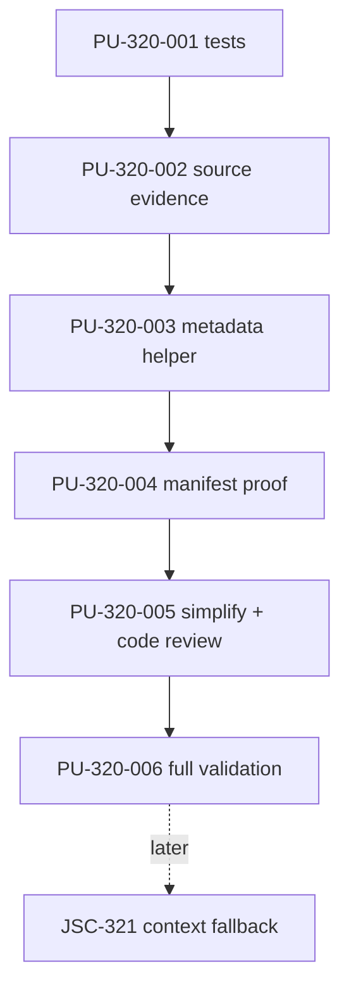
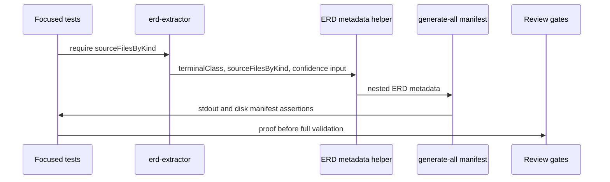

# JSC-320 ERD Source-Kind and Manifest Truth Plan

## Table of Contents
- [Command Summary](#command-summary)
- [Status Block](#status-block)
- [Objective](#objective)
- [Source Contract](#source-contract)
- [Scope and Boundaries](#scope-and-boundaries)
- [Current State / Evidence](#current-state--evidence)
- [Implementation Strategy](#implementation-strategy)
- [Work Units](#work-units)
- [Dependencies and Sequencing](#dependencies-and-sequencing)
- [Ownership and Approval Boundaries](#ownership-and-approval-boundaries)
- [Validation Gates](#validation-gates)
- [Review Plan](#review-plan)
- [Rollback Plan](#rollback-plan)
- [Risk Register](#risk-register)
- [Observability and Evidence](#observability-and-evidence)
- [Visual References / Diagrams](#visual-references--diagrams)
- [Accessibility and Operator Ergonomics](#accessibility-and-operator-ergonomics)
- [Open Questions](#open-questions)
- [Final Decision](#final-decision)
- [Linear Work Item Contract](#linear-work-item-contract)
- [Linear / Spec / Plan / PR Traceability](#linear--spec--plan--pr-traceability)
- [Appendix A. Harness Metadata / Traceability](#appendix-a-harness-metadata--traceability)
- [Appendix B. Linear / Tracker Handoff](#appendix-b-linear--tracker-handoff)
- [Appendix C. Review Outcomes](#appendix-c-review-outcomes)

## Command Summary

BLUF: Implement JSC-320 as a tests-first, additive metadata slice that exposes ERD source evidence and useful/degraded/unavailable manifest truth, because downstream agent context cannot safely reason from Mermaid comments or placeholder heuristics; the main risk is accidentally moving ERD-specific classification into the generic manifest writer or changing manifest schema compatibility.

Decision Needed: Proceed to `he-work` for JSC-320 only. Stop before implementation if JSC-319 proof is challenged, if additive nested metadata cannot satisfy the spec, or if any step requires public CLI/config changes, JSC-321 context copy, or a manifest schema migration.

Top Risks: Misclassifying no-source ERDs as useful because `erd.mmd` exists; guessing source kinds from output filenames; weakening placeholder detection to make tests pass; leaking ERD-specific rules into `toManifestEntry`; broadening into YAML, TypeScript, or context-pack fallback.

Next Action: Start with failing focused tests for JSON Schema, no-source, mixed source-kind summary, and generic manifest-writer preservation; then implement the smallest extractor/ERD metadata changes that satisfy those tests.

## Status Block

| Field | Value |
| --- | --- |
| `interactive_status` | ready_for_he_work |
| `selection_evidence` | JSC-320 spec, JSC-320 technical review, local Linear plan, live Linear issue evidence already captured in source spec |
| `route` | he-plan -> he-work |
| `stage` | execution_plan |
| `scope` | ERD metadata and generate-all manifest truth only |
| `source` | `.harness/specs/2026-05-13-JSC-320-erd-source-kind-manifest-truth-spec.md` |
| `plan_path` | `.harness/plan/2026-05-13-JSC-320-erd-source-kind-manifest-truth-plan.md` |
| `traceability` | JSC-318 parent; JSC-320 owning issue; JSC-319 prerequisite; JSC-321 downstream |
| `validation` | artifact gates plus focused tests, full tests, deep tests, repo fast verify, and two generate-all smoke commands |
| `phase_exit_reviews` | simplify review, bug-fix only for concrete failing evidence, code review, exact validation outcome recording |
| `safe_to_continue` | true |
| `blocked_reason` | none |
| `linear_action_required` | none before implementation |
| `linear_mutation_status` | already_linked |
| `post_plan_handoff` | he-work |
| `confidence` | 92%; strong candidate with validation gaps because live Linear, spec, source, and plan-review evidence are aligned, but JSC-320 implementation and runtime behavior have not yet run |

## Objective

Implement the JSC-320 P1 slice so `diagram-cli generate-all` emits ERD manifest metadata that explicitly identifies:

- which supported schema source kinds contributed to the ERD;
- which relative source files support that source-kind claim;
- whether the ERD is `useful`, `degraded`, or `unavailable`;
- why that availability state was assigned.

The plan must preserve current SQL/Prisma behavior, preserve `manifest.schemaVersion: "1.0"`, avoid public CLI/config changes, and keep JSC-321 context-pack copy out of scope.

## Source Contract

| Source ID | Requirement / Acceptance | Plan Mapping |
| --- | --- | --- |
| `FR-320-001` | Add `metadata.sourceKinds` | `PU-320-002`, `PU-320-003` |
| `FR-320-002` | Add `metadata.sourceKindSummary` with `none`, single-kind, and `mixed` states | `PU-320-002`, `PU-320-004` |
| `FR-320-003` | Add `metadata.availability` enum | `PU-320-003`, `PU-320-004` |
| `FR-320-004` | Add stable `metadata.availabilityReason` | `PU-320-003`, `PU-320-004` |
| `FR-320-005` | Add deterministic `metadata.sourceFilesByKind` | `PU-320-002`, `PU-320-004` |
| `FR-320-006` | Preserve metadata through `generate-all` manifest entries | `PU-320-001`, `PU-320-004` |
| `FR-320-007` / `SA-320-002` / `SA-320-003` | JSON Schema fixture is useful, non-placeholder, and source-kind truthful | `PU-320-001`, `PU-320-004`, `PU-320-006` |
| `FR-320-008` / `SA-320-004` | No-source fixture is unavailable with empty source evidence | `PU-320-001`, `PU-320-004`, `PU-320-006` |
| `FR-320-009` | Low-confidence extracted ERDs become degraded | `PU-320-001`, `PU-320-003` |
| `FR-320-010` / `SA-320-005` | SQL/Prisma behavior remains compatible | `PU-320-001`, `PU-320-006` |
| `FR-320-011` / `SA-320-006` | No public CLI/config/schema-version change | `PU-320-005`, `PU-320-006` |
| `FR-320-012` / `SA-320-010` | Keep `toManifestEntry` ERD-agnostic | `PU-320-001`, `PU-320-005` |
| `SA-320-007` | Do not modify JSC-321 context fallback | `PU-320-005` |
| `SA-320-008` | Record manifest snippets or paths as closeout evidence | `PU-320-006` |
| `SA-320-009` | Test mixed-source behavior | `PU-320-001`, `PU-320-004` |

## Scope and Boundaries

Allowed paths and areas:

- `src/schema/erd-extractor.js`
- `src/core/analysis-generation-diagrams-erd.js`
- `test/erd-extractor.test.js`
- `test/generate-output-json.test.js`
- `test/evidence-manifest-parity.test.js`
- `test/fixtures/erd/**` only for focused JSC-320 fixtures if helper tests are insufficient
- `.harness/evals/**` only if closeout/eval is explicitly requested after implementation

Forbidden paths and areas for this plan:

- `src/context/**` and context-pack guidance for JSC-321
- public CLI command/flag behavior
- `.diagramrc` or new public config fields
- `manifest.schemaVersion` migration
- YAML schema parsing
- TypeScript contract extraction
- remote or cross-file `$ref` support
- renderer or Mermaid syntax redesign
- Linear mutation without explicit approval

Stop conditions:

- Additive nested metadata cannot represent the required truth.
- Implementation would need top-level manifest field changes or schema-version migration.
- Tests require weakening `isPlaceholderDiagram`.
- JSC-319 JSON Schema fixture proof is challenged.
- Work touches JSC-321 context fallback or unrelated repo cleanup.

## Current State / Evidence

| Evidence | Current State | Planning Impact |
| --- | --- | --- |
| `src/core/analysis-generation-diagrams-erd.js` | `buildErdMetadata` centralizes ERD metadata but lacks `sourceKinds`, `sourceKindSummary`, `sourceFilesByKind`, `availability`, and `availabilityReason`. | Main implementation target for ERD truth. |
| `src/schema/erd-extractor.js` | Extractor exposes `sourceFiles`, `sourcePrecedence`, terminal classes, diagnostics, and model, but not a source-kind-to-file map. | Add structured source evidence here or prove deterministic derivation in tests. |
| `src/core/analysis-generation-diagrams.js` | `toManifestEntry` generically preserves metadata and computes `isPlaceholder`. | Keep generic; add regression test that metadata preservation is enough. |
| `src/commands/generate-all.js` | Passes each diagram artifact metadata to `toManifestEntry`. | No expected change unless a test proves a missing metadata pass-through. |
| `src/schema/erd-confidence.js` | Provides `publishable`, `publishable_with_marker`, and `fail_confidence`. | Use as the source of `useful`, `degraded`, and `unavailable` mapping. |
| `test/generate-output-json.test.js` | Existing generate-all ERD metadata assertions for Prisma fixture. | Extend here for manifest metadata behavior. |
| `test/evidence-manifest-parity.test.js` | Existing manifest disk/stdout parity and schema version assertions. | Add or preserve parity around new metadata if needed. |
| `test/erd-extractor.test.js` | Existing extractor tests cover JSON Schema fixture, no-source, helper dispatch, and relationship inference. | Add source evidence helper assertions here if extractor owns `sourceFilesByKind`. |

## Implementation Strategy

Use a proof-first sequence:

1. Add tests that express the spec contract before changing production code.
2. Add structured source evidence at the extractor boundary or a small deterministic helper, preferring extractor output because it already knows each source kind while scanning.
3. Add a small ERD metadata helper near `buildErdMetadata` to compute `sourceKinds`, `sourceKindSummary`, `sourceFilesByKind`, `availability`, and `availabilityReason`.
4. Let `generate-all` carry the metadata through the existing artifact path.
5. Review the diff specifically for scope creep and manifest-writer coupling.
6. Run focused, full, deep, and smoke validation, then record manifest snippets or artifact paths.

Implementation-time unknown:

- Whether a mixed-source fixture is simpler than a helper-level test. The plan allows either, but `sourceKindSummary: "mixed"` must be proven.

## Work Units

### PU-320-001: Add Contract-First Tests

Objective: Create failing tests that pin the JSC-320 metadata contract before production edits.

Source trace:

- `FR-320-001` through `FR-320-012`
- `SA-320-002`, `SA-320-003`, `SA-320-004`, `SA-320-009`, `SA-320-010`

Allowed paths:

- `test/generate-output-json.test.js`
- `test/evidence-manifest-parity.test.js`
- `test/erd-extractor.test.js`
- `test/fixtures/erd/**` for a tiny mixed-source fixture only if helper tests are not enough

Forbidden paths:

- production code
- context-pack code
- manifest schema files or public CLI docs

Steps:

1. Extend generate-all ERD metadata tests to assert JSON Schema fixture metadata:
   - `metadata.sourceKinds` equals `["json-schema"]`.
   - `metadata.sourceKindSummary` equals `"json-schema"`.
   - `metadata.sourceFilesByKind` equals `{ "json-schema": ["manifest.schema.json"] }`.
   - `metadata.availability` equals `"useful"`.
   - `metadata.availabilityReason` is stable.
   - `isPlaceholder` is `false`.
2. Add no-source generate-all assertion:
   - `metadata.sourceKinds` equals `[]`.
   - `metadata.sourceKindSummary` equals `"none"`.
   - `metadata.sourceFilesByKind` equals `{}`.
   - `metadata.availability` equals `"unavailable"`.
   - `isPlaceholder` remains `true`.
3. Add mixed-source assertion through a helper test or a tiny fixture:
   - source kinds sorted by `SOURCE_PRECEDENCE`;
   - `sourceKindSummary` equals `"mixed"`;
   - `sourceFilesByKind` includes all contributing source kinds.
4. Add or preserve assertion that `toManifestEntry` still only preserves supplied metadata and does not classify ERD availability itself.

Validation:

- `npm test -- test/generate-output-json.test.js test/evidence-manifest-parity.test.js test/erd-extractor.test.js`
- Expected before production edits: fail on missing JSC-320 metadata. Record that first expected failure once as TDD evidence, then continue only after production code changes; do not repeatedly rerun the same deterministic failure without new implementation evidence.

Stop condition:

- Stop and revise the spec if tests require top-level manifest fields or schema-version changes.

Rollback:

- Remove only the new JSC-320 test cases and fixtures.

Handoff state:

- Continue to `PU-320-002` after tests fail for the expected missing metadata fields.

### PU-320-002: Expose Structured Source Evidence

Objective: Make extraction output expose deterministic source-kind-to-file evidence so metadata does not guess from generated artifact names or comments.

Source trace:

- `FR-320-001`
- `FR-320-002`
- `FR-320-005`
- `NFR-320-001`
- `NFR-320-002`
- `SA-320-002`
- `SA-320-004`
- `SA-320-009`

Allowed paths:

- `src/schema/erd-extractor.js`
- `test/erd-extractor.test.js`

Forbidden paths:

- `src/core/analysis-generation-diagrams.js`
- `src/context/**`
- parser expansion for YAML/TypeScript

Steps:

1. Add `sourceFilesByKind` to the extractor result, initialized as `{}`.
2. When a source file parses successfully, append its repo-relative path under the active source kind.
3. Sort each path array and omit empty source-kind keys.
4. Preserve existing `sourceFiles` behavior as the sorted compatibility union.
5. Add helper assertions for:
   - JSON Schema fixture;
   - no-source fixture;
   - mixed source-kind behavior by helper or fixture.

Validation:

- `npm test -- test/erd-extractor.test.js`

Stop condition:

- Stop if the cleanest implementation requires changing source precedence semantics or parser dispatch contract.

Rollback:

- Remove `sourceFilesByKind` result field and related tests.

Handoff state:

- Continue to `PU-320-003` after extractor evidence tests pass.

### PU-320-003: Add ERD Metadata Classification Helper

Objective: Centralize source-kind summary and availability mapping near ERD artifact generation.

Source trace:

- `FR-320-001` through `FR-320-005`
- `FR-320-009`
- `NFR-320-003`
- `NFR-320-005`

Allowed paths:

- `src/core/analysis-generation-diagrams-erd.js`
- focused tests that exercise generated metadata

Forbidden paths:

- `src/core/analysis-generation-diagrams.js` except if a test proves generic metadata preservation is broken
- `src/context/**`

Steps:

1. Add a small helper near `buildErdMetadata` to normalize source evidence:
   - `sourceFilesByKind`
   - `sourceKinds`
   - `sourceKindSummary`
2. Add a small helper to map terminal class and confidence outcome:
   - `completed + publishable + sourceKinds.length > 0` -> `useful`
   - `completed + publishable_with_marker` -> `degraded`
   - `failed_no_schema`, `failed_parse`, or `fail_confidence` -> `unavailable`
3. Emit `availabilityReason` using stable snake-case tokens from the spec.
4. Preserve existing metadata fields:
   - `purpose`
   - `consumers`
   - `source`
   - `extractionInvoked`
   - `terminalClass`
   - `schemaSources`
   - `sourcePrecedence`
   - `compactEligible`
   - `confidence`

Validation:

- `npm test -- test/generate-output-json.test.js test/erd-extractor.test.js`

Stop condition:

- Stop if availability cannot be derived without parsing Mermaid comments.

Rollback:

- Remove classification helpers and added metadata fields.

Handoff state:

- Continue to `PU-320-004` after focused generated metadata tests pass.

### PU-320-004: Prove Generate-All Manifest Truth

Objective: Prove `generate-all` preserves the ERD truth metadata in both stdout and disk manifest outputs.

Source trace:

- `FR-320-006`
- `FR-320-007`
- `FR-320-008`
- `SA-320-002`
- `SA-320-003`
- `SA-320-004`
- `SA-320-008`

Allowed paths:

- `test/generate-output-json.test.js`
- `test/evidence-manifest-parity.test.js`
- fixture-local `.diagram-jsc-320-*` smoke output directories during validation

Forbidden paths:

- manifest schema migration
- public CLI behavior changes
- context-pack code

Steps:

1. Ensure JSON stdout manifest and disk `manifest.json` agree for ERD metadata.
2. Run contract fixture smoke:
   - `node src/diagram.js generate-all test/fixtures/erd/contract-schema-json --output-dir .diagram-jsc-320-contract --format json --deterministic --quiet`
3. Run no-source fixture smoke:
   - `node src/diagram.js generate-all test/fixtures/erd/no-schema --output-dir .diagram-jsc-320-no-schema --format json --deterministic --quiet`
4. Record compact manifest snippets or file paths in implementation closeout/eval.
5. Remove generated fixture-local `.diagram-jsc-320-*` directories after evidence is recorded.

Validation:

- `npm test -- test/generate-output-json.test.js test/evidence-manifest-parity.test.js test/erd-extractor.test.js`
- The two smoke commands above.

Stop condition:

- Stop if proof requires changing `manifest.schemaVersion` or adding top-level ERD manifest fields.

Rollback:

- Remove generate-all-specific JSC-320 tests and metadata changes.

Handoff state:

- Continue to `PU-320-005` after manifest truth is proven.

### PU-320-005: Scope, Simplicity, and Boundary Review

Objective: Verify the implementation stayed inside the JSC-320 contract before broad validation.

Source trace:

- `FR-320-011`
- `FR-320-012`
- `SA-320-006`
- `SA-320-007`
- `SA-320-010`

Allowed paths:

- review artifacts if needed under `.harness/review/**`
- source/test diff inspection

Forbidden paths:

- source edits unless a review finding requires a focused correction

Steps:

1. Run a simplify review over the JSC-320 diff:
   - check for duplicated metadata classification logic;
   - check that helpers are small and local;
   - check that `toManifestEntry` remains generic.
2. Run code review over the phase diff:
   - check no public CLI/config changes;
   - check no context-pack changes;
   - check no schema migration;
   - check SQL/Prisma compatibility assertions.
3. Run bug-fix workflow only if validation or review finds concrete failing evidence.

Validation:

- Review evidence recorded in implementation closeout or `.harness/review/**`.
- `git diff -- src/schema/erd-extractor.js src/core/analysis-generation-diagrams-erd.js src/core/analysis-generation-diagrams.js test/generate-output-json.test.js test/evidence-manifest-parity.test.js test/erd-extractor.test.js test/fixtures/erd`

Stop condition:

- Stop if review finds JSC-321 work, manifest schema migration, or generic manifest writer coupling.

Rollback:

- Revert the offending scoped change, not unrelated workspace files.

Handoff state:

- Continue to `PU-320-006` after review gates pass or all concrete findings are resolved.

### PU-320-006: Full Validation and Closeout Evidence

Objective: Run the required implementation gates and capture evidence for JSC-320 closeout.

Source trace:

- all `SA-320-*`
- source spec validation plan
- Linear closeout evidence requirement

Allowed paths:

- `.harness/evals/**` only if creating a closeout eval is explicitly requested
- `.harness/review/**` for review evidence if needed
- fixture-local `.diagram-jsc-320-*` directories for smoke outputs

Forbidden paths:

- Linear mutation without explicit approval
- commits/PRs unless separately requested

Steps:

1. Run focused implementation tests.
2. Run full repo tests.
3. Run deep regression.
4. Run fast repo verification.
5. Run the two generate-all smoke commands.
6. Record exact pass/fail/blocked outcomes and manifest snippet/file path evidence.
7. If all evidence passes, hand off to JSC-321 spec/plan or JSC-320 closure flow according to user direction.

Validation:

- `npm test -- test/evidence-manifest-parity.test.js test/erd-extractor.test.js`
- `npm test -- test/generate-output-json.test.js test/evidence-manifest-parity.test.js test/erd-extractor.test.js`
- `npm test`
- `npm run test:deep`
- `bash scripts/verify-work.sh --fast`
- `node src/diagram.js generate-all test/fixtures/erd/contract-schema-json --output-dir .diagram-jsc-320-contract --format json --deterministic --quiet`
- `node src/diagram.js generate-all test/fixtures/erd/no-schema --output-dir .diagram-jsc-320-no-schema --format json --deterministic --quiet`

Stop condition:

- Stop if the same deterministic blocker repeats twice, if unrelated dirty files would be touched, or if validation evidence contradicts a spec acceptance criterion.

Rollback:

- Remove JSC-320 metadata helpers, extractor source evidence field, and focused tests while preserving JSC-319 JSON Schema extraction.

Handoff state:

- `explicit_stop` after reporting evidence, unless the user has explicitly authorized implementation continuation into the next HE phase.

## Dependencies and Sequencing



Sequencing rules:

- `PU-320-001` must happen before production edits.
- `PU-320-002` should happen before metadata classification so source-kind truth is structured.
- `PU-320-004` must prove both JSON stdout and disk manifest behavior before full validation.
- `PU-320-005` must happen before any commit/PR closeout.
- JSC-321 work remains blocked until JSC-320 metadata exists and is proven.

## Ownership and Approval Boundaries

| Area | Owner / Decision Authority | Plan Rule |
| --- | --- | --- |
| JSC-320 implementation execution | `he-work` implementer for the active plan unit | Continue only the first incomplete or evidence-missing `PU-320-*` unit; preserve unrelated dirty files. |
| Scope, product, and tracker decisions | Jamie / Linear issue owner | Stop before public CLI/config changes, manifest schema migration, JSC-321 context fallback, Linear mutation, or tracker closure. |
| Source-kind and availability contract | JSC-320 spec owner | If implementation proof requires different field names, enum values, or derivation rules, update the spec before continuing. |
| Review gates | Implementer coordinates; independent review evidence required before commit/PR closeout | Run simplify review, bug-fix only for concrete failing evidence, code review, and validation outcome recording before closeout. |
| Validation evidence | Implementer | Record exact commands as `pass`, `fail`, or `blocked` with concrete blocker text; no validator pass may be inferred from plan text. |
| Artifact persistence | Implementer | If closeout creates `.harness/evals/**` or `.harness/solutions/**`, verify persistence/git-ignore behavior or mark persistence blocked instead of assuming the artifact is trackable. |

## Validation Gates

| Gate | Required | Command / Evidence | Expected Outcome |
| --- | --- | --- | --- |
| Plan BLUF | yes | `python3 /Users/jamiecraik/dev/agent-skills/Plugins/harness-engineering/scripts/check_bluf_structure.py .harness/plan/2026-05-13-JSC-320-erd-source-kind-manifest-truth-plan.md --json` | pass |
| Plan artifact shape | yes | `python3 /Users/jamiecraik/dev/agent-skills/Plugins/harness-engineering/scripts/check_generated_artifact_shape.py .harness/plan/2026-05-13-JSC-320-erd-source-kind-manifest-truth-plan.md --kind plan --json` | pass |
| Artifact identity | yes | `python3 /Users/jamiecraik/dev/agent-skills/Infrastructure/scripts/validation-and-linting/he_artifact_identity_lint.py .harness/plan/2026-05-13-JSC-320-erd-source-kind-manifest-truth-plan.md` | pass |
| Linear traceability | yes | `python3 /Users/jamiecraik/dev/agent-skills/Infrastructure/scripts/validation-and-linting/he_linear_traceability_lint.py .harness/plan/2026-05-13-JSC-320-erd-source-kind-manifest-truth-plan.md` | pass |
| Frontmatter safety | yes | `python3 /Users/jamiecraik/dev/agent-skills/Infrastructure/scripts/validation-and-linting/he_frontmatter_safety_lint.py .harness/plan/2026-05-13-JSC-320-erd-source-kind-manifest-truth-plan.md` | pass |
| Focused phase tests | yes | `npm test -- test/evidence-manifest-parity.test.js test/erd-extractor.test.js` | pass after implementation |
| Focused manifest tests | yes | `npm test -- test/generate-output-json.test.js test/evidence-manifest-parity.test.js test/erd-extractor.test.js` | pass after implementation |
| Full test suite | yes | `npm test` | pass before closeout |
| Deep regression | yes | `npm run test:deep` | pass before closeout |
| Fast repo verify | yes | `bash scripts/verify-work.sh --fast` | pass or blocked with exact reason |
| Contract fixture smoke | yes | `node src/diagram.js generate-all test/fixtures/erd/contract-schema-json --output-dir .diagram-jsc-320-contract --format json --deterministic --quiet` | pass and show useful JSON Schema metadata |
| No-source fixture smoke | yes | `node src/diagram.js generate-all test/fixtures/erd/no-schema --output-dir .diagram-jsc-320-no-schema --format json --deterministic --quiet` | pass and show unavailable no-source metadata |

Pre-implementation validation status:

- Existing focused baseline from the spec review passed: `npm test -- test/generate-output-json.test.js test/evidence-manifest-parity.test.js test/erd-extractor.test.js` -> pass, `28 passing`.
- JSC-320-specific metadata assertions are expected to fail before implementation because production code does not yet emit the new fields.

## Review Plan

Before closeout, run these review gates over the JSC-320 diff:

| Review | Trigger | Required Focus | Output |
| --- | --- | --- | --- |
| Simplify review | after focused tests pass | Remove duplicate classification logic, keep helpers local, avoid generic manifest coupling | concise review note or `.harness/review/**` artifact |
| Code review | after simplify fixes | Logic errors, compatibility regressions, boundary violations, missing tests | concise review note or `.harness/review/**` artifact |
| Bug-fix pass | only when failing evidence exists | Fix concrete failures, not speculative issues | exact failure and fix evidence |
| Scope review | before closeout | No JSC-321, YAML, TypeScript, CLI/config, schema migration, or unrelated cleanup | closeout summary |

Exit rule:

1. Do not commit or request PR closeout until simplify review, code review, and required validation gates have exact outcomes.
2. Run the bug-fix pass only when a validator, smoke command, or review finding supplies concrete failing evidence.
3. If a review gate finds a blocker, return to the smallest affected `PU-320-*` unit and re-run only the evidence needed to prove the correction before broad validation.
4. Treat missing, stale, or ignored review/eval artifacts as `blocked`, not `pass`.

## Rollback Plan

Rollback is scoped to JSC-320 only:

1. Remove `sourceFilesByKind` and related source evidence changes.
2. Remove ERD metadata classification helpers and the new metadata fields.
3. Remove or update focused JSC-320 tests and fixtures.
4. Preserve JSC-319 JSON Schema extraction, fixtures, diagnostics, and tests unless a failing JSC-320 gate proves the defect belongs to JSC-319.
5. Re-run:
   - `npm test -- test/erd-extractor.test.js`
   - `npm test -- test/generate-output-json.test.js test/evidence-manifest-parity.test.js test/erd-extractor.test.js`

Rollback must not revert unrelated dirty files.

## Risk Register

| Risk | Likelihood | Impact | Mitigation | Stop Rule |
| --- | --- | --- | --- | --- |
| Source kind guessed from comments or filenames | Medium | High | Add `sourceFilesByKind` at extractor boundary or deterministic helper with tests | Stop if no structured proof exists |
| Generic manifest writer becomes ERD-aware | Medium | Medium | Keep classification in ERD artifact metadata; review `toManifestEntry` diff | Stop if `toManifestEntry` inspects ERD terminal/confidence/source paths |
| No-source ERD marked useful | Medium | High | Add no-source manifest test and smoke command | Stop if `availability` is not `unavailable` |
| Mixed-source behavior untested | Medium | Medium | Add helper or fixture test for `mixed` | Stop before closeout if `SA-320-009` lacks evidence |
| SQL/Prisma compatibility regression | Low-medium | High | Preserve existing tests and extend assertions additively | Stop on regression |
| Context fallback work slips in | Medium | Medium | Forbidden path review for `src/context/**` | Stop and defer to JSC-321 |
| Manifest schema migration sneaks in | Low | High | Assert `manifest.schemaVersion` remains `1.0` | Stop for owner decision |
| Phase appears complete without review evidence | Medium | Medium | Require simplify review, concrete bug-fix evidence when applicable, code review, and exact validation outcomes before closeout | Stop before commit/PR closeout |
| Closeout/eval artifacts are created but ignored | Medium | Low-medium | Verify persistence if `.harness/evals/**` or `.harness/solutions/**` are used; otherwise mark persistence blocked | Stop artifact claims until persistence is proven |

## Observability and Evidence

Implementation closeout must include:

- exact validation command outcomes;
- ERD manifest snippet for JSON Schema fixture showing:
  - `sourceKinds: ["json-schema"]`
  - `sourceKindSummary: "json-schema"`
  - `sourceFilesByKind: {"json-schema": ["manifest.schema.json"]}`
  - `availability: "useful"`
  - `isPlaceholder: false`
- ERD manifest snippet for no-source fixture showing:
  - `sourceKinds: []`
  - `sourceKindSummary: "none"`
  - `sourceFilesByKind: {}`
  - `availability: "unavailable"`
  - `isPlaceholder: true`
- evidence that `manifest.schemaVersion` remains `"1.0"`;
- review evidence for `toManifestEntry` remaining generic.

## Visual References / Diagrams

The diagram is execution guidance only. The work unit tables and validation gates are authoritative.



Visual reference decision: Mermaid is sufficient. No generated image is needed because this plan is a code/data-contract execution plan, not a UI or media spec.

## Accessibility and Operator Ergonomics

- Keep metadata values textual and non-color-only.
- Keep closeout snippets small enough for reviewers to inspect in terminal output or review artifacts.
- Do not require reviewers to read Mermaid comments to understand ERD availability.
- Use stable enum names and relative paths so humans and agents can compare outputs deterministically.

## Open Questions

| Question | Status | Plan Handling |
| --- | --- | --- |
| Should mixed-source proof use a fixture or helper test? | implementation-time unknown | Choose the smallest stable option during `PU-320-001`; either is valid if `SA-320-009` is proven. |
| Should `sourceFilesByKind` be generated in extractor or in an ERD metadata helper? | implementation-time unknown with preference | Prefer extractor-owned evidence. A helper is acceptable only if tests prove deterministic source-kind derivation and the spec is updated if naming/derivation changes. |
| Should closeout create an eval artifact? | user/phase decision | This plan records required closeout evidence but does not create eval artifacts unless `he-eval-report` or equivalent is requested after implementation. |

## Final Decision

Proceed to `he-work` for JSC-320. The first implementation step is `PU-320-001`, contract-first tests. Do not begin JSC-321 or any broader contract-source expansion during this plan.

## Linear Work Item Contract

| Field | Value |
| --- | --- |
| Parent issue | `JSC-318` |
| Owning issue | `JSC-320` |
| Owning issue title | `JSC-318 P1: Make ERD source-kind and unavailable state truthful` |
| Owning issue status | Backlog |
| Owning issue priority | High |
| Owning issue project | Diagram product surface and analysis workflow |
| Owning issue URL | `https://linear.app/jscraik/issue/JSC-320/jsc-318-p1-make-erd-source-kind-and-unavailable-state-truthful` |
| Prerequisite issue | `JSC-319` |
| Downstream issue | `JSC-321` |
| Required next stage | `he-work` |
| Closure rule | `JSC-320` is not complete until source-kind metadata, source evidence, useful JSON Schema state, unavailable no-source state, mixed-source behavior, and SQL/Prisma compatibility are proven with exact command evidence |
| External mutation status | No Linear mutation was performed by this plan pass |

## Linear / Spec / Plan / PR Traceability

| Linear issue | Source acceptance IDs | Plan units | Acceptance IDs | PR evidence |
| --- | --- | --- | --- | --- |
| `JSC-318` | Parent requires useful contract-schema ERD, truthful manifest/degraded state, and context fallback guidance | `PU-320-001` through `PU-320-006` for P1 only | `SA-320-001` through `SA-320-010` | pending implementation PR/evidence |
| `JSC-320` | `FR-320-001` through `FR-320-012`; `SA-320-001` through `SA-320-010` | `PU-320-001` through `PU-320-006` | `SA-320-001` through `SA-320-010` | pending implementation PR/evidence |
| `JSC-319` | JSON Schema logical ERD extraction proof | prerequisite only; no JSC-319 work planned | supports `SA-320-002` and `SA-320-003` | local proof exists; no JSC-319 changes planned |
| `JSC-321` | Context-pack unavailable ERD fallback guidance | explicitly not included | guarded by `SA-320-007` | blocked until JSC-320 metadata proof exists |

## Appendix A. Harness Metadata / Traceability

| Field | Value |
| --- | --- |
| Parent issue | `JSC-318` |
| Owning issue | `JSC-320` |
| Source spec | `.harness/specs/2026-05-13-JSC-320-erd-source-kind-manifest-truth-spec.md` |
| Source technical review | `.harness/review/2026-05-13-JSC-320-erd-source-kind-manifest-truth-technical-review.md` |
| Source Linear plan | `.harness/linear/2026-05-13-JSC-318-contract-schema-erd-linear-plan.md` |
| Plan path | `.harness/plan/2026-05-13-JSC-320-erd-source-kind-manifest-truth-plan.md` |
| Next stage | `he-work` |
| Linear mutation | not required before implementation |

## Appendix B. Linear / Tracker Handoff

| Linear issue | Source acceptance IDs | Plan units | Acceptance IDs | PR evidence |
| --- | --- | --- | --- | --- |
| `JSC-318` | Parent requires useful contract-schema ERD, truthful manifest/degraded state, and context fallback guidance | `PU-320-001` through `PU-320-006` for P1 only | `SA-320-001` through `SA-320-010` | pending implementation PR/evidence |
| `JSC-320` | Source-kind metadata, source evidence, useful/degraded/unavailable manifest truth, additive compatibility | `PU-320-001` through `PU-320-006` | `SA-320-001` through `SA-320-010` | pending implementation PR/evidence |
| `JSC-319` | JSON Schema logical ERD extraction proof | prerequisite only | supports `SA-320-002`, `SA-320-003` | local proof exists; no JSC-319 changes planned |
| `JSC-321` | Context-pack unavailable ERD fallback guidance | not included | guarded by `SA-320-007` | blocked until JSC-320 metadata proof exists |

Ready tracker note after implementation evidence exists:

```md
JSC-320 implementation evidence:
- Focused tests: pending until he-work records exact pass, fail, or blocked outcome.
- Full tests: pending until he-work records exact pass, fail, or blocked outcome.
- Deep tests: pending until he-work records exact pass, fail, or blocked outcome.
- Fast verify: pending until he-work records exact pass, fail, or blocked outcome.
- Contract fixture manifest: pending until he-work records the manifest path or compact snippet.
- No-source fixture manifest: pending until he-work records the manifest path or compact snippet.
- Deferred scope: JSC-321 context fallback, YAML, TypeScript, manifest schema migration.
```

## Appendix C. Review Outcomes

| Check | Result | Evidence / Notes |
| --- | --- | --- |
| Canonical source clear | pass | JSC-320 spec and technical review exist and point to live Linear issue |
| Scope bounded | pass | Plan excludes JSC-321, YAML, TypeScript, public CLI/config changes, and schema migration |
| Stable plan units | pass | `PU-320-001` through `PU-320-006` |
| Acceptance mapping | pass | `SA-320-001` through `SA-320-010` mapped to work units |
| Validation defined | pass | Focused, full, deep, fast verify, and smoke gates listed |
| Rollback defined | pass | JSC-320-only rollback keeps JSC-319 intact |
| Implementation readiness | pass | Ready for `he-work`, starting with contract-first tests |
| Implementation evidence | blocked | Requires `he-work` execution |
