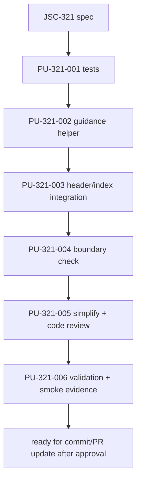

# JSC-321 ERD Unavailable Context Fallback Plan

## Table of Contents
- [Command Summary](#command-summary)
- [Status Block](#status-block)
- [Objective](#objective)
- [Source Contract](#source-contract)
- [Scope and Boundaries](#scope-and-boundaries)
- [Current State / Evidence](#current-state--evidence)
- [Implementation Strategy](#implementation-strategy)
- [Work Units](#work-units)
- [Dependencies and Sequencing](#dependencies-and-sequencing)
- [Ownership and Approval Boundaries](#ownership-and-approval-boundaries)
- [Validation Gates](#validation-gates)
- [Review Plan](#review-plan)
- [Rollback Plan](#rollback-plan)
- [Risk Register](#risk-register)
- [Observability and Evidence](#observability-and-evidence)
- [Visual References / Diagrams](#visual-references--diagrams)
- [Accessibility and Operator Ergonomics](#accessibility-and-operator-ergonomics)
- [Open Questions](#open-questions)
- [Professional Confidence Review](#professional-confidence-review)
- [Evidence Pack](#evidence-pack)
- [Iterative Re-review Loop](#iterative-re-review-loop)
- [Final Decision](#final-decision)
- [Linear Work Item Contract](#linear-work-item-contract)
- [Linear / Spec / Plan / PR Traceability](#linear--spec--plan--pr-traceability)
- [Appendix A. Harness Metadata / Traceability](#appendix-a-harness-metadata--traceability)
- [Appendix B. Linear / Tracker Handoff](#appendix-b-linear--tracker-handoff)
- [Appendix C. Review Outcomes](#appendix-c-review-outcomes)

## Command Summary

BLUF: This plan turns the JSC-321 spec into a tests-first context-pack implementation path for the developer or agent executing the next phase. It will change the AI context pack so agents see stable ERD availability guidance when manifest metadata says the ERD is unavailable, degraded, missing, or unknown, while preserving normal output for useful ERDs. The work matters because context packs are used as compressed reasoning evidence, and a placeholder ERD without fallback guidance can mislead agents into trusting nonexistent domain-model coverage. Execution is bounded to `test/context-pack.test.js` and `src/context/build-context-pack.js`; the main stop risk is discovering that JSC-320 metadata is absent or incompatible on the implementation branch. The handoff is `he-work` after this plan passes artifact, BLUF, and traceability validation.

Decision Needed: Proceed to `he-work` for JSC-321 only. Stop before implementation if JSC-320 metadata fields are absent, if guidance cannot be derived from manifest entries without schema migration, or if the work requires public CLI changes, new parsers, renderer changes, or Linear mutation.

Top Risks: Warning text attached only to embedded ERD content and disappearing under budget; inventing a second fallback priority order; treating missing metadata as useful; referencing fallback diagrams that were not generated; over-warning useful ERDs; widening into context-pack redesign.

Next Action: Confirm the JSC-320 metadata prerequisite is present on the implementation branch, then start with focused failing tests in `test/context-pack.test.js` before adding the smallest local guidance helper and integration in `src/context/build-context-pack.js`.

## Status Block

| Field | Value |
| --- | --- |
| `interactive_status` | ready_for_he_work |
| `selection_evidence` | JSC-321 spec; JSC-320 prerequisite spec; local Linear plan; source review of context-pack builder and artifact priority |
| `route` | he-plan -> he-work |
| `stage` | execution_plan |
| `scope` | context-pack ERD availability guidance only |
| `source` | `.harness/specs/2026-05-13-JSC-321-erd-unavailable-context-fallback-spec.md` |
| `plan_path` | `.harness/plan/2026-05-13-JSC-321-erd-unavailable-context-fallback-plan.md` |
| `traceability` | JSC-318 parent; JSC-319/JSC-320 prerequisites; JSC-321 owning issue |
| `validation` | artifact gates plus prerequisite metadata probe, focused context-pack tests, metadata compatibility tests, baseline tests, deep tests, repo fast verify, and two context-output smoke checks |
| `phase_exit_reviews` | simplify review, bug-fix only for concrete failing evidence, code review, exact validation outcome recording |
| `safe_to_continue` | true |
| `blocked_reason` | none |
| `linear_action_required` | none before implementation |
| `linear_mutation_status` | already_linked |
| `post_plan_handoff` | he-work |
| `confidence` | 92%; implementation-ready candidate with runtime validation gaps because the plan is grounded in the reviewed spec and local code evidence, but implementation and runtime context-output behavior have not been changed or validated yet |

## Objective

Implement the JSC-321 P2 slice so `.diagram/context/diagram-context.md` tells agents when ERD evidence is unavailable, degraded, missing, or unknown based on manifest metadata, and points them to safer generated fallback artifacts.

The implementation must keep useful ERDs quiet, keep guidance deterministic, reuse existing manifest priority ordering, and avoid public CLI, parser, renderer, and manifest schema changes.

## Source Contract

| Source ID | Requirement / Acceptance | Plan Mapping |
| --- | --- | --- |
| `FR-321-001` | Treat `entry.type === "erd"` manifest metadata as authoritative availability source. | `PU-321-001`, `PU-321-002`, `PU-321-003` |
| `FR-321-002` / `SA-321-002` | Unavailable ERDs include unavailable guidance and stable reason. | `PU-321-001`, `PU-321-002`, `PU-321-006` |
| `FR-321-003` / `SA-321-003` | Degraded ERDs include caution/corroboration guidance and stable reason. | `PU-321-001`, `PU-321-002`, `PU-321-006` |
| `FR-321-004` / `SA-321-004` | Useful ERDs preserve normal output and avoid warning copy. | `PU-321-001`, `PU-321-003`, `PU-321-006` |
| `FR-321-005` / `SA-321-006` | Fallback guidance references only manifest-present diagrams or source metadata. | `PU-321-001`, `PU-321-002`, `PU-321-003` |
| `FR-321-006` / `SA-321-005` | Availability guidance does not parse Mermaid comments when metadata exists. | `PU-321-001`, `PU-321-002` |
| `FR-321-007` / `FR-321-013` / `SA-321-007` | Missing or unknown availability metadata produces conservative guidance, not a false useful claim. | `PU-321-001`, `PU-321-002`, `PU-321-006` |
| `FR-321-008` / `SA-321-008` | Output remains deterministic for identical input. | `PU-321-001`, `PU-321-003`, `PU-321-006` |
| `FR-321-009` | Guidance fits existing context budget behavior. | `PU-321-001`, `PU-321-003`, `PU-321-006` |
| `FR-321-010` / `SA-321-009` | No public CLI, manifest schema, or Mermaid syntax changes. | `PU-321-004`, `PU-321-006` |
| `FR-321-011` | Guidance uses stable `Status`, `Reason`, and `Fallback evidence` labels. | `PU-321-001`, `PU-321-002`, `PU-321-006` |
| `FR-321-012` | Fallback ordering reuses existing sorted manifest priority and excludes ERD. | `PU-321-001`, `PU-321-002`, `PU-321-003` |
| `TR-321-001` through `TR-321-006` | Technical review risks around placement, priority, missing metadata, privacy, string stability, and useful-ERD non-warning behavior. | `PU-321-001` through `PU-321-006` |
| `SA-321-010` | Validation gates pass or are recorded as blocked with exact reasons. | `PU-321-006` |

## Scope and Boundaries

Allowed paths and areas:

- `src/context/build-context-pack.js`
- `test/context-pack.test.js`
- `.harness/plan/2026-05-13-JSC-321-erd-unavailable-context-fallback-plan.md`
- `.harness/specs/2026-05-13-JSC-321-erd-unavailable-context-fallback-spec.md` only if implementation reveals a spec contradiction
- `.harness/evals/**` only if closeout/eval is explicitly requested after implementation

Forbidden paths and areas for this plan:

- `src/schema/**` extractor changes
- `src/core/analysis-generation-diagrams-erd.js` metadata generation changes unless JSC-320 prerequisite evidence is missing and the plan stops for reconciliation
- public CLI command or flag behavior
- `.diagramrc` or public config behavior
- top-level manifest schema version migration
- YAML, TypeScript, remote-reference, or cross-file-reference parsing
- renderer or Mermaid syntax redesign
- broad context-pack layout rewrite
- `.diagram/agent-context.json` changes
- Linear/GitHub mutation without explicit approval
- unrelated repo cleanup or changes to current unrelated dirty files

Stop conditions:

- JSC-320 metadata fields are absent or incompatible on the implementation branch.
- Guidance requires a top-level manifest schema migration.
- Tests require parsing Mermaid comments as the authoritative availability source.
- The ERD guidance cannot fit the existing context budget model without broad layout redesign.
- Implementation needs changes outside allowed paths.
- The same deterministic validation failure repeats twice during heartbeat execution.

## Current State / Evidence

| Evidence | Current State | Planning Impact |
| --- | --- | --- |
| `src/context/build-context-pack.js` | Builds a compact header/index, embeds Mermaid sections, handles omitted sections, writes deterministic context metadata, and has no ERD availability guidance. | Main implementation target. |
| `src/artifacts/artifact-budget.js` | Exposes `AGENT_DIAGRAM_PRIORITY` and `sortByPriority`; ERD is sorted after `architecture` and `dependency`, before `database`. | Reuse sorted manifest order for fallback references. |
| `src/context/normalize-diagram-manifest.js` | Preserves existing per-diagram metadata while recomputing file metrics. | Confirms JSC-320 ERD metadata should survive into context-pack input. |
| `test/context-pack.test.js` | Existing tests cover manifest normalization, budget behavior, deterministic metadata, and fail-closed header behavior. | Add focused tests here first. |
| `test/generate-output-json.test.js` | Existing JSC-320 evidence covers useful, degraded, and unavailable ERD metadata states. | Compatibility test if shared metadata behavior is touched. |
| `.harness/specs/2026-05-13-JSC-321-erd-unavailable-context-fallback-spec.md` | Reviewed spec defines guidance labels, fallback ordering, missing-metadata behavior, and acceptance IDs. | Authoritative source contract for this plan. |

## Implementation Strategy

Use a tests-first local context-pack change:

1. Confirm JSC-320 ERD metadata fields exist in the current implementation branch before writing tests.
2. Add focused manifest-driven tests to `test/context-pack.test.js`.
3. Add a small ERD guidance builder in or beside `src/context/build-context-pack.js`.
4. Integrate the guidance block into the header/index path before embedded Mermaid content.
5. Reuse `sortByPriority`/`AGENT_DIAGRAM_PRIORITY` behavior already applied to manifest entries.
6. Keep useful ERDs quiet and missing/unknown metadata conservative.
7. Prove deterministic output, budget behavior, and no public CLI/schema changes through focused tests and broader gates.

Do not touch extraction or manifest production unless the first implementation check proves JSC-320 metadata is missing. If that happens, stop and reconcile JSC-320 rather than folding the fix into JSC-321.

## Work Units

### PU-321-000: Confirm Prerequisite Metadata and Active Scope

Objective: Confirm the implementation branch still contains the JSC-320 ERD metadata contract and that JSC-321 remains the active scope before writing tests.

Source trace: `FR-321-001`, `SA-321-002`, `SA-321-003`, `SA-321-005`, `SA-321-007`, `TR-321-003`.

Allowed paths:

- Read-only inspection of `src/core/analysis-generation-diagrams-erd.js`
- Read-only inspection of `test/generate-output-json.test.js`
- Read-only inspection of `.harness/specs/2026-05-13-JSC-321-erd-unavailable-context-fallback-spec.md`
- Read-only inspection of `.harness/plan/2026-05-13-JSC-321-erd-unavailable-context-fallback-plan.md`

Forbidden paths:

- Any source or test edits during this unit.
- Linear/GitHub mutation.

Steps:

1. Run `rg -n "availability|availabilityReason|sourceKinds|sourceFilesByKind" src/core/analysis-generation-diagrams-erd.js test/generate-output-json.test.js`.
2. Confirm the current worktree still targets JSC-321 and that no newer approved plan supersedes this artifact.
3. Confirm unrelated dirty files are preserved and not needed for this slice.
4. Stop if the metadata contract is absent, renamed, or contradicted by current tests.

Validation command/evidence:

- `rg -n "availability|availabilityReason|sourceKinds|sourceFilesByKind" src/core/analysis-generation-diagrams-erd.js test/generate-output-json.test.js`
- `git status --short --branch`

Stop condition:

- Stop if JSC-320 metadata is missing or if active scope is ambiguous.

Rollback note:

- No rollback required; this unit is read-only.

Handoff state:

- Continue to `PU-321-001` only when prerequisite metadata and scope are verified.

### PU-321-001: Add Focused Context-Pack Test Fixtures

Objective: Establish failing tests for the exact JSC-321 behaviors before implementation.

Source trace: `FR-321-001` through `FR-321-013`; `SA-321-002` through `SA-321-008`; `TR-321-001` through `TR-321-006`.

Allowed paths:

- `test/context-pack.test.js`

Forbidden paths:

- Production source files during this unit.
- Extractor, renderer, CLI, or manifest schema code.

Steps:

1. Add helper fixture setup inside `test/context-pack.test.js` for manifest entries containing `architecture`, `dependency`, optional `database`, and `erd`.
2. Add unavailable ERD test with `metadata.availability: "unavailable"` and `availabilityReason: "no_supported_schema_sources"`.
3. Add degraded ERD test with `metadata.availability: "degraded"` and `availabilityReason: "low_confidence_extraction"`.
4. Add useful ERD test proving no unavailable/degraded warning copy appears.
5. Add missing/unknown availability test proving conservative metadata guidance appears.
6. Add absent fallback test proving absent diagrams such as `database` are not referenced.
7. Add deterministic or reuse an existing deterministic assertion to prove stable output.

Validation command/evidence:

- `npm test -- test/context-pack.test.js` must fail before implementation for the new behavior, then pass after later units.

Stop condition:

- Stop if tests cannot be expressed from manifest entries alone and would require end-to-end extractor mutation.

Rollback note:

- Remove the new tests if the JSC-321 source contract is withdrawn or superseded.

Handoff state:

- Continue to `PU-321-002` after tests define observable behavior.

### PU-321-002: Build ERD Availability Guidance Helper

Objective: Add a small deterministic helper that turns ERD manifest metadata and manifest-present fallback entries into compact Markdown guidance.

Source trace: `FR-321-001`, `FR-321-002`, `FR-321-003`, `FR-321-005`, `FR-321-006`, `FR-321-007`, `FR-321-011`, `FR-321-012`, `FR-321-013`; `TR-321-002`, `TR-321-003`, `TR-321-004`, `TR-321-005`.

Allowed paths:

- `src/context/build-context-pack.js`
- `test/context-pack.test.js` for assertion refinement only

Forbidden paths:

- New shared module unless the helper becomes unwieldy.
- Any extraction or manifest writer code.

Steps:

1. Find the ERD entry from sorted diagram entries.
2. Read `metadata.availability` and `metadata.availabilityReason`.
3. Return no guidance for `availability: "useful"`.
4. Return unavailable guidance for `availability: "unavailable"`.
5. Return degraded guidance for `availability: "degraded"`.
6. Return conservative metadata-missing guidance for absent or unknown availability values when the ERD entry is indexed.
7. Build fallback evidence from sorted non-ERD manifest entries only, using relative `.diagram/diagrams/<file>` paths.
8. Use stable labels: `Status`, `Reason`, and `Fallback evidence`.
9. Avoid Mermaid content inspection for availability.

Validation command/evidence:

- `npm test -- test/context-pack.test.js` after integration in `PU-321-003`.

Stop condition:

- Stop if helper output requires source-file fallback references as primary evidence, because the spec prefers generated diagrams for privacy and clarity.

Rollback note:

- Revert the helper and related tests if guidance is moved to a different context surface by owner decision.

Handoff state:

- Continue to `PU-321-003` for header/index integration.

### PU-321-003: Integrate Guidance into Header/Index Budget Path

Objective: Place guidance where it survives normal embedding omission and stays within existing context budget behavior.

Source trace: `FR-321-008`, `FR-321-009`, `FR-321-011`, `FR-321-012`, `SA-321-006`, `SA-321-008`, `TR-321-001`.

Allowed paths:

- `src/context/build-context-pack.js`
- `test/context-pack.test.js`

Forbidden paths:

- Broad context-pack layout rewrite.
- `.diagram/agent-context.json` changes.

Steps:

1. Inject the guidance block near the diagram index, before `## Embedded Mermaid (Budgeted)`.
2. Ensure guidance appears only when the ERD row is included in the non-minimal header/index path.
3. Preserve existing compact header behavior when the budget is too small for rows or guidance.
4. Preserve existing fail-closed behavior when the budget is too small for the minimal header.
5. Preserve omitted-diagram behavior and deterministic metadata.
6. Keep output byte length at or below `contextMaxBytes`.

Validation command/evidence:

- `npm test -- test/context-pack.test.js` must pass.
- Focused budget test must prove guidance is present under normal/default budget and does not break tight-budget behavior.

Stop condition:

- Stop if adding guidance requires removing existing index/header guarantees or changing the public context budget contract.

Rollback note:

- Revert this unit if guidance cannot be integrated without violating budget invariants.

Handoff state:

- Continue to `PU-321-004` for boundary verification.

### PU-321-004: Verify Public Boundary Preservation

Objective: Prove the implementation stayed inside the JSC-321 context-pack consumer slice.

Source trace: `FR-321-010`, `SA-321-009`, JSC-321 Non-Goals.

Allowed paths:

- Source diff review.
- Existing tests.

Forbidden paths:

- Public CLI changes.
- Manifest schema migration.
- Renderer syntax changes.
- Extractor/parser expansion.

Steps:

1. Review the diff for touched files and confirm only allowed paths changed.
2. Confirm no public command strings, options, robot-mode guidance, or manifest schema-version fields changed.
3. Run metadata compatibility tests if any shared metadata surface changed.
4. Record a clear boundary statement in closeout evidence.

Validation command/evidence:

- `git diff -- src/context/build-context-pack.js test/context-pack.test.js`
- `npm test -- test/generate-output-json.test.js test/context-pack.test.js` if shared metadata behavior is touched.

Stop condition:

- Stop if implementation touches disallowed surfaces.

Rollback note:

- Revert disallowed changes and return to the smallest context-pack-only patch.

Handoff state:

- Continue to `PU-321-005`.

### PU-321-005: Run Phase Exit Reviews

Objective: Apply required phase review gates before commit or closeout.

Source trace: heartbeat policy; JSC-321 spec Validation Plan; `SA-321-010`.

Allowed paths:

- Review artifacts under `.harness/review/**` if a review workflow persists them.
- Implementation diff paths from prior units.

Forbidden paths:

- Code changes outside active phase unless a review finding has failing evidence and remains in scope.

Steps:

1. Run a simplify review over the phase diff and apply only in-scope simplifications.
2. Run bug-fix work only if failing validation or review evidence exists.
3. Run code review with file/line evidence and fix valid in-scope findings.
4. Record exact review outcomes and any residual risk.

Validation command/evidence:

- Review artifacts or structured review summaries with pass/fail/blocked outcomes.

Stop condition:

- Stop if review findings require broader architecture, public behavior, or owner decision.

Rollback note:

- Revert review-driven edits that broaden scope or weaken the source contract.

Handoff state:

- Continue to `PU-321-006`.

### PU-321-006: Run Validation and Record Closeout Evidence

Objective: Produce exact implementation evidence for the JSC-321 closeout.

Source trace: `SA-321-001` through `SA-321-010`; Validation Plan.

Allowed paths:

- Validation command outputs.
- `.harness/evals/**` only if closeout/eval workflow is explicitly requested.

Forbidden paths:

- Linear/GitHub mutation unless separately approved.
- Generated runtime artifact churn committed from local `.diagram/**` unless explicitly part of the workflow.

Steps:

1. Run focused context-pack tests.
2. Run metadata compatibility tests if shared metadata behavior changed.
3. Run baseline tests.
4. Run deep tests.
5. Run repo fast verify.
6. Generate no-schema context output in a temp path and record exact fallback guidance behavior.
7. Generate useful JSON Schema context output in a temp path and confirm no unavailable/degraded warning appears.
8. Record pass/fail/blocked outcomes with exact commands.

Validation command/evidence:

- `npm test -- test/context-pack.test.js`
- `npm test -- test/generate-output-json.test.js test/context-pack.test.js` if shared metadata behavior changed
- `npm test`
- `npm run test:deep`
- `bash scripts/verify-work.sh --fast`
- No-schema temp context smoke with output path and guidance excerpt
- Useful JSON Schema temp context smoke with output path and negative warning assertion

Stop condition:

- Stop if a deterministic validation blocker repeats twice or if smoke output contradicts focused tests.

Rollback note:

- Revert implementation changes and keep the plan/spec artifacts as evidence if validation proves the approach invalid.

Handoff state:

- Ready for commit/PR update only after all required validation and review gates pass or are explicitly blocked with exact reasons.

## Dependencies and Sequencing

| Order | Unit | Depends On | Reason |
| ---: | --- | --- | --- |
| 1 | `PU-321-000` | JSC-321 spec and JSC-320 prerequisite evidence | Confirms the branch can support the context consumer slice before tests are added. |
| 2 | `PU-321-001` | `PU-321-000` | Tests define the contract before source changes. |
| 3 | `PU-321-002` | `PU-321-001` | Helper should satisfy concrete tests, not imagined output. |
| 4 | `PU-321-003` | `PU-321-002` | Integration depends on the helper output shape. |
| 5 | `PU-321-004` | `PU-321-003` | Boundary review must inspect the actual diff. |
| 6 | `PU-321-005` | `PU-321-004` | Simplify/code review applies to the completed phase diff. |
| 7 | `PU-321-006` | `PU-321-005` | Final validation should run after review-driven fixes. |

## Ownership and Approval Boundaries

| Area | Owner / Authority | Plan Rule |
| --- | --- | --- |
| JSC-321 behavior contract | JSC-321 spec and spec owner | Implementation must follow the spec or stop for spec update. |
| JSC-320 metadata contract | JSC-320 implementation/spec | Treat as prerequisite; do not repair inside JSC-321 unless explicitly redirected. |
| Source implementation | HE work executor | May edit only allowed paths. |
| Review gates | HE phase workflow | Simplify, bug-fix-on-failing-evidence, and code review required before closeout. |
| Linear/GitHub mutation | User-approved workflow | This plan does not authorize tracker or PR mutation by itself. |

## Validation Gates

### Plan Artifact Gates

| Gate | Command | Required / Conditional | Expected Result |
| --- | --- | --- | --- |
| BLUF structure | `python3 /Users/jamiecraik/dev/agent-skills/Plugins/harness-engineering/scripts/check_bluf_structure.py .harness/plan/2026-05-13-JSC-321-erd-unavailable-context-fallback-plan.md --json` | required | pass |
| Harness artifact shape | `python3 /Users/jamiecraik/dev/agent-skills/Plugins/cache/agent-skills-local/harness-engineering/0.1.0/scripts/check_generated_artifact_shape.py .harness/plan/2026-05-13-JSC-321-erd-unavailable-context-fallback-plan.md --kind plan --json` | required | pass |
| Artifact identity lint | `python3 /Users/jamiecraik/dev/agent-skills/Infrastructure/scripts/validation-and-linting/he_artifact_identity_lint.py .harness/plan/2026-05-13-JSC-321-erd-unavailable-context-fallback-plan.md` | required | pass |
| Linear traceability lint | `python3 /Users/jamiecraik/dev/agent-skills/Infrastructure/scripts/validation-and-linting/he_linear_traceability_lint.py .harness/plan/2026-05-13-JSC-321-erd-unavailable-context-fallback-plan.md` | required | pass |

### Implementation Gates

| Gate | Command / Evidence | Required / Conditional | Expected Result |
| --- | --- | --- | --- |
| Metadata prerequisite probe | `rg -n "availability|availabilityReason|sourceKinds|sourceFilesByKind" src/core/analysis-generation-diagrams-erd.js test/generate-output-json.test.js` | required before edits | pass by observed fields |
| Focused context-pack tests | `npm test -- test/context-pack.test.js` | required | pass |
| Metadata compatibility tests | `npm test -- test/generate-output-json.test.js test/context-pack.test.js` | conditional if shared metadata behavior changes | pass |
| Baseline tests | `npm test` | required | pass |
| Deep tests | `npm run test:deep` | required | pass |
| Repo fast verify | `bash scripts/verify-work.sh --fast` | required | pass |
| No-schema context smoke | Use the smoke command sequence below with a repo-relative `.harness/tmp/jsc-321-no-schema-*` directory | required | pass |
| Useful JSON Schema context smoke | Use the smoke command sequence below with a repo-relative `.harness/tmp/jsc-321-contract-schema-json-*` directory | required | pass |
| Diff boundary check | `git diff -- src/context/build-context-pack.js test/context-pack.test.js` | required | pass by reviewer judgment |

### Smoke Command Sequences

No-schema context smoke:

```sh
set -euo pipefail
mkdir -p .harness/tmp
SMOKE_DIR="$(mktemp -d .harness/tmp/jsc-321-no-schema-XXXXXX)"
cp -R test/fixtures/erd/no-schema "$SMOKE_DIR/workspace"
node src/diagram.js generate-all "$SMOKE_DIR/workspace" --output-dir diagrams --format json --deterministic --quiet > "$SMOKE_DIR/generate-output.json"
ROOT_DIR="$PWD" TMP_DIR="$PWD/$SMOKE_DIR/workspace" CONTEXT_DETERMINISTIC=1 CONTEXT_OUTPUT_PATH="$PWD/$SMOKE_DIR/diagram-context.md" CONTEXT_META_OUTPUT_PATH="$PWD/$SMOKE_DIR/diagram-context.meta.json" node src/context/build-context-pack.js
rg -n "Status: unavailable|Reason: no_supported_schema_sources|Fallback evidence" "$SMOKE_DIR/diagram-context.md"
```

Useful JSON Schema context smoke:

```sh
set -euo pipefail
mkdir -p .harness/tmp
SMOKE_DIR="$(mktemp -d .harness/tmp/jsc-321-contract-schema-json-XXXXXX)"
cp -R test/fixtures/erd/contract-schema-json "$SMOKE_DIR/workspace"
node src/diagram.js generate-all "$SMOKE_DIR/workspace" --output-dir diagrams --format json --deterministic --quiet > "$SMOKE_DIR/generate-output.json"
ROOT_DIR="$PWD" TMP_DIR="$PWD/$SMOKE_DIR/workspace" CONTEXT_DETERMINISTIC=1 CONTEXT_OUTPUT_PATH="$PWD/$SMOKE_DIR/diagram-context.md" CONTEXT_META_OUTPUT_PATH="$PWD/$SMOKE_DIR/diagram-context.meta.json" node src/context/build-context-pack.js
rg -n "Status: unavailable|Status: degraded|Reason: no_supported_schema_sources|Reason: low_confidence_extraction" "$SMOKE_DIR/diagram-context.md"
```

The useful JSON Schema smoke must treat the final `rg` as a negative assertion: exit code `1` is the expected pass condition because useful ERD output must not include unavailable/degraded warning labels.

## Review Plan

| Review | Trigger | Required Output |
| --- | --- | --- |
| Simplify review | After `PU-321-003` implementation diff exists | Confirm helper/integration is minimal, readable, and avoids unnecessary abstraction. |
| Bug-fix pass | Only when validation or review produces failing evidence | Fix the concrete failure and rerun the relevant gate. |
| Code review | Before commit/PR closeout | Findings first with file/line evidence, or explicit no-findings result with residual risk. |
| Scope review | Before final closeout | Confirm no forbidden JSC-320/JSC-321+ surfaces or public behavior changes were touched. |

## Rollback Plan

Rollback is simple because JSC-321 should touch only tests and context-pack generation:

1. Revert changes to `src/context/build-context-pack.js`.
2. Revert JSC-321 additions to `test/context-pack.test.js`.
3. Keep the plan/spec artifacts as historical evidence unless the source contract is withdrawn.
4. Re-run `npm test -- test/context-pack.test.js` to confirm the previous baseline returns.
5. Do not mutate generated `.diagram/**` artifacts as rollback evidence unless a workflow explicitly asks for persisted runtime artifacts.

## Risk Register

| Risk | Likelihood | Impact | Mitigation |
| --- | --- | --- | --- |
| JSC-320 metadata fields are not present on the implementation branch. | medium | high | Start by confirming metadata shape; stop and reconcile if absent. |
| Smoke commands accidentally persist generated runtime artifacts into the repo. | low | medium | Use `/private/tmp` paths only and keep generated `.diagram/**` out of the commit unless explicitly approved. |
| Guidance disappears when ERD is not embedded. | medium | high | Place guidance near index/header; test default-budget visibility. |
| Fallback references mention absent diagrams. | medium | medium | Build fallbacks from manifest entries only; add absent `database` assertion. |
| Useful ERDs get warning copy. | low | medium | Add negative assertion for useful ERD output. |
| Budget handling regresses. | medium | medium | Preserve current fail-closed and compact-header behavior; add budget assertion. |
| Source paths leak or add noise. | low | medium | Prefer generated diagram paths; use source metadata only as secondary relative evidence. |
| Scope expands into extractor/parser or CLI work. | medium | high | Enforce allowed/forbidden path boundary and stop conditions. |

## Observability and Evidence

Closeout must record:

- Exact changed files.
- Exact context output path for no-schema smoke.
- Exact unavailable guidance copy or excerpt.
- Exact context output path for useful JSON Schema smoke.
- Exact negative assertion that useful output does not include unavailable/degraded warning copy.
- Exact validation commands and outcomes.
- Review gate outcomes.
- Any blocked gates with blocker reason.

No runtime metrics, dashboards, or telemetry changes are required for this slice.

## Visual References / Diagrams



## Accessibility and Operator Ergonomics

- Generated Markdown guidance must remain text-first and screen-reader friendly.
- Stable labels must not rely on color, symbols, emoji, or visual-only state.
- Guidance must be close to the diagram index so agents and humans see it before embedded Mermaid content.
- The plan itself uses deterministic IDs, short headings, and accessible Markdown tables.

## Open Questions

| ID | Question | Owner | Handling |
| --- | --- | --- | --- |
| OQ-321-001 | Should context-pack meta JSON eventually expose ERD availability for machine consumers? | Spec owner | Out of scope for this plan; keep Markdown guidance only unless implementation evidence proves a local need and the spec is updated. |

## Professional Confidence Review

### Initial Confidence Assessment

| Field | Assessment |
| --- | --- |
| Confidence before deepening | 91%; strong candidate with validation gaps. |
| Confidence after deepening | 92%; implementation-ready candidate with runtime validation gaps. |
| Confidence ceiling | 92% because runtime behavior and implementation are not yet tested. |
| Evidence supporting confidence | Reviewed JSC-321 spec; source inspection of `src/context/build-context-pack.js`, `src/context/normalize-diagram-manifest.js`, `src/artifacts/artifact-budget.js`, and `test/context-pack.test.js`; passing plan artifact validators. |
| What prevents higher confidence | No JSC-321 implementation diff exists; smoke commands are planned but not yet run after implementation; live Linear delta was not re-read in this review pass. |

### Issues and Fixes Applied

| Problem | Why It Matters | Fix Applied | Validation Method | Spec Update Needed |
| --- | --- | --- | --- | --- |
| Plan did not require a prerequisite metadata probe before writing tests. | JSC-321 depends on JSC-320 metadata; missing metadata would make the plan fail after code work begins. | Added `PU-321-000` and a required `rg` metadata probe. | Plan artifact validators; implementation must record probe evidence. | no |
| Smoke checks were too descriptive. | Operators could run different commands and record incomparable evidence. | Added concrete no-schema and useful JSON Schema smoke command sequences. | Implementation closeout runs the commands. | no |
| Professional review evidence was implicit. | Future agents could not distinguish verified facts from assumptions. | Added evidence pack and review loop sections. | Artifact shape and traceability lint. | no |
| Negative useful-ERD smoke expected an unusual `rg` result. | A passing absence check could be misreported as a failed command. | Explicitly stated that `rg` exit code `1` is the expected pass condition for the negative assertion. | Implementation closeout must record that outcome. | no |

## Evidence Pack

| source_path | claim_id | classification | freshness | observed_at | redaction_status | confidence_impact | used_by_section |
| --- | --- | --- | --- | --- | --- | --- | --- |
| `.harness/specs/2026-05-13-JSC-321-erd-unavailable-context-fallback-spec.md` | CLAIM-321-SPEC-001 | verified | fresh | 2026-05-13 review pass | non_sensitive | raises | Source Contract, Scope, Validation Gates |
| `.harness/plan/2026-05-13-JSC-321-erd-unavailable-context-fallback-plan.md` | CLAIM-321-PLAN-001 | verified | fresh | 2026-05-13 review pass | non_sensitive | raises | Full plan |
| `src/context/build-context-pack.js` | CLAIM-321-CODE-001 | verified | fresh | 2026-05-13 source inspection | non_sensitive | raises | Current State, Work Units |
| `src/artifacts/artifact-budget.js` | CLAIM-321-ORDER-001 | verified | fresh | 2026-05-13 source inspection | non_sensitive | raises | Fallback ordering, Risk Register |
| `test/context-pack.test.js` | CLAIM-321-TEST-001 | verified | fresh | 2026-05-13 source inspection | non_sensitive | raises | Test strategy |
| `src/core/analysis-generation-diagrams-erd.js` | CLAIM-321-META-001 | inferred | fresh | 2026-05-13 source inspection from prior spec pass | non_sensitive | caps | `PU-321-000` prerequisite probe |
| Live Linear JSC-321 | CLAIM-321-LINEAR-001 | unresolved | mixed | not re-read in this review pass | unknown | caps | Tracker handoff |

## Iterative Re-review Loop

| Pass | Main Issues Found | Fixes Applied | Spec Changes Applied | Confidence After Pass | Stop / Continue Reason |
| --- | --- | --- | --- | ---: | --- |
| 1 | Missing prerequisite metadata probe; descriptive smoke evidence; no professional-review evidence pack. | Added `PU-321-000`, concrete smoke command sequences, professional review sections, evidence pack, and loop summary. | none | 92% | Continue to validators. |
| 2 | Remaining issues require implementation testing, runtime smoke evidence, or live tracker refresh. | No further plan patch needed before implementation. | none | 92% | Stop: no material fixable plan issue remains. |

## Final Decision

Proceed to `he-work` for JSC-321 as a bounded, tests-first context-pack implementation. The first incomplete phase is `PU-321-000`. Do not implement extractor changes, public CLI changes, manifest schema changes, or tracker mutation under this plan.

## Linear Work Item Contract

| Field | Value |
| --- | --- |
| Parent | JSC-318 |
| Slice | JSC-321 |
| Priority | P2 / Medium |
| Project | Diagram product surface and analysis workflow |
| Labels | `diagram-cli`, `Drift-Risk`, `Eval`, `Roadmap: Next`, `Agent`, `Improvement` |
| Required predecessor | JSC-320 metadata truth contract |
| Tracker mutation in this plan | none |
| Tracker mutation expected after implementation | Only with explicit workflow approval |

## Linear / Spec / Plan / PR Traceability

| Linear issue | Spec / Plan Evidence | Acceptance IDs | Source acceptance IDs | Plan units | PR evidence |
| --- | --- | --- | --- | --- | --- |
| `JSC-318` | Parent Linear plan and JSC-321 spec show this is the P2 context fallback slice. | `SA-321-001` through `SA-321-010` | `SA-321-001` through `SA-321-010` cover only this slice. | `PU-321-000` through `PU-321-006` | Pending implementation evidence. |
| `JSC-319` | JSON Schema logical ERD proof is prerequisite for useful-ERD non-warning smoke. | `SA-321-004` | Supports `SA-321-004`. | `PU-321-000`, `PU-321-001`, `PU-321-006` | Historical prerequisite evidence. |
| `JSC-320` | Manifest availability metadata is prerequisite input for this plan. | `SA-321-002`, `SA-321-003`, `SA-321-005`, `SA-321-007` | Supports `SA-321-002`, `SA-321-003`, `SA-321-005`, `SA-321-007`. | `PU-321-000`, `PU-321-001`, `PU-321-002`, `PU-321-003`, `PU-321-006` | Historical prerequisite evidence. |
| `JSC-321` | This plan plus the JSC-321 spec define implementation, validation, rollback, and review gates. | `SA-321-001` through `SA-321-010` | `SA-321-001` through `SA-321-010`. | `PU-321-000` through `PU-321-006` | Pending implementation evidence. |

## Appendix A. Harness Metadata / Traceability

| Field | Value |
| --- | --- |
| `schema_version` | 1 |
| `artifact_id` | `he-plan-jsc-321-erd-unavailable-context-fallback` |
| `artifact_type` | `he-plan` |
| `canonical_slug` | `jsc-321-erd-unavailable-context-fallback` |
| `origin` | `he-plan` |
| `risk` | medium |
| `source_spec` | `.harness/specs/2026-05-13-JSC-321-erd-unavailable-context-fallback-spec.md` |
| `safe_to_continue` | true |
| `post_plan_handoff` | `he-work` |

## Appendix B. Linear / Tracker Handoff

| Field | Value |
| --- | --- |
| `linear_mutation_status` | already_linked |
| `linear_action_required` | none before implementation |
| `required_closeout_policy` | Implementation closeout may update Linear only after explicit workflow approval and exact validation evidence. |

## Appendix C. Review Outcomes

| Review Surface | Outcome |
| --- | --- |
| Scope review | Bounded to `src/context/build-context-pack.js` and `test/context-pack.test.js` unless implementation reveals a spec contradiction. |
| Architecture review | Reuses existing manifest metadata and priority ordering; no new parser or public API. |
| Security/privacy review | Low risk if output remains relative-path-only and generated diagram fallbacks are preferred over source metadata. |
| Accessibility review | Markdown labels and guidance must be text-first and non-color-only. |
| Validation review | Focused tests plus baseline/deep/repo gates and two smoke checks are required. |
| Rollback review | Simple revert of context-pack source/test changes. |
| Professional confidence review | Deepening pass added prerequisite proof, concrete smoke commands, evidence classification, and re-review loop; remaining confidence blockers require implementation/runtime evidence. |
