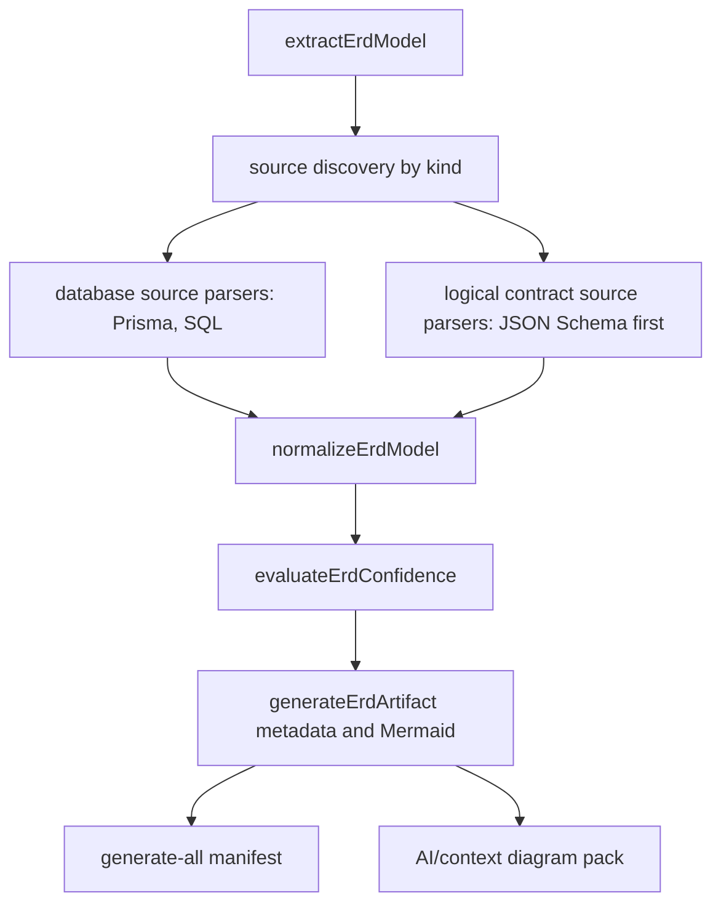

# JSC-318 Contract Schema ERD Refactor Program

## Table of Contents
- [Command Summary](#command-summary)
- [Refactor Classification](#refactor-classification)
- [Problem Statement](#problem-statement)
- [Root Cause Analysis](#root-cause-analysis)
- [Evidence](#evidence)
- [Architectural Impact](#architectural-impact)
- [Desired End State](#desired-end-state)
- [Migration Strategy](#migration-strategy)
- [Smallest Reversible Step](#smallest-reversible-step)
- [Execution Phases](#execution-phases)
- [Linear Mapping](#linear-mapping)
- [Anti-Regression Constraints](#anti-regression-constraints)
- [Eval Requirements](#eval-requirements)
- [Success Criteria](#success-criteria)
- [Safe Rollback Conditions](#safe-rollback-conditions)
- [Future-Agent Guidance](#future-agent-guidance)
- [Related Systems](#related-systems)
- [Fact, Interpretation, Assumption Split](#fact-interpretation-assumption-split)
- [Subagent Policy](#subagent-policy)
- [Validation Outcomes](#validation-outcomes)

## Command Summary

BLUF: Refactor ERD extraction into staged source-kind support, starting with a reversible JSON Schema logical extractor that leaves the existing SQL and Prisma database path intact.

Decision Needed: Admit this program through `he-plan` or `he-spec` before implementation, because this artifact defines migration safety rails but does not authorize runtime edits.

Top Risks: Blending database and control-plane semantics; changing existing ERD output for SQL or Prisma fixtures; declaring ERD success when generated artifacts are placeholders; letting YAML and TypeScript support bloat P0.

Next Action: Create a JSC-318 P0 execution slice for JSON Schema extraction, focused fixtures, metadata proof, and regression tests for current database ERD behavior.

## Refactor Classification

- Candidate: contract-schema logical ERD source-kind migration.
- Classification: high-leverage architectural migration.
- Creation decision: create refactor program.
- Reason: the source strategy proves a structural mismatch between the current
  ERD source boundary and Archscope's agent evidence protocol. Fixing it
  improves determinism, repository cognition, artifact truth, and future Linear
  execution hygiene.
- Not a tactical cleanup: the work changes source-kind routing, parser
  boundaries, manifest interpretation, and downstream context behavior.

## Problem Statement

Archscope can generate an `erd.mmd` file, but the extractor currently treats
supported schema sources as only Prisma or SQL. Contract-heavy repositories can
therefore receive an ERD artifact that exists on disk while conveying no useful
domain model. That weakens the evidence pack because agents and reviewers see a
complete-looking artifact set that hides an unavailable ERD.

The refactor target is not a new diagram style. It is a safer source-kind
architecture: database schemas and logical contract schemas must feed the common
ERD model through separate, testable extraction paths.

## Root Cause Analysis

- Source discovery is source-kind closed: `SOURCE_PRECEDENCE` contains only
  `prisma` and `sql`.
- Parser dispatch is coupled to that source list through `SCHEMA_PARSERS`.
- The no-source failure branch reports `failed_no_schema` and names only
  Prisma or SQL.
- Artifact metadata records `terminalClass`, `schemaSources`, and
  `sourcePrecedence`, but does not yet expose a distinct logical contract
  source kind.
- Placeholder detection can already recognize no-schema ERDs, but the migration
  has not yet made unavailable ERDs first-class artifact truth.

## Evidence

| Evidence | Source | Confidence |
| --- | --- | --- |
| ERD source precedence is only `prisma`, `sql` | `src/schema/erd-extractor.js` | High |
| ERD discovery patterns are only `**/schema.prisma` and `**/*.sql` | `src/schema/erd-extractor.js` | High |
| No supported source returns `failed_no_schema` | `src/schema/erd-extractor.js` | High |
| ERD metadata already carries terminal class and source precedence | `src/core/analysis-generation-diagrams-erd.js` | High |
| Manifest entries preserve metadata additively | `src/core/analysis-generation-diagrams.js` | High |
| Existing ERD tests are fixture-oriented and can absorb a contract fixture | `test/erd-extractor.test.js`, `test/fixtures/erd/**` | High |
| Strategy has already selected JSON Schema as P0 and deferred YAML/TypeScript | `.harness/strategy/2026-05-12-JSC-318-contract-schema-erd-strategy.md` | High |

## Architectural Impact

The migration should introduce a source-kind boundary without changing the
common ERD model shape. The desired architecture is:



Architectural principle: source-specific semantics belong before
`normalizeErdModel`; cross-source rendering, confidence, and manifest handling
belong after it.

## Desired End State

- SQL and Prisma ERD behavior is preserved.
- JSON Schema contract sources can produce explicit logical entities,
  attributes, required/nullability hints, and relationships from local `$ref`.
- Source-kind metadata makes it clear whether an ERD came from database schema,
  contract schema, mixed sources, or no supported source.
- `failed_no_schema` and equivalent unavailable states are treated as degraded
  artifact truth, not a normal successful ERD.
- Agent context tells agents when ERD is unavailable and where to look next.
- Closure proof exists before Linear completion is recommended.

## Migration Strategy

Use a staged additive migration. Do not rewrite the ERD renderer, model
normalizer, or SQL/Prisma parsers up front.

1. Add JSON Schema as the smallest new source kind.
2. Stabilize source-kind metadata and fixture proof.
3. Make unavailable/degraded ERD state explicit in manifest and context surfaces.
4. Add YAML only after the JSON Schema path proves the logical model contract.
5. Treat TypeScript contract extraction as a separate parser strategy, not a
   tail-end addition to this migration.

## Smallest Reversible Step

P0 is the smallest reversible step:

- Add `json-schema` after `prisma` and `sql` in source precedence.
- Discover `**/*.schema.json` with the existing ignore pipeline.
- Parse a tiny local JSON Schema fixture into entities, attributes, and local
  `$ref` relationships.
- Keep metadata additive.
- Run only focused ERD tests first.

Rollback: remove the JSON Schema source kind, parser dispatch entry, fixture,
and tests. SQL/Prisma behavior remains untouched if P0 is kept isolated.

## Execution Phases

| Phase | Objective | Affected systems | Expected risk | Feedback expected | Stop or pivot condition | Can run in parallel | Validation requirements | Rollback conditions | Linear mapping | Agent-safe | Human review required |
| --- | --- | --- | --- | --- | --- | --- | --- | --- | --- | --- | --- |
| P0 JSON Schema source kind | Prove contract-heavy ERD extraction with one tiny JSON Schema fixture and no database sources | `src/schema/erd-extractor.js`, `test/erd-extractor.test.js`, `test/fixtures/erd/contract-schema-json/**` | Medium | Contract fixture returns `completed`, deterministic entities, and explicit `$ref` relationships while SQL/Prisma tests pass | Remote refs, dialect ambiguity, or fixture requires TypeScript/YAML to be meaningful | no | `npm test -- test/erd-extractor.test.js` | Revert JSON Schema source/parser/fixture/test additions | JSC-318 P0 | yes | yes |
| P1 Source-kind metadata and generate-all truth | Ensure generated manifest distinguishes useful, degraded, and unavailable ERD states without schema-breaking changes | `src/core/analysis-generation-diagrams-erd.js`, `src/core/analysis-generation-diagrams.js`, generate-all manifest tests | Medium | Manifest entry shows additive source-kind/terminal metadata and contract-heavy ERD is not placeholder | Requires a machine-output schema migration or new artifact status | no | `npm test -- test/evidence-manifest-parity.test.js test/erd-extractor.test.js` plus focused generate-all fixture command | Revert metadata fields and manifest-specific tests | JSC-318 P1 | assisted | yes |
| P2 Agent context unavailable guidance | Make `AI/context/diagram-context.md` tell agents when ERD is unavailable and suggest fallback diagrams | `src/context/build-context-pack.js`, context-pack tests | Medium | Context pack gives actionable fallback guidance for no-schema ERD without bloating normal packs | Context copy changes stable agent artifact contract beyond additive guidance | no | `npm test -- test/context-pack.test.js` | Revert context guidance and tests | JSC-318 P2 | assisted | yes |
| P3 YAML schema contracts | Add YAML schema support only after JSON Schema model semantics are stable | ERD extractor parser registry, YAML fixture tests, package/parser dependency review if needed | Medium-high | YAML fixture maps into the same logical contract ERD model | Requires new dependency, dialect policy, or config design not covered by P0-P2 | no | focused ERD tests plus package/dependency validation if dependency changes | Revert YAML source kind, parser, dependency, and fixture | JSC-318 P3 | assisted | yes |
| P4 TypeScript contract surfaces | Decide whether TypeScript contracts are AST/type extraction, config-driven discovery, or out of scope | New parser strategy, potential TypeScript tooling, config docs | High | Separate spec identifies a safe source boundary and cost | Needs project-aware type resolution or introduces broad dependency/runtime cost | no | New spec/plan first; implementation validation TBD | Do not start without separate approval | JSC-318 P4 candidate | no | yes |
| P5 Closure eval | Prove the migration solves the original product gap and did not regress database ERD behavior | `.harness/evals/**`, focused CLI runs, Linear closeout evidence | Low | Eval artifact captures SQL/Prisma preservation, JSON Schema success, unavailable-state truth, and remaining deferred scope | Any P0-P2 acceptance gap remains open | no | `.harness/evals/2026-05-12-JSC-318-diagram-cli-contract-schema-erd-eval.md` plus exact command outcomes | Reopen prior phase or mark Linear incomplete | JSC-318 closure | assisted | yes |

## Linear Mapping

- Parent issue: JSC-318.
- Suggested labels: `diagram-cli`, `Agent`, `Improvement`.
- Current route: `he-plan` or `he-spec` before `he-work`.
- Recommended child/slice map:
  - JSC-318/P0: JSON Schema logical ERD extractor.
  - JSC-318/P1: source-kind metadata and manifest truth.
  - JSC-318/P2: agent context unavailable guidance.
  - JSC-318/P3: YAML schema contracts.
  - JSC-318/P4: TypeScript contract strategy decision.
  - JSC-318/P5: closure eval.
- Do not create Linear objects from this artifact. Use `he-linear-plan` if the
  child issue topology needs to be materialized.

## Anti-Regression Constraints

- Preserve SQL/Prisma parser behavior and existing ERD fixture expectations.
- Keep source precedence deterministic: database schema sources remain first.
- Do not add fake schema files to consumer repositories.
- Do not resolve remote JSON Schema references in P0.
- Do not change canonical machine envelope fields solely to expose ERD metadata.
- Do not classify an empty ERD artifact as a successful useful ERD.
- Keep fixture repositories tiny and purpose-built.
- Avoid adding a dependency for YAML or TypeScript parsing until the owning
  phase explicitly admits it.

## Eval Requirements

Expected closure proof path:

```text
.harness/evals/2026-05-12-JSC-318-diagram-cli-contract-schema-erd-eval.md
```

Minimum eval evidence:

- `npm test -- test/erd-extractor.test.js` passes after P0.
- A contract-heavy fixture with no `.sql` or `schema.prisma` produces a
  non-placeholder ERD.
- Existing SQL/Prisma ERD tests still pass.
- Generate-all manifest includes truthful ERD metadata for the contract fixture.
- No-source repository reports unavailable/degraded ERD state and useful agent
  fallback guidance after P2.
- Deferred YAML and TypeScript scope is explicitly marked incomplete unless
  implemented and validated.

## Success Criteria

- P0 gives immediate proof that JSON Schema contracts can become useful logical
  ERDs.
- P1 prevents artifact completeness drift by making ERD source-kind and
  unavailable state visible.
- P2 prevents agents from wasting context on empty ERDs.
- P3/P4 remain explicitly deferred or independently validated.
- Closure eval links JSC-318, the strategy artifact, this refactor program,
  implementation evidence, and remaining scope.

## Safe Rollback Conditions

Safe rollback is allowed when:

- Any new source kind changes SQL/Prisma ERD output unexpectedly.
- JSON Schema parsing accepts ambiguous remote references without a policy.
- Manifest/source-kind metadata requires a non-additive schema change.
- Context-pack guidance increases noise without improving no-schema behavior.
- Tests pass only by weakening placeholder detection or confidence rules.

Rollback should remove only the active phase's source-kind/parser/metadata
changes and keep earlier passing phases when their contracts remain valid.

## Future-Agent Guidance

- Start with this artifact and the source strategy before implementation.
- Treat P0 as a source-boundary test, not a full JSC-318 fix.
- Add tests before or alongside parser changes.
- Keep SQL/Prisma changes suspect unless a test proves they are unchanged.
- If tempted to parse TypeScript in P0, stop and route to `he-spec`.
- If a generated ERD exists but has no entities, classify it as artifact truth
  failure or degradation, not success.
- Hand off to `he-code-review` after meaningful runtime changes because this
  touches parser behavior and machine-readable artifact semantics.

## Related Systems

- `src/schema/erd-extractor.js`
- `src/schema/erd-model.js`
- `src/schema/erd-confidence.js`
- `src/core/analysis-generation-diagrams-erd.js`
- `src/core/analysis-generation-diagrams.js`
- `src/context/build-context-pack.js`
- `src/artifacts/evidence-manifest.js`
- `test/erd-extractor.test.js`
- `test/context-pack.test.js`
- `test/evidence-manifest-parity.test.js`
- `test/fixtures/erd/**`
- `.harness/strategy/2026-05-12-JSC-318-contract-schema-erd-strategy.md`

## Fact, Interpretation, Assumption Split

Facts:

- Current ERD source discovery is limited to Prisma and SQL.
- Current no-source terminal class is `failed_no_schema`.
- Existing metadata and manifest paths can carry additive ERD details.
- Existing tests already cover the database ERD path.

Interpretations:

- JSC-318 is high leverage because it protects Archscope's evidence protocol,
  not just one diagram type.
- JSON Schema is the smallest useful source-kind proof.
- YAML and TypeScript support should follow only after source-kind boundaries
  and metadata truth are stable.

Assumptions:

- Local JSON Schema `$ref` relationships are enough for a meaningful first
  contract-heavy fixture.
- No public config field is required for P0.
- Consumers can tolerate additive ERD metadata without a schema migration.

## Subagent Policy

- `subagent_policy`: conditional.
- `roles_used`: none.
- `roles_recommended`: repo-research-analyst, learnings-researcher,
  architecture-strategist, feasibility-reviewer, scope-guardian-reviewer,
  deployment-verification-agent.
- `roles_missing`: none observed for mapped `he-refactor` roles in
  `~/.codex/agents/manifest.json`.

## Validation Outcomes

| Gate | Outcome | Evidence |
| --- | --- | --- |
| Refactor threshold | pass | Strategy proves source-kind and artifact-truth migration, not tactical cleanup |
| Source strategy read | pass | `.harness/strategy/2026-05-12-JSC-318-contract-schema-erd-strategy.md` |
| Live source evidence read | pass | `src/schema/erd-extractor.js`, `src/core/analysis-generation-diagrams-erd.js` |
| Subagent map resolved | pass | `he-refactor` policy is conditional; mapped roles exist in manifest |
| Implementation mutation | pass | Artifact-only change; no runtime/test source edited |
| BLUF structure | pass | `python3 /Users/jamiecraik/dev/agent-skills/Plugins/harness-engineering/scripts/check_bluf_structure.py .harness/refactors/2026-05-12-JSC-318-contract-schema-erd-refactor.md --json` |
| Spelling/prose checker | blocked | No repo spelling/prose checker identified for `.harness/refactors/**` |
