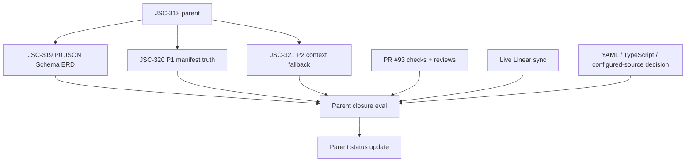

# JSC-318 Contract Schema ERD Parent Closure Readiness Specification

## Table of Contents
- [Command Summary](#command-summary)
- [Status Block](#status-block)
- [Purpose](#purpose)
- [Problem Statement](#problem-statement)
- [User / Operator Scenarios](#user--operator-scenarios)
- [Goals](#goals)
- [Non-Goals](#non-goals)
- [Current State / Evidence](#current-state--evidence)
- [Current PR Review Inventory](#current-pr-review-inventory)
- [Proposed Behavior](#proposed-behavior)
- [Requirements](#requirements)
- [Interfaces](#interfaces)
- [Data / Domain Contract](#data--domain-contract)
- [Security, Privacy, and Safety](#security-privacy-and-safety)
- [Accessibility and Operator Ergonomics](#accessibility-and-operator-ergonomics)
- [Failure and Recovery](#failure-and-recovery)
- [Validation Plan](#validation-plan)
- [Acceptance Criteria](#acceptance-criteria)
- [Visual References / Diagrams](#visual-references--diagrams)
- [Implementation Notes](#implementation-notes)
- [Technical Review Findings](#technical-review-findings)
- [Open Questions](#open-questions)
- [Decision](#decision)
- [Evidence and References](#evidence-and-references)
- [Linear Work Item Contract](#linear-work-item-contract)
- [Linear Acceptance Traceability](#linear-acceptance-traceability)
- [Appendix A. Harness Metadata / Traceability](#appendix-a-harness-metadata--traceability)
- [Appendix B. Review Outcomes](#appendix-b-review-outcomes)
- [Appendix C. he-plan Handoff](#appendix-c-he-plan-handoff)

## Command Summary

BLUF: This specification defines the parent-closure readiness contract for the operator, developer, or agent reviewing `JSC-318`, the `diagram-cli` work that makes ERDs useful for contract-schema repositories instead of only SQL or Prisma repositories. The document's job is to stop the workflow from closing the parent just because P0, P1, and P2 local proof exists on PR #93; parent closure still depends on live Linear truth, actionable PR review resolution, explicit deferred-scope decisions for YAML/TypeScript/configured-source work, and a closure eval that maps child evidence back to the original parent acceptance criteria. The decision is to move next into a closure-readiness plan, not another implementation slice. The main risk is a false completion signal where green local validation hides stale tracker state or unresolved review comments. The next action is an `he-plan` that reconciles PR #93, CodeRabbit comments, JSC-321 Linear status, and final parent acceptance evidence before any Done transition.

Decision Needed: Decide whether YAML schema support, TypeScript contract extraction, and configured contract source globs are explicitly deferred from `JSC-318` or promoted into new child issues before parent closure.

Top Risks: Closing `JSC-318` while `JSC-321` remains Backlog in live Linear; ignoring actionable CodeRabbit comments because the status context is green; treating local eval artifacts as external tracker proof; silently widening into YAML or TypeScript implementation during closure.

Next Action: Create a closure-readiness plan for `JSC-318` that verifies review resolution, updates or blocks stale Linear state, records deferred scope, and produces a parent closure eval before any parent status mutation.

## Status Block

| Field | Value |
| --- | --- |
| `interactive_status` | ready_for_plan |
| `selection_evidence` | `.harness/linear/2026-05-13-JSC-318-contract-schema-erd-linear-plan.md`, live Linear read for `JSC-318` children, PR #93 status and review data, JSC-319/JSC-320/JSC-321 specs/evals |
| `route` | he-spec -> he-plan |
| `stage` | parent closure readiness specification |
| `scope` | closure gates for parent `JSC-318` after P0/P1/P2 local proof |
| `traceability` | `JSC-318` parent; children `JSC-319`, `JSC-320`, `JSC-321`; PR #93; commits `f4d6c5f`, `2d56c30`, `35d56df` |
| `validation` | BLUF, generated artifact shape, artifact identity, Linear traceability, diff whitespace; implementation validation is not required because this is a closure specification |
| `safe_to_continue` | true |
| `blocked_reason` | none for planning; parent closure remains blocked until acceptance criteria below pass |
| `linear_mutation_status` | confirmation_required |
| `linear_action_required` | Sync `JSC-321` status/PR linkage and parent closeout only after review and delivery gates are satisfied and mutation approval is explicit |
| `spec_path` | `.harness/specs/2026-05-13-JSC-318-contract-schema-erd-parent-closure-readiness-spec.md` |
| `acceptance_ids` | `SA-318-CLOSE-001` through `SA-318-CLOSE-011` |
| `handoff` | he-plan |
| `confidence` | 91%; strong candidate with validation gaps because current PR/Linear state and exact CodeRabbit review inventory were read in this pass, but review-thread resolution, tracker mutation, and parent closure eval are still future work |

## Purpose

This spec defines the closure contract for the `JSC-318` parent issue after its three planned child slices have local implementation proof.

The purpose is not to implement more ERD behavior. It is to make parent completion safe and auditable by proving that local child evidence, PR review state, CI state, live Linear state, deferred-scope decisions, and parent acceptance criteria all agree before `JSC-318` moves toward Done.

## Problem Statement

The `JSC-318` parent acceptance criteria were intentionally broader than the first implementation proof. They mention JSON/YAML contract schemas, TypeScript contract/type surfaces, configured sources, meaningful `generate-all` ERDs, degraded/unavailable manifest truth, context fallback guidance, fixture coverage, and SQL/Prisma preservation.

The current implementation lane has strong local evidence for the bounded P0/P1/P2 slices:

- `JSC-319`: JSON Schema logical ERD extraction.
- `JSC-320`: ERD source-kind and manifest availability truth.
- `JSC-321`: context-pack fallback guidance for unavailable or degraded ERDs.

That evidence is necessary but not sufficient for parent closure. Live Linear still shows `JSC-321` as Backlog with no PR attachment. PR #93 is open and draft. CodeRabbit's status context is successful, but the latest review body reports four actionable comments, mostly around plan portability and validation-command consistency. The parent also needs an explicit decision on whether YAML, TypeScript, and configured-source work are deferred rather than accidentally treated as done.

## User / Operator Scenarios

1. Parent closeout reviewer:
   - A reviewer wants to decide whether `JSC-318` can move to Done.
   - The reviewer can inspect one closure readiness artifact and see child proof, PR/CI/review state, tracker sync, deferred scope, and remaining blockers.

2. Linear operator:
   - An operator wants to update child and parent Linear state.
   - The operator can see that `JSC-321` must be linked or moved before the parent can close.

3. PR reviewer:
   - A reviewer sees green CI checks on PR #93 but also CodeRabbit comments.
   - The reviewer does not treat green status alone as proof that review feedback is resolved.

4. Future agent:
   - An agent asked to continue `JSC-318` can tell that the next work is closure reconciliation, not another parser, renderer, or context-pack implementation.

5. Scope owner:
   - Jamie decides whether YAML, TypeScript, and configured-source support are deferred from `JSC-318` or admitted as new child issues.
   - The decision is recorded before parent closure rather than inferred from missing implementation.

## Goals

- Define pass/fail closure gates for `JSC-318`.
- Keep `JSC-318` parent closure separate from child implementation proof.
- Require live Linear truth for `JSC-321` before parent closeout.
- Require PR #93 review-thread triage or resolution before parent closeout.
- Require explicit deferred-scope decisions for YAML, TypeScript, and configured source globs.
- Require a parent closure eval that maps child evidence to original parent acceptance criteria.
- Preserve SQL/Prisma behavior as a parent acceptance gate.
- Prevent new implementation scope from entering the closure-readiness phase.

## Non-Goals

- Do not implement YAML schema parsing.
- Do not implement TypeScript contract extraction.
- Do not implement configured contract source globs.
- Do not modify public CLI behavior.
- Do not change manifest schema version.
- Do not resolve CodeRabbit comments by editing files inside this spec pass.
- Do not mutate Linear or GitHub from this spec.
- Do not mark `JSC-318`, `JSC-319`, `JSC-320`, or `JSC-321` Done from local artifacts alone.
- Do not merge, force-push, deploy, delete branches, or close review threads as part of this specification.

## Current State / Evidence

| Evidence | Classification | Finding | Spec Impact |
| --- | --- | --- | --- |
| Live Linear `JSC-318` fetch | verified | Parent is In Progress, High, project `Diagram product surface and analysis workflow`, PR #93 attached. | Parent closure remains a live tracker operation requiring approval. |
| Live Linear children list | verified | `JSC-319` and `JSC-320` are In Review; `JSC-321` is Backlog with no PR attachment. | `JSC-321` tracker state is stale relative to local proof. |
| PR #93 live read | verified | PR is open and draft; GitHub checks are successful; CodeRabbit status context is successful. | Green checks are necessary but not sufficient. |
| PR #93 latest CodeRabbit review | verified | Latest CodeRabbit body reports four actionable comments against JSC-321 plan/solution artifacts. | Closure must require comment triage or fix evidence. |
| Commit `f4d6c5f` | verified | Adds JSON Schema ERD extraction and JSC-319/JSC-320 proof. | Supports P0/P1 local evidence. |
| Commit `35d56df` | verified | Adds JSC-321 context-pack ERD availability guidance and validation evidence. | Supports P2 local evidence but has review comments. |
| `.harness/evals/2026-05-13-jsc-319-json-schema-logical-erd-diagram-cli-eval.md` | verified | JSC-319 local implementation proof passed, parent closure blocked by downstream slices. | Child proof source for closure eval. |
| `.harness/evals/2026-05-13-jsc-320-erd-source-kind-manifest-truth-diagram-cli-eval.md` | verified | JSC-320 local implementation proof accepted; external delivery still approval-gated. | Child proof source for closure eval. |
| `.harness/evals/2026-05-13-jsc-321-erd-unavailable-context-fallback-diagram-cli-eval.md` | verified | JSC-321 local implementation proof passed; closure blocked by human steering and external delivery. | Child proof source, but not tracker closure proof. |
| `.harness/solutions/2026-05-13-jsc-321-context-pack-smoke-path-contract.md` | verified | Captures corrected context-pack smoke path contract. | CodeRabbit portability comments overlap this area and must be reconciled. |
| `.harness/linear/2026-05-13-JSC-318-contract-schema-erd-linear-plan.md` | verified | Approved next slice is parent closure readiness. | This spec implements that queue decision. |

## Current PR Review Inventory

PR #93 currently has a successful CodeRabbit status context, but the latest CodeRabbit review body reports four actionable comments. Parent closure MUST treat these as unresolved until the closure plan records a resolution classification for each item.

| ID | Source | Evidence | Required Closure Handling |
| --- | --- | --- | --- |
| CR-318-001 | CodeRabbit review on PR #93 | `.harness/plan/2026-05-13-JSC-321-erd-unavailable-context-fallback-plan.md` line 595 says "Use `/private/tmp` paths only", while the corrected smoke sequences use `.harness/tmp/...` and exclude generated `.diagram/**` persistence without approval. | Fix the risk row or prove it is already corrected; closure must explicitly mention `/private/tmp`, `.harness/tmp`, and `.diagram/**`. |
| CR-318-002 | CodeRabbit review on PR #93 | `.harness/plan/2026-05-13-JSC-321-erd-unavailable-context-fallback-plan.md` lines 524-527 embed machine-specific `/Users/jamiecraik/...` validation command paths. | Replace with portable repo-relative, wrapper, or agreed harness command references, or record a spec-owner decision that these are local-only and not reusable closure commands. |
| CR-318-003 | CodeRabbit review on PR #93 | `.harness/plan/2026-05-13-JSC-321-erd-unavailable-context-fallback-plan.md` lines 559-570 include a useful-output negative smoke where a bare `rg` under `set -euo pipefail` exits with `1` when the intended "no matches" success condition occurs. | Change the negative smoke to an explicit conditional or prove the plan already handles `rg` exit code `1` as success. |
| CR-318-004 | CodeRabbit review on PR #93 | `.harness/solutions/2026-05-13-jsc-321-context-pack-smoke-path-contract.md` lines 62-65 and 169-173 use absolute workstation paths in markdown links. | Replace with repo-relative references or record why the solution is intentionally local-only; parent closure should prefer portable evidence links. |

Conformance rule: if any row remains `blocked`, `valid-fix-required`, or unclassified, `JSC-318` parent closure MUST remain blocked even if GitHub checks are green.

## Proposed Behavior

Parent `JSC-318` closure MUST proceed through a closure-readiness plan and closure eval before any Done transition.

The closure-readiness plan must:

1. Reconcile live Linear:
   - Confirm `JSC-319`, `JSC-320`, and `JSC-321` statuses.
   - Link PR #93 to `JSC-321` or record why mutation is blocked.
   - Avoid closing the parent while any child state is stale.

2. Reconcile PR/review evidence:
   - Confirm PR #93 is the intended delivery vehicle for P0/P1/P2.
   - Confirm all required GitHub checks are green or blocked with exact reasons.
   - Triage CodeRabbit's four actionable comments as fixed, intentionally skipped with evidence, or blocking.
   - Record the exact resolution for `CR-318-001` through `CR-318-004` using the Review Comment Triage Contract.

3. Reconcile scope:
   - Record explicit decisions for YAML schema support, TypeScript contract extraction, and configured contract source globs.
   - If any item is admitted into `JSC-318`, create a new child spec/plan before parent closeout.
   - If deferred, record the deferral in the parent closure eval and Linear update.

4. Produce parent closure eval:
   - Map original parent acceptance criteria to child proof artifacts and validation gates.
   - Identify remaining evidence gaps.
   - Recommend one of: Complete, Complete with follow-up, Blocked, or Rework.

The parent MUST NOT close directly from local child eval files, commit messages, draft PR existence, or green CI alone.

## Requirements

### Functional Requirements

| ID | Requirement |
| --- | --- |
| FR-318-CLOSE-001 | The closure plan MUST verify live Linear status for `JSC-318`, `JSC-319`, `JSC-320`, and `JSC-321` before recommending any tracker status mutation. |
| FR-318-CLOSE-002 | The closure plan MUST treat `JSC-321` Backlog/no-PR-link state as a parent closure blocker until synced or explicitly blocked with exact reason. |
| FR-318-CLOSE-003 | The closure plan MUST verify PR #93 state, draft/readiness state, CI status, review state, and delivery branch before parent closeout. |
| FR-318-CLOSE-004 | The closure plan MUST triage all current CodeRabbit actionable comments on PR #93 before parent closeout. |
| FR-318-CLOSE-005 | The closure eval MUST map each original `JSC-318` acceptance criterion to child evidence, explicit deferral, or unresolved blocker. |
| FR-318-CLOSE-006 | YAML schema support MUST be recorded as deferred or promoted to a new child issue/spec before parent closeout. |
| FR-318-CLOSE-007 | TypeScript contract extraction MUST be recorded as deferred or promoted to a new child issue/spec before parent closeout. |
| FR-318-CLOSE-008 | Configured contract source globs MUST be recorded as deferred or promoted to a new child issue/spec before parent closeout. |
| FR-318-CLOSE-009 | Parent closeout MUST preserve the distinction between local implementation proof, PR delivery proof, CI proof, review proof, and live Linear proof. |
| FR-318-CLOSE-010 | Parent closeout MUST NOT introduce new implementation changes except review-comment fixes or artifact corrections explicitly required for closure readiness. |
| FR-318-CLOSE-011 | Parent closeout MUST preserve existing SQL/Prisma ERD behavior evidence from the child validation gates. |
| FR-318-CLOSE-012 | Parent closeout MUST record a rollback/recovery path for each accepted child slice and for any review-comment fix committed after this spec. |
| FR-318-CLOSE-013 | Parent closeout MUST resolve or explicitly block the four current CodeRabbit items `CR-318-001` through `CR-318-004` before recommending parent Done. |
| FR-318-CLOSE-014 | Reusable closure commands and review artifacts SHOULD avoid hard-coded `/Users/jamiecraik/...` paths unless the closure eval marks them local-only and gives a portable alternative. |
| FR-318-CLOSE-015 | Negative smoke commands under `set -euo pipefail` MUST encode expected `rg` no-match success with an explicit conditional instead of a bare `rg` command. |

### Non-Functional Requirements

| ID | Requirement |
| --- | --- |
| NFR-318-CLOSE-001 | Closure artifacts MUST be reader-first and usable by future agents without replaying the entire implementation history. |
| NFR-318-CLOSE-002 | Closure evidence MUST use exact command names and explicit `pass`, `fail`, `blocked`, or `not applicable` outcomes. |
| NFR-318-CLOSE-003 | Closure artifacts MUST avoid absolute workstation paths in reusable commands unless the command is explicitly local-only and marked as such. |
| NFR-318-CLOSE-004 | Closure artifacts MUST keep generated proof surfaces under `.harness/**` and generated runtime artifacts out of commits unless explicitly approved. |
| NFR-318-CLOSE-005 | Closure work MUST preserve unrelated dirty files and stage only approved paths. |
| NFR-318-CLOSE-006 | Closure recommendations MUST not claim production readiness without CI, review, tracker, and parent eval evidence. |

## Interfaces

### Linear Interface

The closure plan may propose but must not silently perform these Linear mutations:

| Target | Required Decision |
| --- | --- |
| `JSC-319` | Move toward Done only if P0 proof, PR delivery, and review state support it. |
| `JSC-320` | Move toward Done only if P1 proof, PR delivery, and review state support it. |
| `JSC-321` | Move out of Backlog and attach/link PR #93 only after explicit mutation approval. |
| `JSC-318` | Move toward Done only after all child states, PR review state, deferred-scope decision, and parent closure eval pass. |

### GitHub / PR Interface

PR #93 is the current delivery surface for this parent. The closure plan must inspect:

- PR state: open/closed/merged.
- Draft state.
- Head branch.
- Required checks and failed checks.
- Latest reviews.
- CodeRabbit review comments and current thread state if available.
- Commit list and whether closure fixes are included.

### Harness Artifact Interface

The parent closure eval should be written under `.harness/evals/**` and reference:

- `.harness/specs/2026-05-13-JSC-319-json-schema-logical-erd-spec.md`
- `.harness/specs/2026-05-13-JSC-320-erd-source-kind-manifest-truth-spec.md`
- `.harness/specs/2026-05-13-JSC-321-erd-unavailable-context-fallback-spec.md`
- child plan and eval artifacts
- this closure readiness spec
- closure-readiness plan

## Data / Domain Contract

### Parent Closure State

| State | Meaning | Allowed Next Move |
| --- | --- | --- |
| `blocked-tracker-stale` | Local proof exists but live Linear is stale. | Sync or block with exact reason. |
| `blocked-review-open` | PR review comments or requested changes are unresolved. | Fix, skip with evidence, or block. |
| `blocked-scope-decision` | YAML/TypeScript/configured-source decision is missing. | Defer or create new child scope. |
| `ready-for-parent-eval` | Tracker, review, and scope gates are reconciled. | Write parent closure eval. |
| `ready-for-parent-status-update` | Parent eval recommends closure and mutation is approved. | Update Linear and PR status. |

### Closure Evidence Conformance Rules

Closure evidence MUST conform to these rules before a parent status update is recommended:

- Required field coverage for closure evidence includes `closure_state`, `source`, `result`, `owner`, `parent_closeout_impact`, and `evidence`.
- Optional field coverage includes `commit`, `pr_url`, `linear_issue`, `review_source`, `blocked_reason`, and `follow_up_issue`.
- Enum values for `result` are `pass`, `fail`, `blocked`, and `not applicable`.
- Unknown-field handling: closure artifacts MAY include additional evidence fields, but unknown fields MUST NOT override the required fields or weaken a blocker into a pass.
- Compatibility rule: this closure contract is additive to child specs and evals; it MUST NOT rename child acceptance IDs, child artifact paths, Linear issue IDs, or PR references.
- Error handling rule: missing required fields, unknown closure states, or unsupported result values MUST block parent closeout until corrected.
- Each closure state MUST be one of `blocked-tracker-stale`, `blocked-review-open`, `blocked-scope-decision`, `ready-for-parent-eval`, or `ready-for-parent-status-update`.
- Unknown or missing tracker state MUST be treated as `blocked-tracker-stale`.
- Unknown or missing review-thread state MUST be treated as `blocked-review-open`.
- Unknown or missing deferred-scope decision state MUST be treated as `blocked-scope-decision`.
- Evidence rows MUST include a source path, live tracker reference, command, commit SHA, PR URL, or explicit blocker.
- Closure evidence MUST use `pass`, `fail`, `blocked`, or `not applicable` for validation result fields.
- Parent closure MUST NOT infer a pass from local proof when the corresponding live tracker, PR, or review evidence is missing.

### Deferred Scope Decision Contract

Each deferred or admitted scope item must be recorded with:

```yaml
scope_item: yaml-schema-support | typescript-contract-extraction | configured-contract-source-globs
decision: deferred | admitted-new-child | blocked
reason: string
owner: string
follow_up_issue: Linear issue id or "not_created"
parent_closeout_impact: allowed | blocked
evidence: paths or live tracker references
```

### Review Comment Triage Contract

Each actionable review item must be recorded with:

```yaml
review_source: CodeRabbit | human | GitHub Actions | other
location: file path and line if available
classification: valid-fix-required | valid-deferred | invalid-with-evidence | already-fixed | blocked
resolution_evidence: commit, diff path, command, or blocker
parent_closeout_impact: allowed | blocked
```

Unknown review state defaults to blocked for parent closure.

## Security, Privacy, and Safety

- Closure work MUST NOT access secrets, credentials, private user-global config, or production systems.
- Review-comment fixes MUST avoid embedding absolute workstation paths in reusable harness artifacts.
- Linear and GitHub mutations require explicit approval.
- Parent closure artifacts MUST not publish local temp paths, generated cache paths, or private filesystem data unless needed as local validation evidence and clearly marked local-only.
- No release, deploy, merge, force-push, branch delete, or destructive cleanup is authorized by this spec.

## Accessibility and Operator Ergonomics

This is an operator-artifact spec. Accessibility means the closure proof must be easy for humans and agents to inspect:

- Use stable headings, markdown tables, and short status labels.
- Do not rely on color, icons, or visual-only indicators.
- Use plain status words such as `pass`, `fail`, `blocked`, and `not applicable`.
- Keep the parent closure eval compact enough that reviewers can see blockers before historical detail.
- Include links or paths to evidence artifacts rather than duplicating large logs.

## Failure and Recovery

| Failure Mode | Required Behavior | Recovery |
| --- | --- | --- |
| `JSC-321` remains Backlog/no PR link | Block parent closure. | Request approval to update Linear, or record external mutation blocker. |
| CodeRabbit actionable comments remain untriaged | Block parent closure. | Fix valid comments, explain invalid comments, or record blocker. |
| PR #93 remains draft | Block parent Done recommendation unless explicitly accepted as a draft closure stage. | Convert when ready or document draft blocker. |
| Required CI check fails | Block closure. | Fix failure or classify external flake with rerun evidence. |
| YAML/TypeScript/configured-source decision missing | Block parent closure. | Record deferral or create new child issue/spec. |
| Closure fixes touch unrelated dirty files | Stop before staging. | Split or ask Jamie how to handle unrelated changes. |
| Parent eval cannot map original acceptance to evidence | Block parent closure. | Reopen missing child work or narrow acceptance with explicit owner decision. |

Rollback for closure-only changes is to revert closure artifacts or review-comment fix commits. Rollback for implementation commits is already recorded in child commit messages and child eval artifacts.

## Validation Plan

### Spec Artifact Validation

| Gate | Command | Required Result |
| --- | --- | --- |
| BLUF structure | `python3 /Users/jamiecraik/dev/agent-skills/Plugins/harness-engineering/scripts/check_bluf_structure.py .harness/specs/2026-05-13-JSC-318-contract-schema-erd-parent-closure-readiness-spec.md --json` | pass |
| Generated artifact shape | `python3 /Users/jamiecraik/dev/agent-skills/Plugins/harness-engineering/scripts/check_generated_artifact_shape.py .harness/specs/2026-05-13-JSC-318-contract-schema-erd-parent-closure-readiness-spec.md --kind spec --json` | pass |
| Artifact identity | `python3 /Users/jamiecraik/dev/agent-skills/Infrastructure/scripts/validation-and-linting/he_artifact_identity_lint.py .harness/specs/2026-05-13-JSC-318-contract-schema-erd-parent-closure-readiness-spec.md` | pass |
| Linear traceability | `python3 /Users/jamiecraik/dev/agent-skills/Infrastructure/scripts/validation-and-linting/he_linear_traceability_lint.py .harness/specs/2026-05-13-JSC-318-contract-schema-erd-parent-closure-readiness-spec.md` | pass |
| Diff hygiene | `git diff --check -- .harness/specs/2026-05-13-JSC-318-contract-schema-erd-parent-closure-readiness-spec.md` | pass |

### Closure Readiness Validation

| Gate | Evidence | Required Result |
| --- | --- | --- |
| Live Linear parent/child read | Linear fetch/list results for `JSC-318` and children | `JSC-319`, `JSC-320`, and `JSC-321` states are current and recorded. |
| PR state | `gh pr view 93 --json ...` or GitHub connector equivalent | PR state, draft state, checks, reviews, commits, and branch are recorded. |
| Review comments | CodeRabbit/GitHub review thread read | Each actionable comment is fixed, skipped with evidence, or blocking. |
| Child proof map | child specs/plans/evals plus commit evidence | P0/P1/P2 evidence maps to original parent acceptance criteria. |
| Deferred scope decision | closure plan/eval table | YAML, TypeScript, and configured-source scope have explicit decisions. |
| Parent closure eval | `.harness/evals/**jsc-318**closure**.md` | Eval recommends Complete, Complete with follow-up, Blocked, or Rework with evidence. |
| Baseline implementation validation | child validation commands or current reruns if code changed | Required commands pass or are blocked with exact reason. |

If closure work changes source code, tests, validation commands, or review artifacts, rerun the affected child validation gates plus `npm test`, `npm run test:deep`, and `bash scripts/verify-work.sh --fast`.

## Acceptance Criteria

| ID | Criterion | Evidence Required |
| --- | --- | --- |
| SA-318-CLOSE-001 | Closure readiness spec exists and passes HE artifact validators. | This spec plus validation command output. |
| SA-318-CLOSE-002 | Live Linear state for `JSC-318`, `JSC-319`, `JSC-320`, and `JSC-321` is current in the closure plan. | Linear fetch/list evidence. |
| SA-318-CLOSE-003 | `JSC-321` live state is synced with PR #93 or recorded as a closure blocker. | Linear update evidence or blocker. |
| SA-318-CLOSE-004 | PR #93 check, draft, commit, and review state are recorded. | GitHub/`gh` evidence. |
| SA-318-CLOSE-005 | CodeRabbit actionable comments on PR #93 are resolved, intentionally skipped with evidence, or recorded as blockers. | Review triage table and commits if fixed. |
| SA-318-CLOSE-006 | Original `JSC-318` acceptance criteria are mapped to `JSC-319`, `JSC-320`, `JSC-321`, explicit deferrals, or blockers. | Parent closure eval. |
| SA-318-CLOSE-007 | YAML schema support has an explicit deferred/admitted/blocked decision. | Deferred scope decision contract. |
| SA-318-CLOSE-008 | TypeScript contract extraction has an explicit deferred/admitted/blocked decision. | Deferred scope decision contract. |
| SA-318-CLOSE-009 | Configured contract source globs have an explicit deferred/admitted/blocked decision. | Deferred scope decision contract. |
| SA-318-CLOSE-010 | Parent `JSC-318` is not moved to Done unless closure eval recommends it and mutation approval is explicit. | Closure eval and Linear action evidence. |
| SA-318-CLOSE-011 | Current PR #93 CodeRabbit comments `CR-318-001` through `CR-318-004` are fixed, intentionally skipped with evidence, or recorded as blockers. | Review triage table, diff evidence, and validation command outcomes. |

## Visual References / Diagrams



Text requirements are authoritative if this diagram and the requirements disagree.

## Implementation Notes

- Start the closure plan with live reads, not stale local assumptions.
- Treat CodeRabbit's successful status context as a transport/status signal, not proof that actionable comments are resolved.
- Use the latest PR review body and thread state where available; if thread state cannot be fetched, record it as blocked rather than resolved.
- If fixing CodeRabbit comments, prefer narrow artifact edits before source edits. The observed comments target plan/solution portability and shell-smoke correctness, not product behavior.
- Prefer correcting the current JSC-321 plan/solution comments before parent closure. Those fixes are artifact-quality fixes, but they still require validation because the smoke-command text is executable reviewer guidance.
- Do not mix unrelated dirty files into closure commits.
- If source code changes are needed during closure, rerun the affected child gates and update the parent closure eval.
- Keep deferred YAML/TypeScript/configured-source decisions visible in both the closure eval and Linear update text.

## Technical Review Findings

| ID | Finding | Evidence | Risk | Required Response |
| --- | --- | --- | --- | --- |
| TR-318-CLOSE-001 | The parent closure spec initially named CodeRabbit as a blocker but did not preserve the exact comment inventory. | PR #93 latest CodeRabbit review reports four actionable comments; status context is `SUCCESS`. | Future agents could treat green status as resolved review. | Spec now includes `CR-318-001` through `CR-318-004`; closure plan must triage each row. |
| TR-318-CLOSE-002 | The current JSC-321 plan contains a contradiction between corrected `.harness/tmp` smoke sequences and a risk row that still says to use `/private/tmp` only. | `.harness/plan/2026-05-13-JSC-321-erd-unavailable-context-fallback-plan.md` lines 539-566 and 595. | Later validation could repeat the stale path failure or weaken CLI path safety. | Closure plan must fix or explicitly block `CR-318-001`. |
| TR-318-CLOSE-003 | The useful-output negative smoke in the current JSC-321 plan is ambiguous under `set -euo pipefail`. | `.harness/plan/2026-05-13-JSC-321-erd-unavailable-context-fallback-plan.md` lines 559-570. | A correct no-warning output can abort the smoke command. | Closure plan must fix or explicitly block `CR-318-003`. |
| TR-318-CLOSE-004 | The reinforcement solution contains absolute workstation links in reusable markdown evidence. | `.harness/solutions/2026-05-13-jsc-321-context-pack-smoke-path-contract.md` lines 62-65 and 169-173. | Review artifacts become less portable for future agents or CI. | Closure plan must fix or explicitly block `CR-318-004`. |
| TR-318-CLOSE-005 | The parent still needs an explicit deferral decision for YAML, TypeScript, and configured-source acceptance text. | Live `JSC-318` acceptance text mentions JSON/YAML, TypeScript, and configured sources; current child proof covers JSON Schema only. | Parent could close while leaving original acceptance ambiguous. | Closure eval must map each item to deferred/admitted/blocked. |

## Open Questions

| ID | Question | Owner | Required Before |
| --- | --- | --- | --- |
| OQ-318-CLOSE-001 | Should YAML schema support be explicitly deferred from `JSC-318` or promoted into a new child issue? | Jamie / spec owner | Parent closure eval |
| OQ-318-CLOSE-002 | Should TypeScript contract extraction be explicitly deferred from `JSC-318` or promoted into a new research child issue? | Jamie / spec owner | Parent closure eval |
| OQ-318-CLOSE-003 | Should configured contract source globs be deferred, or does parent acceptance require an issue now? | Jamie / spec owner | Parent closure eval |
| OQ-318-CLOSE-004 | Should PR #93 remain draft until CodeRabbit comments are fixed, or can it move ready-for-review after triage? | Jamie / PR owner | PR delivery |

## Decision

Proceed to `he-plan` for `JSC-318` parent closure readiness. Do not create another P0/P1/P2 implementation spec. Do not close the parent until live tracker state, PR review state, deferred-scope decisions, and parent closure eval evidence all pass.

## Evidence and References

| Evidence | Classification | Detail |
| --- | --- | --- |
| `.harness/linear/2026-05-13-JSC-318-contract-schema-erd-linear-plan.md` | verified | Approved next slice is parent closure readiness. |
| Live Linear `JSC-318` fetch | verified | Parent is In Progress with PR #93 attachment. |
| Live Linear children list | verified | `JSC-319` and `JSC-320` In Review; `JSC-321` Backlog/no PR link. |
| PR #93 live read | verified | Open draft PR; successful checks; CodeRabbit latest review reports actionable comments. |
| `.harness/specs/2026-05-13-JSC-319-json-schema-logical-erd-spec.md` | verified | P0 JSON Schema logical ERD scope. |
| `.harness/specs/2026-05-13-JSC-320-erd-source-kind-manifest-truth-spec.md` | verified | P1 manifest truth scope. |
| `.harness/specs/2026-05-13-JSC-321-erd-unavailable-context-fallback-spec.md` | verified | P2 context fallback scope. |
| `.harness/evals/2026-05-13-jsc-319-json-schema-logical-erd-diagram-cli-eval.md` | verified | P0 local proof. |
| `.harness/evals/2026-05-13-jsc-320-erd-source-kind-manifest-truth-diagram-cli-eval.md` | verified | P1 accepted local proof. |
| `.harness/evals/2026-05-13-jsc-321-erd-unavailable-context-fallback-diagram-cli-eval.md` | verified | P2 local proof; closure still blocked. |

## Linear Work Item Contract

| Field | Value |
| --- | --- |
| Parent issue | `JSC-318` |
| Child issues | `JSC-319`, `JSC-320`, `JSC-321` |
| Project | Diagram product surface and analysis workflow |
| Parent status at spec creation | In Progress |
| Closure readiness status | ready for plan; parent closure still blocked |
| Required external mutation approval | yes |
| Next plan path | `.harness/plan/2026-05-13-JSC-318-contract-schema-erd-parent-closure-readiness-plan.md` |
| Expected eval path | `.harness/evals/2026-05-13-jsc-318-contract-schema-erd-parent-closure-readiness-diagram-cli-eval.md` |

## Linear Acceptance Traceability

| Linear issue | Parent acceptance slice | Acceptance IDs | Current evidence | Closure impact |
| --- | --- | --- | --- | --- |
| `JSC-319` | Useful ERD from JSON Schema fixture; preserve SQL/Prisma behavior | `SA-318-CLOSE-006`, `SA-318-CLOSE-010` | Spec, plan, eval, commit `f4d6c5f`, PR #93 | Supports parent after PR/review delivery is clean. |
| `JSC-320` | Manifest distinguishes useful/degraded/unavailable ERDs | `SA-318-CLOSE-006`, `SA-318-CLOSE-010` | Spec, plan, accepted eval, commit `f4d6c5f`, PR #93 | Supports parent after PR/review delivery is clean. |
| `JSC-321` | Context pack tells agents when ERD is unavailable and gives fallback guidance | `SA-318-CLOSE-002`, `SA-318-CLOSE-003`, `SA-318-CLOSE-006` | Spec, plan, eval, commit `35d56df`, PR #93 | Local proof exists, but live Linear status is stale and CodeRabbit comments affect artifacts. |
| `JSC-318` | Broader parent closeout including deferred YAML/TypeScript/configured-source decisions and PR review triage | `SA-318-CLOSE-001` through `SA-318-CLOSE-011` | This spec only | Closure requires plan/eval, CodeRabbit triage, and external mutation approval. |

## Appendix A. Harness Metadata / Traceability

| Field | Value |
| --- | --- |
| `schema_version` | 1 |
| `artifact_id` | `he-spec-jsc-318-contract-schema-erd-parent-closure-readiness` |
| `artifact_type` | `he-spec` |
| `canonical_slug` | `jsc-318-contract-schema-erd-parent-closure-readiness` |
| `spec_mode` | `standard-spec` |
| `spec_depth` | `full` |
| `risk` | `medium-high` |
| `linear_mutation_status` | `confirmation_required` |
| `handoff` | `he-plan` |
| `safe_to_continue` | true for planning; false for parent closure until gates pass |

## Appendix B. Review Outcomes

| Review Surface | Outcome |
| --- | --- |
| Canonical source | pass: selected slice comes from updated Linear plan. |
| Live tracker evidence | pass for read; mutation remains confirmation-required. |
| Scope boundary | pass: closure readiness only, no new parser/context implementation. |
| PR evidence | partial: checks are green, PR is draft, CodeRabbit has actionable comments. |
| Security/privacy | pass: closure spec forbids secrets, destructive operations, and external mutation without approval. |
| Accessibility/operator ergonomics | pass: closure proof must use text-first labels and compact evidence tables. |
| Implementation correctness | not applicable: this spec does not change runtime code. |
| Parent closure readiness | blocked until plan/eval, review triage, tracker sync, and deferred-scope decisions complete. |
| Technical review | pass with fixable-now spec gaps patched; remaining gaps require closure plan, review-comment fixes, and/or external mutation approval. |

No-Fog Gate:

- One owning parent is named: `JSC-318`.
- Child scope is already represented by `JSC-319`, `JSC-320`, and `JSC-321`.
- The next work is closure readiness, not another implementation slice.
- Blocking conditions are explicit: `JSC-321` Linear sync, PR review triage, deferred-scope decision, and parent closure eval.
- Stable `FR-*`, `NFR-*`, and `SA-*` IDs exist for planning and review.
- Current CodeRabbit comments are preserved as `CR-318-001` through `CR-318-004` so they cannot disappear behind a green status context.

## Appendix C. he-plan Handoff

```yaml
schema_version: 1
selected_stage: he-plan
source_spec: .harness/specs/2026-05-13-JSC-318-contract-schema-erd-parent-closure-readiness-spec.md
owning_issue: JSC-318
target_plan_path: .harness/plan/2026-05-13-JSC-318-contract-schema-erd-parent-closure-readiness-plan.md
must_include_acceptance_ids:
  - SA-318-CLOSE-001
  - SA-318-CLOSE-002
  - SA-318-CLOSE-003
  - SA-318-CLOSE-004
  - SA-318-CLOSE-005
  - SA-318-CLOSE-006
  - SA-318-CLOSE-007
  - SA-318-CLOSE-008
  - SA-318-CLOSE-009
  - SA-318-CLOSE-010
  - SA-318-CLOSE-011
must_verify:
  - live Linear parent and child state
  - PR #93 draft/check/review/commit state
  - CodeRabbit actionable comment triage
  - JSC-321 Linear status/PR-link reconciliation
  - deferred YAML/TypeScript/configured-source decision
  - parent closure eval creation
must_not_include:
  - new YAML parser implementation
  - new TypeScript extraction implementation
  - configured source glob implementation
  - public CLI behavior changes
  - manifest schema migration
  - parent Done transition before explicit approval
stop_if:
  - CodeRabbit or human review comments require product behavior rework
  - JSC-321 Linear sync cannot be performed or approved
  - deferred-scope decision is missing
  - unrelated dirty files would be staged
  - PR #93 checks fail
  - parent closure eval cannot map acceptance to evidence
```
