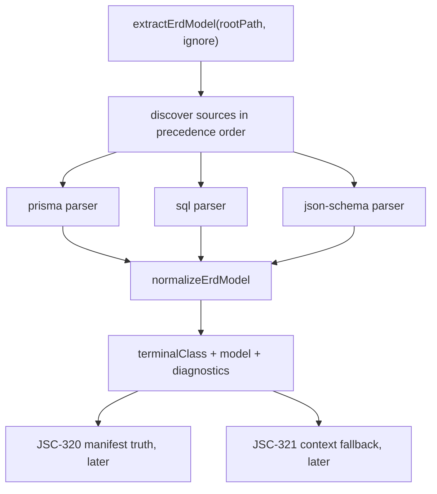

# JSC-319 JSON Schema Logical ERD Specification

## Table of Contents
- [Command Summary](#command-summary)
- [Status Block](#status-block)
- [Purpose](#purpose)
- [Problem Statement](#problem-statement)
- [User / Operator Scenarios](#user--operator-scenarios)
- [Goals](#goals)
- [Non-Goals](#non-goals)
- [Current State / Evidence](#current-state--evidence)
- [Proposed Behavior](#proposed-behavior)
- [Requirements](#requirements)
- [Interfaces](#interfaces)
- [Data / Domain Contract](#data--domain-contract)
- [Assumptions and Constraints](#assumptions-and-constraints)
- [Security, Privacy, and Safety](#security-privacy-and-safety)
- [Accessibility and Operator Ergonomics](#accessibility-and-operator-ergonomics)
- [Observability](#observability)
- [Failure and Recovery](#failure-and-recovery)
- [Validation Plan](#validation-plan)
- [Acceptance Criteria](#acceptance-criteria)
- [Visual References / Diagrams](#visual-references--diagrams)
- [Implementation Notes](#implementation-notes)
- [Open Questions](#open-questions)
- [Decision](#decision)
- [Evidence and References](#evidence-and-references)
- [Linear Work Item Contract](#linear-work-item-contract)
- [Linear Acceptance Traceability](#linear-acceptance-traceability)
- [Appendix A. Harness Metadata / Traceability](#appendix-a-harness-metadata--traceability)
- [Appendix B. Review Outcomes](#appendix-b-review-outcomes)
- [Appendix C. he-plan Handoff](#appendix-c-he-plan-handoff)

## Command Summary

BLUF: Implement JSC-319 as the narrow P0 proof that `diagram-cli` can extract a useful logical ERD from local JSON Schema files, without changing SQL/Prisma ERD behavior or pulling YAML, TypeScript, manifest truth, or context-pack guidance into the first slice.

Decision Needed: Admit this spec to `he-plan` for implementation planning, with `JSC-319` as the owning issue and `JSC-320`/`JSC-321` kept downstream. Do not treat this specification as implementation correctness or production readiness evidence.

Top Risks: Blurring database and contract semantics; accidentally resolving remote `$ref` values; changing existing SQL/Prisma snapshots; treating P1 manifest truth as done just because P0 returns entities.

Next Action: Build an `he-plan` for JSC-319 that starts with fixture/test proof, then adds the smallest parser/source-kind changes needed to pass those tests.

## Status Block

| Field | Value |
| --- | --- |
| `interactive_status` | ready_for_plan |
| `selection_evidence` | Local Linear artifact records `JSC-319`, applied linear plan, refactor P0, strategy smallest slice, source/test review |
| `route` | he-spec -> he-plan |
| `stage` | specification |
| `scope` | JSON Schema logical ERD extraction only |
| `traceability` | JSC-318 parent; JSC-319 P0; JSC-320/P1 and JSC-321/P2 downstream |
| `validation` | BLUF check required for this artifact; implementation validation defined below |
| `safe_to_continue` | true |
| `blocked_reason` | none |
| `linear_mutation_status` | not_needed |
| `linear_action_required` | none for this spec pass; local `.harness/linear` artifact records applied topology on 2026-05-13 |
| `spec_path` | `.harness/specs/2026-05-13-JSC-319-json-schema-logical-erd-spec.md` |
| `acceptance_ids` | `SA-319-001` through `SA-319-011` |
| `handoff` | he-work |
| `confidence` | 92%; strong candidate with validation gaps from local artifacts, source/test inspection, plan/spec alignment review, and technical review |

## Purpose

This spec defines the first implementation slice for contract-schema ERD support in `diagram-cli`. It turns the applied `JSC-319` Linear issue into a testable behavior contract for JSON Schema extraction.

The purpose is to prove that contract-heavy repositories can produce meaningful ERD entities and relationships from real schema artifacts without fake database schema files and without destabilizing existing Prisma or SQL ERD behavior.

## Problem Statement

The current ERD extractor only discovers Prisma and SQL schema sources. Repositories whose domain model lives in JSON Schema contracts therefore get `failed_no_schema` even when meaningful logical entities exist in `*.schema.json` files.

That is a product-trust issue: Archscope can write an `erd.mmd` artifact, but the artifact may be empty and unhelpful for the actual repository architecture. P0 must close the smallest useful part of that gap by adding a JSON Schema source kind that maps local object schemas into the existing normalized ERD model.

## User / Operator Scenarios

1. Contract-heavy repository with JSON Schema contracts:
   - An operator runs ERD generation against a repo containing local `*.schema.json` files and no SQL/Prisma schema.
   - The extractor finds JSON Schema sources and returns a completed model with deterministic entities, attributes, and local `$ref` relationships.

2. Existing database-backed repository:
   - An operator runs existing ERD generation against a repo with `schema.prisma` or `.sql` files.
   - Output remains compatible with current tests and fixtures.

3. Repository with no supported ERD source:
   - An operator runs ERD generation against a repo with no Prisma, SQL, or JSON Schema sources.
   - P0 may update the diagnostic wording to include JSON Schema, but it must still report an unavailable/no-schema state rather than inventing entities.

4. JSON Schema with unsupported external references:
   - A schema contains a remote `$ref` such as `https://example.com/schema.json`.
   - The extractor does not fetch the network and does not claim a resolved relationship from that reference.

5. JSON Schema with cross-file local references:
   - A schema contains a `$ref` such as `./event.schema.json`.
   - P0 treats the reference as unsupported unless a later spec admits cross-file ref resolution.

## Goals

- Add `json-schema` as a first-class ERD source kind after existing database source kinds.
- Discover `**/*.schema.json` files through the same ignore behavior used for existing sources.
- Parse a minimal, local JSON Schema object model into ERD entities and attributes.
- Extract explicit relationships from local `$ref` and array `items.$ref` values.
- Preserve existing Prisma and SQL ERD behavior.
- Keep P0 reversible and fixture-backed.

## Non-Goals

- YAML schema support.
- TypeScript AST or type extraction.
- Remote `$ref` resolution.
- Configured contract source globs or `.diagramrc` changes.
- Manifest truth/degraded-state changes owned by `JSC-320`.
- Agent context fallback guidance owned by `JSC-321`.
- Renderer rewrite or new Mermaid syntax.
- Adding fake `schema.prisma` or SQL files to consumer repositories.

## Current State / Evidence

| Evidence | Source | Spec impact |
| --- | --- | --- |
| `SOURCE_PRECEDENCE` is `['prisma', 'sql']` | `src/schema/erd-extractor.js` | P0 must add `json-schema` after database sources |
| `SOURCE_FILE_PATTERNS` only includes Prisma and SQL | `src/schema/erd-extractor.js` | P0 must add `**/*.schema.json` |
| `SCHEMA_PARSERS` only maps Prisma and SQL | `src/schema/erd-extractor.js` | P0 must add parser dispatch |
| Missing source diagnostic names only `schema.prisma` and `.sql` | `src/schema/erd-extractor.js` | P0 may update no-schema wording |
| Normalization canonicalizes entity, attribute, relationship, and type tokens | `src/schema/erd-model.js` | JSON Schema parser should feed the same model shape |
| Existing extractor tests cover Prisma, SQL, no-source, ignore, and parse failure behavior | `test/erd-extractor.test.js` | P0 must extend rather than weaken this suite |
| Existing ERD fixtures are small source-specific directories | `test/fixtures/erd/**` | Add a tiny `contract-schema-json` fixture |
| Local Linear artifact records P0 as `JSC-319` | `.harness/linear/2026-05-13-JSC-318-contract-schema-erd-linear-plan.md` | Spec is tracked work, not local-only intent |
| Local Linear artifact records `JSC-320` and `JSC-321` downstream | `.harness/linear/2026-05-13-JSC-318-contract-schema-erd-linear-plan.md` | P1/P2 must stay out of P0 |
| Local Linear topology artifact records applied children | `.harness/linear/2026-05-13-JSC-318-contract-schema-erd-linear-plan.md` | This pass does not require an external Linear write |

## Proposed Behavior

P0 adds a JSON Schema extraction path that feeds the same normalized ERD model used by existing SQL and Prisma parsers.

The extractor should discover JSON Schema files, parse local object schemas into entities, map object properties into attributes, and create explicit relationships when a property refers to another local schema definition. Existing SQL and Prisma parsing remain authoritative for database schemas and must not be rewritten as part of this slice.

Do:

- Keep `prisma` and `sql` first in source precedence.
- Add `json-schema` after `sql`.
- Keep parser output in the existing `{ entities, relationships }` shape.
- Keep fixture data small and deterministic.
- Treat in-document JSON Pointer `$ref` values as relationship evidence.
- Emit deterministic diagnostics for unsupported, unresolved, cross-file, or remote refs so operators do not mistake skipped references for complete ERD coverage.

Do Not:

- Fetch remote references.
- Resolve cross-file references.
- Add broad JSON Schema dialect support before a fixture proves the core path.
- Change renderer behavior solely for JSON Schema.
- Claim generate-all manifest truth is complete in P0.

## Requirements

### Functional Requirements

| ID | Requirement | Trace |
| --- | --- | --- |
| FR-319-001 | `SOURCE_PRECEDENCE` MUST include `json-schema` after `prisma` and `sql`. | JSC-319 scope |
| FR-319-002 | `SOURCE_FILE_PATTERNS` MUST discover `**/*.schema.json` files using the same ignore pipeline as existing sources. | JSC-319 scope |
| FR-319-003 | `SCHEMA_PARSERS` MUST dispatch `json-schema` to a JSON Schema parser through the same `parseSchemaSource` path used by Prisma and SQL. The internal dispatch may pass file context to parsers, but the public `extractErdModel({ rootPath, ignore })` API MUST NOT change. | Source inspection |
| FR-319-004 | The JSON Schema parser MUST create ERD entities from local object schemas in root schemas, `$defs`, or `definitions`. | JSC-319 scope |
| FR-319-005 | The parser MUST create attributes from JSON Schema `properties`. | JSC-319 scope |
| FR-319-006 | The parser MUST mark properties listed in a schema object's `required` array as `nullable: false`; other properties SHOULD be `nullable: true`. | JSC-319 scope |
| FR-319-007 | In-document JSON Pointer `$ref` values pointing at another object schema in the same file MUST create explicit relationships. | JSC-319 scope |
| FR-319-008 | Array properties with `items.$ref` pointing at another object schema in the same file MUST create explicit relationships with collection cardinality. | JSC-319 scope |
| FR-319-009 | Remote `$ref` values MUST NOT trigger network access and MUST NOT create claimed resolved relationships. | Refactor stop condition |
| FR-319-010 | Existing Prisma and SQL parser behavior MUST remain compatible with current tests. | Anti-regression |
| FR-319-011 | Repositories with no Prisma, SQL, or JSON Schema source MUST still return a no-schema terminal class rather than fabricated entities. | Current behavior preservation |
| FR-319-012 | Cross-file `$ref` values MUST NOT be resolved in P0 and SHOULD produce a diagnostic if encountered. | P0 scope boundary |
| FR-319-013 | JSON Pointer tokens in supported refs MUST handle `~0` and `~1` unescaping for local definition names. | JSON Pointer correctness |
| FR-319-014 | The fixture MUST prove both scalar property extraction and local `$ref` relationship extraction from the same schema document. | Acceptance proof |
| FR-319-015 | Relationship property handling MUST be deterministic: the implementation must either retain relationship properties as attributes or omit them, and the focused test must assert the chosen behavior. | Source/test review |
| FR-319-016 | Unsupported, unresolved, cross-file, non-object, composition, and remote `$ref` values MUST produce deterministic diagnostics without creating resolved relationships. | Operator trust |
| FR-319-017 | JSON Schema fixtures MUST distinguish explicit `$ref` relationships from existing inferred `*Id` relationship behavior so inferred relationships cannot mask parser failures. | Source/test review |

### Non-Functional Requirements

| ID | Requirement | Trace |
| --- | --- | --- |
| NFR-319-001 | Output ordering MUST be deterministic across repeated runs. | Existing ERD model normalization |
| NFR-319-002 | The implementation SHOULD avoid new runtime dependencies for P0. | Reversibility |
| NFR-319-003 | Parser errors in one JSON Schema file MUST be reported through existing diagnostics behavior rather than crashing the whole extraction. | Current parse error model |
| NFR-319-004 | P0 MUST remain reversible by removing the source kind, parser, fixture, and tests. | Refactor rollback |
| NFR-319-005 | P0 MUST NOT require a public config or manifest schema migration. | P1 boundary |
| NFR-319-006 | Parser helpers SHOULD stay local to `erd-extractor.js` unless shared use is proven by P1/P2. | Scope containment |
| NFR-319-007 | The fixture SHOULD avoid broad JSON Schema validation semantics and model only the contract shapes needed for ERD proof. | Ruthless testing |
| NFR-319-008 | Diagnostics added by the JSON Schema parser MUST be stable enough for focused assertions and generated artifact comments, using category tokens such as `remote_ref_unsupported`, `cross_file_ref_unsupported`, `local_ref_unresolved`, `composition_unsupported`, and `non_object_definition_ignored`. | Observability |
| NFR-319-009 | This spec MUST NOT be used as proof of implementation correctness until the implementation validation gates pass. | Confidence discipline |

## Interfaces

### Public CLI Behavior

P0 does not define a new CLI flag. Existing ERD generation paths call `extractErdModel` and should gain JSON Schema support through source discovery.

### Internal API

`extractErdModel({ rootPath, ignore })` must continue returning:

```js
{
  extractionInvoked: true,
  sourcePrecedence: string[],
  sourceFiles: string[],
  diagnostics: string[],
  terminalClass: 'completed' | 'failed_no_schema' | 'failed_parse',
  model: {
    entities: Entity[],
    relationships: Relationship[],
    diagnostics: string[],
    sourceFiles: string[],
    sourcePrecedence: string[]
  }
}
```

The public extractor API is stable, but the internal parser dispatch may pass file context to parser implementations so the JSON Schema parser can derive filename fallback entity names and relative diagnostics:

```js
parseSchemaSource(source, content, {
  absoluteFilePath,
  relativeFilePath,
  rootPath,
})
```

Existing Prisma and SQL parsers may ignore this context. This context object is internal and MUST NOT become a public CLI or API requirement in P0.

`json-schema` parser output must use the same core parser contract as existing parsers and MAY add non-fatal diagnostics:

```js
{
  entities: [
    {
      name: 'AgentRunManifest',
      source: 'explicit',
      attributes: [
        { name: 'runId', type: 'string', nullable: false, keyFlags: [] }
      ]
    }
  ],
  relationships: [
    {
      fromEntity: 'AgentRunManifest',
      toEntity: 'AgentRunEvent',
      cardinality: '||--o{',
      provenance: 'explicit'
    }
  ],
  diagnostics: [
    'json-schema:manifest.schema.json:#/properties/externalRef remote_ref_unsupported'
  ]
}
```

Parser-returned diagnostics MUST be merged into `result.diagnostics` without turning partial extraction into `failed_parse`. Thrown parser errors remain whole-file parse failures through the existing parse-error path.

The parser contract remains data-only. It MUST NOT call validators, load modules from the target repository, execute schema examples, consult `.diagramrc`, fetch remote refs, or traverse cross-file refs.

## Data / Domain Contract

### Source Discovery

| Source kind | Pattern | P0 status |
| --- | --- | --- |
| `prisma` | `**/schema.prisma` | existing |
| `sql` | `**/*.sql` | existing |
| `json-schema` | `**/*.schema.json` | add in P0 |

The ignore list used by `globSync` MUST remain shared across all source kinds. The source list is additive: if a repository contains Prisma, SQL, and JSON Schema sources, all discovered sources may be parsed and normalized into the same model unless a later issue introduces source-kind conflict policy.

### Supported JSON Schema Shape

P0 supports this deliberately small subset:

| Shape | Status | Notes |
| --- | --- | --- |
| root object schema with `properties` | supported | entity name from `title` or filename stem |
| `$defs` object entries | supported | entity name from definition key |
| `definitions` object entries | supported | legacy alias for `$defs` |
| `required` array | supported | drives `nullable: false` |
| property `$ref` to `#/$defs/Name` or `#/definitions/Name` | supported | creates explicit relationship |
| array `items.$ref` to `#/$defs/Name` or `#/definitions/Name` | supported | creates collection relationship |
| `allOf`, `anyOf`, `oneOf`, `not`, `if/then/else` | unsupported in P0 | ignore unless needed later |
| cross-file refs | unsupported in P0 | diagnostic required |
| remote refs | unsupported in P0 | no network access |

### Entity Naming

The parser SHOULD prefer entity names in this order:

1. Local definition key from `$defs.<Name>` or `definitions.<Name>`.
2. Root schema `title`.
3. Filename stem with `.schema` removed.

Names are normalized by the existing `normalizeErdModel` path, so the parser does not need a separate naming convention beyond providing stable raw names.

If two files or definitions normalize to the same entity name, the existing model normalization may merge them. The fixture SHOULD avoid accidental collisions, and implementation notes SHOULD call out intentional merges only when tested.

### Attribute Mapping

| JSON Schema input | ERD attribute behavior |
| --- | --- |
| `type: "string"` | `type: "string"` |
| `type: "integer"` | `type: "integer"` |
| `type: "number"` | `type: "number"` |
| `type: "boolean"` | `type: "boolean"` |
| `type: "array"` without local `$ref` items | `type: "array"` |
| object property with in-document `$ref` | relationship plus attribute retained with target entity name when resolved, otherwise `ref` |
| `type: ["string", "null"]` | `type: "string"`; nullability still follows the `required` array in P0 |
| unknown, absent, or unsupported type | `type: "unknown"` |

Required properties MUST be represented as `nullable: false`. Optional properties SHOULD be represented as `nullable: true`.

Relationship properties MUST remain as attributes in P0 and also create explicit relationships when their `$ref` resolves. Focused tests MUST assert this behavior so later manifest/context work does not infer a different contract.

### Relationship Mapping

| JSON Schema relation input | Relationship behavior |
| --- | --- |
| Property `$ref: "#/$defs/Target"` | `fromEntity` is containing schema; `toEntity` is target schema; `cardinality` SHOULD be `}o--||`; `provenance` is `explicit` |
| Property `$ref: "#/definitions/Target"` | Same as `$defs` |
| Property `items.$ref: "#/$defs/Target"` | `fromEntity` is containing schema; `toEntity` is target schema; `cardinality` SHOULD be `||--o{`; `provenance` is `explicit` |
| Remote `$ref` | No relationship; deterministic sanitized diagnostic required |
| Unresolved local `$ref` | No relationship; diagnostic MUST identify unresolved local target |
| Cross-file `$ref` | No relationship in P0; diagnostic MUST identify unsupported cross-file ref |
| Referenced non-object definition | No relationship; diagnostic MUST identify ignored non-object definition |
| Composition keyword requiring flattening | No relationship in P0; diagnostic SHOULD use the composition unsupported category |

Supported local references are in-document JSON Pointers only. The resolver MUST unescape `~1` to `/` and `~0` to `~` when reading pointer tokens.

P0 MUST NOT rely on relationship labels. The current normalized ERD model preserves `fromEntity`, `toEntity`, `cardinality`, and `provenance`, but not property labels. Any relationship-label support is a separate model/rendering contract change and requires a spec update before implementation.

### Unknown-Field Behavior

Unknown JSON Schema keywords MUST be ignored unless they are needed for the P0 contract above. Ignoring an unknown keyword MUST NOT cause parse failure by itself.

Unsupported composition keywords such as `allOf`, `anyOf`, and `oneOf` SHOULD NOT be partially interpreted in P0. If they appear where relationship extraction would require flattening or guessing, emit a deterministic diagnostic rather than fabricating relationships.

### Compatibility

P0 does not change the machine-output envelope. P1 may add manifest/source-kind truth after P0 proves useful model extraction.

## Assumptions and Constraints

- The canonical source for this review is `.harness/specs/2026-05-13-JSC-319-json-schema-logical-erd-spec.md`.
- The applied Linear topology is evidenced by `.harness/linear/2026-05-13-JSC-318-contract-schema-erd-linear-plan.md`; this review did not perform a fresh external Linear read.
- `json-schema` support is unimplemented at the time of this spec review; source inspection shows only `prisma` and `sql` are registered.
- P0 may add local helper functions in `src/schema/erd-extractor.js`, but it must not introduce a JSON Schema validator dependency unless the implementation plan explicitly justifies it.
- Existing inferred relationship logic runs after parser output normalization; implementation tests must prove JSON Schema explicit relationships are not accidentally satisfied by `*Id` inference alone.
- Any change that requires source-kind metadata in generated manifests belongs to `JSC-320`, even if discovered while implementing `JSC-319`.
- Parser-returned diagnostics are valid partial-extraction evidence and are not the same as thrown parse errors.
- Relationship labels are not part of the P0 normalized ERD contract.
- This spec is implementation-ready planning input, not production-readiness evidence.

## Security, Privacy, and Safety

- The parser MUST read only local files discovered under the requested `rootPath`.
- The parser MUST NOT fetch remote `$ref` URLs.
- The parser MUST NOT walk cross-file refs in P0.
- The parser MUST NOT execute code from schema files.
- Malformed JSON MUST be handled as a parse diagnostic through existing error behavior.
- The fixture MUST avoid secrets, customer data, or copied production contracts.
- Diagnostics MUST NOT include full remote URLs with sensitive query strings; if a remote ref is reported, the implementation should report only the unsupported ref class and a sanitized ref target.

## Accessibility and Operator Ergonomics

This is not a UI spec. Operator-facing ergonomics apply to generated artifact clarity:

- Diagnostics SHOULD name JSON Schema as a supported source when no supported files are found.
- Failure text SHOULD remain concise enough for generated ERD comments and test assertions.
- Output should remain stable and easy for agents to scan.
- Diagnostics MUST not rely on color, emoji, or visual-only markers to communicate degraded or unsupported ref handling.
- Generated ERD comments and diagnostics SHOULD use plain text labels such as `remote_ref_unsupported`, `cross_file_ref_unsupported`, `local_ref_unresolved`, `composition_unsupported`, and `non_object_definition_ignored` so screen readers and agents can parse the reason.

## Observability

P0 observability is text-artifact and test-output based:

- `result.sourceFiles` and `result.model.sourceFiles` MUST include discovered JSON Schema files using the existing relative-path behavior.
- `result.diagnostics` MUST include deterministic entries for malformed JSON and unsupported ref classes.
- Unsupported ref diagnostics SHOULD identify the source file and ref class without dumping large schema fragments.
- Focused tests MUST assert at least one diagnostic path for unsupported or unresolved JSON Schema refs.
- Parser-returned diagnostics MUST be visible through `result.diagnostics` after extraction completes.
- Generated ERD output does not need new telemetry, metrics, tracing, or dashboards in P0.

## Failure and Recovery

| Failure | Expected behavior | Recovery |
| --- | --- | --- |
| No supported source files | `failed_no_schema`; no entities | Add supported schema source or defer to P2 fallback guidance |
| Malformed JSON Schema file | Existing parse diagnostic path; no crash | Fix fixture/schema JSON |
| JSON Schema source found but no entities | `failed_parse` or existing no-entity behavior | Add object schema or definition |
| Remote `$ref` found | No network access; no claimed relationship | Keep unsupported or add separate future spec |
| Cross-file `$ref` found | No claimed relationship in P0 | Defer to future spec if needed |
| Unsupported or unresolved ref silently skipped | Not acceptable after this spec revision | Add deterministic diagnostic and focused assertion |
| Parser-returned diagnostic dropped before output | Not acceptable after this spec revision | Merge parser diagnostics into extractor result and assert category token |
| Inferred `*Id` relationship masks missing explicit `$ref` relationship | Not acceptable | Add fixture assertions that check relationship provenance and source input |
| Duplicate normalized entity names | Existing normalization may merge entities | Rename fixture schemas or add explicit collision test before relying on merge |
| SQL/Prisma regression | P0 is not acceptable | Revert JSON Schema source/parser/fixture changes |

Rollback is safe when the change is limited to source-kind registration, parser implementation, fixture, and focused tests.

## Validation Plan

Required implementation validation:

| Gate | Command / Evidence | Expected result |
| --- | --- | --- |
| Extractor focused tests | `npm test -- test/erd-extractor.test.js` | pass |
| Source precedence proof | focused test assertion | `SOURCE_PRECEDENCE` is `['prisma', 'sql', 'json-schema']` |
| JSON Schema fixture proof | focused test under `test/fixtures/erd/contract-schema-json/**` | terminal class `completed`, deterministic entities/relationships |
| Existing SQL/Prisma regression proof | existing tests in `test/erd-extractor.test.js` | pass without weakened assertions |
| No remote ref behavior | focused parser/fixture assertion if remote refs are represented | no fetch, no resolved relationship |
| Cross-file ref boundary | focused parser assertion if cross-file refs are represented | no resolved relationship; deterministic diagnostic |
| JSON Pointer unescape | focused parser assertion | `~1` and `~0` tokens resolve when used in supported local refs |
| Unsupported ref diagnostics | focused parser assertion | deterministic diagnostic for remote, cross-file, or unresolved local ref |
| Inference masking guard | focused fixture assertion | expected relationship provenance is `explicit`; fixture cannot pass solely because of `*Id` inference |
| Parser diagnostics merge | focused extractor assertion | parser-returned JSON Schema diagnostics appear in `result.diagnostics` without forcing whole extraction to `failed_parse` |
| CLI JSON smoke | `node src/diagram.js generate test/fixtures/erd/contract-schema-json --type erd --format json --deterministic --quiet` | JSON envelope reports success and includes ERD metadata for the JSON Schema source |
| Optional file smoke | `node src/diagram.js generate test/fixtures/erd/contract-schema-json --type erd --output /private/tmp/diagram-cli-jsc-319-erd-smoke.mmd --force --deterministic --quiet` | `.mmd` output is written if artifact-write proof is required |

Optional follow-on validation if implementation touches artifact generation:

- `npm test -- test/evidence-manifest-parity.test.js test/erd-extractor.test.js`

That optional gate belongs to `JSC-320` if P0 does not touch manifest behavior.

## Acceptance Criteria

| ID | Acceptance criterion | Evidence |
| --- | --- | --- |
| SA-319-001 | A contract-heavy fixture with only `*.schema.json` files produces `terminalClass: completed`. | `npm test -- test/erd-extractor.test.js` |
| SA-319-002 | The JSON Schema fixture produces deterministic entity names, attributes, required/nullability values, and explicit local `$ref` relationships. | focused extractor assertions |
| SA-319-003 | `SOURCE_PRECEDENCE` includes `json-schema` after `prisma` and `sql`. | focused extractor assertion |
| SA-319-004 | Existing SQL and Prisma ERD tests still pass. | existing extractor test suite |
| SA-319-005 | Remote refs, YAML, TypeScript, configured source globs, manifest truth, and context guidance remain explicitly out of P0 scope. | spec/handoff review and implementation diff |
| SA-319-006 | Cross-file refs and unsupported composition keywords remain out of P0 scope and do not create claimed relationships. | focused extractor assertions or implementation diff review |
| SA-319-007 | Relationship property attribute behavior is explicitly tested. | focused extractor assertion |
| SA-319-008 | Unsupported, unresolved, cross-file, and remote refs produce deterministic diagnostics without resolved relationships. | focused extractor assertions |
| SA-319-009 | JSON Schema explicit relationship tests cannot pass solely because of existing `*Id` relationship inference. | focused extractor assertion |
| SA-319-010 | Parser-returned JSON Schema diagnostics are merged into `result.diagnostics` as non-fatal diagnostics when partial extraction succeeds. | focused extractor assertion |
| SA-319-011 | CLI JSON smoke succeeds for the JSON Schema fixture without requiring Mermaid CLI rendering. | CLI smoke command |

## Visual References / Diagrams



Text requirements are authoritative if this diagram and the requirements disagree.

## Implementation Notes

- Add tests before or alongside parser implementation.
- Keep the fixture small: two or three local schemas are enough if they prove an entity relationship and an array relationship.
- Prefer a helper that resolves local JSON pointers for `$defs` and `definitions`; do not introduce a full JSON Schema validator unless P0 proves it is needed.
- Keep JSON Pointer resolution in-document for P0; cross-file resolution is a separate parser strategy.
- Feed raw parser output through `normalizeErdModel` rather than duplicating canonicalization.
- If a property is both a relationship and an attribute, retain it as an attribute and create the relationship when the `$ref` resolves; do not invent a richer ERD model in P0.
- Include at least one scalar `*Id`-style property in a JSON Schema fixture only if the test also proves the intended explicit `$ref` relationship provenance; otherwise omit `*Id` names from the fixture to avoid false confidence.
- If source-kind metadata beyond `sourcePrecedence` is needed for generated manifests, stop and route that work to `JSC-320`.

## Open Questions

- Should root schemas without `title` use the filename stem or be ignored when `$defs` contains named object schemas? The recommended fallback is filename stem for a root object.
- Should unsupported composition keywords always emit diagnostics, or only when encountered along a relationship extraction path? P0 requires diagnostics when relationship extraction would otherwise require flattening or guessing.

## Decision

Admit JSC-319 as a JSON Schema-only P0 spec. The implementation must prove useful logical ERD extraction from local JSON Schema contracts while preserving existing database ERD behavior.

`JSC-320` and `JSC-321` remain downstream. Parent `JSC-318` is not complete until P0/P1/P2 evidence and closure eval exist.

## Evidence and References

- Linear parent: `JSC-318`, evidenced in local Linear artifact.
- Linear P0 issue: `JSC-319`, evidenced in local Linear artifact.
- Downstream Linear issues: `JSC-320`, `JSC-321`, evidenced in local Linear artifact.
- Strategy: `.harness/strategy/2026-05-12-JSC-318-contract-schema-erd-strategy.md`.
- Refactor program: `.harness/refactors/2026-05-12-JSC-318-contract-schema-erd-refactor.md`.
- Linear topology: `.harness/linear/2026-05-13-JSC-318-contract-schema-erd-linear-plan.md`.
- Source: `src/schema/erd-extractor.js`.
- Model normalizer: `src/schema/erd-model.js`.
- Tests: `test/erd-extractor.test.js`.
- Fixtures: `test/fixtures/erd/**`.

## Linear Work Item Contract

| Field | Value |
| --- | --- |
| Linear issue | `JSC-319` |
| Parent issue | `JSC-318` |
| Linear status | `backlog` in local artifact context; not freshly verified externally in this pass |
| Work type | P0 implementation slice |
| Owning artifact | `.harness/specs/2026-05-13-JSC-319-json-schema-logical-erd-spec.md` |
| Implementation plan | `.harness/plan/2026-05-13-JSC-319-json-schema-logical-erd-plan.md` |
| Downstream issues | `JSC-320`, `JSC-321` |
| External mutation status | not authorized by this spec pass |
| Completion evidence | focused extractor tests, baseline tests, deep tests, fast verification, CLI JSON smoke |

## Linear Acceptance Traceability

| Linear issue | Acceptance IDs |
| --- | --- |
| `JSC-319` | `SA-319-001`, `SA-319-002`, `SA-319-003`, `SA-319-004`, `SA-319-005`, `SA-319-006`, `SA-319-007`, `SA-319-008`, `SA-319-009`, `SA-319-010`, `SA-319-011` |

## Appendix A. Harness Metadata / Traceability

| Field | Value |
| --- | --- |
| `schema_version` | 1 |
| `selected_stage` | he-spec |
| `spec_mode` | standard-spec |
| `spec_depth` | full |
| `linear_mutation_status` | not_needed |
| `linear_action_required` | none |
| `linear_parent` | JSC-318 |
| `linear_issue` | JSC-319 |
| `repo_location_label` | diagram-cli |
| `project` | Diagram product surface and analysis workflow |
| `current_status` | Backlog |
| `artifact_write_status` | created locally |
| `subagent_policy` | conditional; not used |

Traceability matrix:

| Spec item | Linear / artifact source | Evidence |
| --- | --- | --- |
| FR-319-001 through FR-319-003 | JSC-319 scope | Local Linear artifact and `erd-extractor.js` source |
| FR-319-004 through FR-319-008 | Strategy P0 and refactor P0 | local artifacts |
| FR-319-009 | Refactor stop condition | no remote refs in P0 |
| FR-319-010 | Anti-regression constraints | existing test suite |
| FR-319-016 through FR-319-017 | Technical review hardening | diagnostics and inference-masking risk review |
| SA-319-001 through SA-319-011 | JSC-319 closeout evidence | validation plan |

## Appendix B. Review Outcomes

A technical review artifact was written at `.harness/review/2026-05-13-JSC-319-json-schema-logical-erd-plan-technical-review.md`. No independent review swarm was requested or run for this spec. The main residual review risk is implementation behavior, especially JSON Pointer edge cases and diagnostic merge correctness. That risk is bounded by P0's local `$ref` and minimal fixture scope.

Validation outcomes for this spec artifact:

| Gate | Outcome | Evidence |
| --- | --- | --- |
| Repo preflight | pass | `bash scripts/codex-preflight.sh --mode optional` |
| Spec BLUF structure | pass | `python3 /Users/jamiecraik/dev/agent-skills/Plugins/harness-engineering/scripts/check_bluf_structure.py .harness/specs/2026-05-13-JSC-319-json-schema-logical-erd-spec.md --json` |
| Plan BLUF structure | pass | `python3 /Users/jamiecraik/dev/agent-skills/Plugins/harness-engineering/scripts/check_bluf_structure.py .harness/plan/2026-05-13-JSC-319-json-schema-logical-erd-plan.md --json` |
| Repo fast verification | pass | `bash scripts/verify-work.sh --fast` |
| Spec artifact identity lint | pass | `python3 /Users/jamiecraik/dev/agent-skills/Infrastructure/scripts/validation-and-linting/he_artifact_identity_lint.py .harness/specs/2026-05-13-JSC-319-json-schema-logical-erd-spec.md` |
| Spec Linear traceability lint | pass | `python3 /Users/jamiecraik/dev/agent-skills/Infrastructure/scripts/validation-and-linting/he_linear_traceability_lint.py .harness/specs/2026-05-13-JSC-319-json-schema-logical-erd-spec.md` |
| Plan artifact identity lint | pass | `python3 /Users/jamiecraik/dev/agent-skills/Infrastructure/scripts/validation-and-linting/he_artifact_identity_lint.py .harness/plan/2026-05-13-JSC-319-json-schema-logical-erd-plan.md` |
| Plan Linear traceability lint | pass | `python3 /Users/jamiecraik/dev/agent-skills/Infrastructure/scripts/validation-and-linting/he_linear_traceability_lint.py .harness/plan/2026-05-13-JSC-319-json-schema-logical-erd-plan.md` |

No-Fog Gate:

- The spec names one owning issue: `JSC-319`.
- The spec has stable `FR-*`, `NFR-*`, and `SA-*` IDs.
- P1 and P2 are explicitly downstream, not hidden in P0.
- The validation plan includes exact focused commands.
- Remote `$ref`, YAML, TypeScript, and config globs are out of scope.

## Appendix C. he-plan Handoff

Recommended `he-plan` input:

```yaml
selected_issue: JSC-319
selected_spec: .harness/specs/2026-05-13-JSC-319-json-schema-logical-erd-spec.md
source_artifacts:
  - .harness/linear/2026-05-13-JSC-318-contract-schema-erd-linear-plan.md
  - .harness/refactors/2026-05-12-JSC-318-contract-schema-erd-refactor.md
  - .harness/strategy/2026-05-12-JSC-318-contract-schema-erd-strategy.md
primary_files:
  - src/schema/erd-extractor.js
  - src/schema/erd-model.js
  - test/erd-extractor.test.js
  - test/fixtures/erd/**
required_validation:
  - npm test -- test/erd-extractor.test.js
  - npm test
  - npm run test:deep
  - bash scripts/verify-work.sh --fast
  - node src/diagram.js generate test/fixtures/erd/contract-schema-json --type erd --format json --deterministic --quiet
acceptance_ids:
  - SA-319-001
  - SA-319-002
  - SA-319-003
  - SA-319-004
  - SA-319-005
  - SA-319-006
  - SA-319-007
  - SA-319-008
  - SA-319-009
  - SA-319-010
  - SA-319-011
out_of_scope:
  - JSC-320 manifest truth
  - JSC-321 context fallback
  - YAML schema support
  - TypeScript contract extraction
  - remote ref resolution
```
