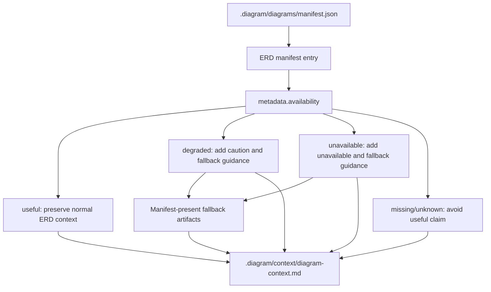

# JSC-321 ERD Unavailable Context Fallback Specification

## Table of Contents
- [Command Summary](#command-summary)
- [Status Block](#status-block)
- [Purpose](#purpose)
- [Problem Statement](#problem-statement)
- [User / Operator Scenarios](#user--operator-scenarios)
- [Goals](#goals)
- [Non-Goals](#non-goals)
- [Current State / Evidence](#current-state--evidence)
- [Proposed Behavior](#proposed-behavior)
- [Requirements](#requirements)
- [Interfaces](#interfaces)
- [Data / Domain Contract](#data--domain-contract)
- [Security, Privacy, and Safety](#security-privacy-and-safety)
- [Accessibility and Operator Ergonomics](#accessibility-and-operator-ergonomics)
- [Failure and Recovery](#failure-and-recovery)
- [Validation Plan](#validation-plan)
- [Acceptance Criteria](#acceptance-criteria)
- [Visual References / Diagrams](#visual-references--diagrams)
- [Implementation Notes](#implementation-notes)
- [Technical Review Findings](#technical-review-findings)
- [Open Questions](#open-questions)
- [Decision](#decision)
- [Evidence and References](#evidence-and-references)
- [Linear Work Item Contract](#linear-work-item-contract)
- [Linear Acceptance Traceability](#linear-acceptance-traceability)
- [Appendix A. Harness Metadata / Traceability](#appendix-a-harness-metadata--traceability)
- [Appendix B. Review Outcomes](#appendix-b-review-outcomes)
- [Appendix C. he-plan Handoff](#appendix-c-he-plan-handoff)

## Command Summary

BLUF: This document specifies JSC-321 as the narrow context-pack guidance slice for ERD unavailable and degraded states. Its job is to define how `.diagram/context/diagram-context.md` must consume ERD manifest availability metadata and tell agents when an ERD should not be trusted as complete domain-model evidence. This matters because the risk is that an agent context pack can embed a placeholder ERD without fallback guidance and falsely imply database-model coverage. The next action is `he-plan` with tests around `test/context-pack.test.js` before the smallest safe change in `src/context/build-context-pack.js`.

Decision Needed: Admit this spec to `he-plan` for implementation planning after artifact-shape and traceability validation. Stop for owner decision if the implementation cannot derive fallback guidance from existing manifest entries without changing public CLI behavior or the manifest schema contract.

Top Risks: Reintroducing false completeness through prose that is not tied to manifest metadata; over-expanding into context-pack layout redesign; hard-coding fallback references to diagrams that were not generated; treating degraded ERDs as fully reliable; breaking deterministic context output.

Next Action: Build an `he-plan` that starts with focused context-pack tests for unavailable, degraded, useful, and missing-metadata ERD entries, then patches `src/context/build-context-pack.js` to emit compact deterministic guidance.

## Status Block

| Field | Value |
| --- | --- |
| `interactive_status` | ready_for_plan |
| `selection_evidence` | Live `JSC-321` Linear issue; `.harness/linear/2026-05-13-JSC-318-contract-schema-erd-linear-plan.md`; JSC-320 metadata contract; source review of context-pack builder |
| `route` | he-spec -> he-plan |
| `stage` | specification |
| `scope` | context-pack guidance for ERD unavailable/degraded states derived from manifest metadata |
| `traceability` | JSC-318 parent; JSC-319 logical JSON Schema ERD prerequisite; JSC-320 manifest truth prerequisite; JSC-321 P2 consumer |
| `validation` | BLUF, artifact shape, identity lint, Linear traceability lint; implementation validation defined below |
| `safe_to_continue` | true |
| `blocked_reason` | none |
| `linear_mutation_status` | not_needed |
| `linear_action_required` | none for this spec pass |
| `spec_path` | `.harness/specs/2026-05-13-JSC-321-erd-unavailable-context-fallback-spec.md` |
| `acceptance_ids` | `SA-321-001` through `SA-321-010` |
| `handoff` | he-plan |
| `confidence` | 91%; strong candidate with validation gaps because local source evidence supports the slice boundary, but implementation and runtime context-pack tests still need to be written and run |

## Purpose

This specification defines the JSC-321 behavior contract for ERD availability guidance in the AI context pack generated by `diagram-cli`.

JSC-319 expands ERD extraction to JSON Schema. JSC-320 makes ERD usefulness explicit in generated metadata. JSC-321 consumes that truth in `.diagram/context/diagram-context.md` so AI agents and human reviewers can avoid mistaking placeholder, unavailable, or degraded ERD output for reliable domain-model evidence.

## Problem Statement

The context pack currently builds a compact diagram index and embeds selected Mermaid diagrams from `.diagram/diagrams/manifest.json`. It does not explain whether an ERD is useful, degraded, or unavailable. When an ERD exists as a placeholder or low-confidence artifact, the context pack can still list or embed it like any other diagram.

That is dangerous for contract-heavy repositories. Agents often treat the context pack as a compressed source of truth. If the ERD is unavailable because no supported schema source exists, or degraded because extraction confidence is low, the context pack must say so and point the agent toward safer fallback evidence. The implementation must derive that guidance from manifest metadata rather than from brittle Mermaid comment parsing or optimistic prose.

## User / Operator Scenarios

1. Agent reviews a repository with no supported ERD source: The generated context pack tells the agent that ERD evidence is unavailable, gives the stable metadata reason, and points to available fallback diagrams or source artifacts instead of implying ERD coverage.
2. Agent reviews a repository with a low-confidence SQL ERD: The context pack marks ERD evidence as degraded, preserves the ERD as inspectable evidence, and tells the agent to corroborate with listed fallback artifacts.
3. Agent reviews a repository with a useful JSON Schema ERD: The context pack continues to show normal ERD output without adding fallback-warning copy that would make correct output look suspect.
4. Context pack budget omits the ERD body: Availability guidance still appears in the compact context surface when the ERD manifest entry is indexed, so the warning does not depend on embedded Mermaid content.
5. Manifest metadata is missing because an older artifact generated the context input: The context pack remains deterministic and avoids claiming ERD usefulness from missing metadata.

## Goals

- Make ERD unavailable and degraded states visible in `.diagram/context/diagram-context.md`.
- Use ERD manifest metadata from JSC-320 as the authoritative availability signal.
- Preserve existing normal context-pack behavior for useful ERDs.
- Keep output deterministic and compact enough for the existing context budget model.
- Reference only fallback artifacts or source evidence that are present in the manifest metadata or generated diagram manifest.
- Add focused tests proving unavailable, degraded, useful, and missing-metadata behavior.

## Non-Goals

- Do not add new ERD parsers.
- Do not add YAML, TypeScript, remote-reference, cross-file-reference, or renderer-rewrite behavior.
- Do not change public CLI commands, flags, or robot-mode syntax.
- Do not migrate top-level manifest schema version.
- Do not broadly redesign the context-pack layout.
- Do not mutate Linear, GitHub, PR state, or tracker status as part of this spec.
- Do not claim ERD completeness when manifest metadata says unavailable, degraded, or unknown.
- Do not infer availability from Mermaid comments when structured manifest metadata is available.

## Current State / Evidence

| Evidence | Classification | Finding |
| --- | --- | --- |
| `src/context/build-context-pack.js` | source-of-truth | Builds `# Diagram Context Pack`, a diagram index, embedded Mermaid sections, omitted-diagram notes, and deterministic metadata, but has no ERD availability guidance. |
| `src/context/normalize-diagram-manifest.js` | source-of-truth | Preserves existing manifest entry fields while normalizing file metrics, allowing ERD metadata to survive into context-pack input. |
| `src/artifacts/artifact-budget.js` | source-of-truth | Defines `AGENT_DIAGRAM_PRIORITY` as `architecture`, `dependency`, `erd`, `database`, `security`, `auth`, `events`, `user`, `flow`, `class`, `sequence`, `agent`, `c4context`, `rag`; fallback ordering must not invent a separate priority model without reason. |
| `src/core/analysis-generation-diagrams-erd.js` | prerequisite implementation evidence | JSC-320 metadata exposes `metadata.availability`, `metadata.availabilityReason`, `metadata.sourceKinds`, `metadata.sourceKindSummary`, and `metadata.sourceFilesByKind`. |
| `test/generate-output-json.test.js` | validation evidence | Covers useful Prisma, useful JSON Schema, unavailable no-schema, and degraded low-confidence ERD metadata states. |
| `test/context-pack.test.js` | validation surface | Existing context-pack tests cover manifest normalization, metadata preservation, deterministic metadata, budget behavior, and too-small budget errors. |
| `.harness/specs/2026-05-13-JSC-320-erd-source-kind-manifest-truth-spec.md` | prerequisite spec | Defines JSC-320 as the metadata source of truth consumed by this slice. |
| Linear JSC-321 | issue evidence | Defines the goal: tell agents when ERD is unavailable and point to better fallback diagrams or contract artifacts. |

## Proposed Behavior

`buildContextPack` must detect the ERD manifest entry when one is present and inspect its structured metadata.

For `metadata.availability: "unavailable"`, the generated context pack must include concise guidance stating that the ERD is unavailable for model-reasoning purposes, include the stable `availabilityReason`, and point the agent to safer fallback artifacts that actually exist in the manifest or source metadata.

For `metadata.availability: "degraded"`, the generated context pack must include cautionary guidance stating that the ERD may be incomplete or low confidence, include the stable `availabilityReason`, and require corroboration from fallback artifacts.

For `metadata.availability: "useful"`, the generated context pack must preserve current normal ERD behavior and avoid warning copy.

For missing or unknown ERD availability metadata, the generated context pack must avoid claiming usefulness and must emit conservative metadata guidance when the ERD entry is included in the diagram index. The guidance should say that ERD availability metadata is missing or unknown and that the ERD should be corroborated before use. This state is distinct from `metadata.availability: "unavailable"`; do not collapse missing metadata into the same reason string as a known no-schema ERD.

Fallback references must be deterministic. They must be selected from generated diagram entries present in the sorted manifest, using the existing context-pack priority order, excluding the ERD entry itself. If no generated fallback diagram is present, the guidance may cite manifest/source metadata as secondary evidence, but only with relative paths already present in metadata. The implementation must not reference a section heading or artifact path that does not exist in the generated manifest.

The preferred Markdown shape is a compact guidance block near the diagram index, before embedded Mermaid content:

```md
## ERD Availability Guidance

- Status: unavailable
- Reason: no_supported_schema_sources
- Fallback evidence: `.diagram/diagrams/architecture.mmd`, `.diagram/diagrams/dependency.mmd`
- Operator note: Do not treat the ERD as complete domain-model evidence without corroboration.
```

The exact wording may be refined during planning, but the labels `Status`, `Reason`, and `Fallback evidence` must remain stable enough for tests. Guidance may be omitted only when the ERD entry itself is excluded from the compacted header/index because of byte-budget constraints; in that case existing `headerCompacted` and `indexRowsIncluded` metadata are the recovery evidence.

## Requirements

### Functional Requirements

| ID | Requirement |
| --- | --- |
| FR-321-001 | The context-pack builder must treat `entry.type === "erd"` manifest metadata as the authoritative ERD availability source when present. |
| FR-321-002 | When ERD availability is `unavailable`, `.diagram/context/diagram-context.md` must state that ERD evidence is unavailable and include the stable `availabilityReason`. |
| FR-321-003 | When ERD availability is `degraded`, `.diagram/context/diagram-context.md` must state that ERD evidence is degraded or requires corroboration and include the stable `availabilityReason`. |
| FR-321-004 | When ERD availability is `useful`, existing normal context-pack output must remain materially unchanged except for deterministic metadata changes required by existing code paths. |
| FR-321-005 | Fallback guidance must reference only generated diagram entries or source metadata that exists in the manifest input. |
| FR-321-006 | Fallback guidance must not parse Mermaid comments or inspect placeholder prose to determine availability when structured metadata is present. |
| FR-321-007 | Missing or unknown ERD availability metadata must not be treated as proof that the ERD is useful. |
| FR-321-008 | Guidance must remain deterministic for identical input, including ordering of fallback artifact references. |
| FR-321-009 | Guidance must fit the existing context budget model; if the context budget is too small for the header, existing fail-closed behavior remains valid. |
| FR-321-010 | The implementation must not change public CLI commands, flags, manifest top-level schema version, or generated Mermaid diagram syntax. |
| FR-321-011 | Guidance must use stable labels for `Status`, `Reason`, and `Fallback evidence` so future agents and tests can parse the result without relying on decorative prose. |
| FR-321-012 | Fallback diagram ordering must reuse the existing `AGENT_DIAGRAM_PRIORITY` sorted manifest order and exclude the ERD itself. |
| FR-321-013 | Missing or unknown availability metadata for an indexed ERD must produce an explicit conservative metadata note, not silence. |

### Non-Functional Requirements

| ID | Requirement |
| --- | --- |
| NFR-321-001 | Guidance must be concise enough for AI context use and should not add long explanatory prose to every diagram section. |
| NFR-321-002 | Output wording must be stable enough for focused tests while remaining understandable to human operators. |
| NFR-321-003 | The change must be maintainable inside the existing context-pack module or a small local helper, avoiding a new abstraction layer unless tests show duplication or budget handling requires it. |
| NFR-321-004 | The change must not expose absolute local paths, secrets, credentials, or additional private repository details beyond existing relative artifact paths and manifest metadata. |
| NFR-321-005 | The implementation must preserve deterministic mode semantics and existing metadata timestamps. |
| NFR-321-006 | Test coverage must prove behavior directly from manifest entries instead of relying on end-to-end optimism alone. |

## Interfaces

### Input Interface

The implementation consumes `.diagram/diagrams/manifest.json` entries already read by `buildContextPack`.

Relevant ERD entry shape:

```json
{
  "type": "erd",
  "file": "erd.mmd",
  "isPlaceholder": true,
  "metadata": {
    "availability": "unavailable",
    "availabilityReason": "no_supported_schema_sources",
    "sourceKinds": [],
    "sourceKindSummary": "none",
    "sourceFilesByKind": {}
  }
}
```

### Output Interface

The primary output is `.diagram/context/diagram-context.md`.

The existing `.diagram/context/diagram-context.meta.json` output may record unchanged context-build metadata. This spec does not require new meta fields unless the implementation plan identifies a low-risk reason to expose them.

### CLI Interface

No public CLI interface changes are allowed. Existing `archscope context [path]`, `generate-all`, and robot-mode command guidance remain unchanged.

## Data / Domain Contract

| Field | Contract |
| --- | --- |
| `metadata.availability` | Expected values from JSC-320 are `useful`, `degraded`, and `unavailable`. Unknown or missing values must not be interpreted as `useful`. |
| `metadata.availabilityReason` | Stable reason string surfaced in guidance for unavailable and degraded states. Missing reason may be rendered as `unknown` or omitted only if tests cover the behavior. |
| `metadata.sourceKinds` | Optional evidence for source provenance; used for context wording only if present. |
| `metadata.sourceFilesByKind` | Optional fallback evidence; any source references must remain relative and deterministic. |
| `entry.isPlaceholder` | Secondary safety signal only. It may help avoid optimistic wording when metadata is missing, but it must not replace structured availability metadata. |
| Manifest diagram entries | Fallback diagram references must come from actual entries in the manifest and must be rendered in deterministic priority order. |
| Header/index budget state | If the ERD row is omitted from the compact header/index because of byte budget, ERD guidance may be absent; tests must cover the default-budget path where the ERD entry is indexed. |

## Security, Privacy, and Safety

- The change must not read credentials, environment secrets, user-global config, or remote resources.
- Guidance must use relative artifact paths such as `.diagram/diagrams/architecture.mmd`; do not emit absolute filesystem paths from temp directories.
- The context pack must avoid false safety claims. "Unavailable" and "degraded" are diagnostic states, not proof that no domain model exists in the repository.
- If source metadata includes unusual paths, output must preserve the existing manifest-relative behavior and must not normalize into absolute private paths.

## Accessibility and Operator Ergonomics

- The generated Markdown must be screen-reader friendly: use headings, short paragraphs, and lists or tables only when they add structure.
- Do not rely on color, icons, or visual-only status markers.
- Status wording must be plain enough for both humans and agents: `ERD availability: unavailable`, `Reason: no_supported_schema_sources`, and `Fallback evidence: ...` are preferred over decorative language.
- Keep guidance near the diagram index or ERD section so operators do not need to inspect raw Mermaid comments to understand reliability.

## Failure and Recovery

| Failure Mode | Expected Behavior | Recovery |
| --- | --- | --- |
| Manifest file missing or invalid | Preserve existing `buildContextPack` error behavior. | Re-run diagram generation or fix the manifest producer. |
| ERD entry absent | Do not add ERD-specific guidance. | Existing context output remains the source of truth for available diagrams. |
| ERD metadata missing | Do not claim usefulness; use conservative guidance only if tests define the exact output. | Regenerate artifacts with JSC-320-capable code. |
| ERD metadata unknown value | Do not crash or claim usefulness. | Treat as conservative/unknown and add focused test coverage. |
| Context budget too small for header | Preserve existing fail-closed error. | Increase context byte budget. |
| Fallback artifact missing | Do not reference it. | Use available manifest entries or source metadata only. |
| JSC-320 metadata contract changes before merge | Stop and update this spec before implementation. | Reconcile JSC-320/JSC-321 contracts. |

## Validation Plan

### Spec Artifact Validation

| Gate | Command | Required Result |
| --- | --- | --- |
| BLUF structure | `python3 /Users/jamiecraik/dev/agent-skills/Plugins/harness-engineering/scripts/check_bluf_structure.py .harness/specs/2026-05-13-JSC-321-erd-unavailable-context-fallback-spec.md --json` | pass |
| Harness artifact shape | `python3 /Users/jamiecraik/dev/agent-skills/Plugins/harness-engineering/scripts/check_generated_artifact_shape.py .harness/specs/2026-05-13-JSC-321-erd-unavailable-context-fallback-spec.md --kind spec --json` | pass |
| Artifact identity lint | `python3 /Users/jamiecraik/dev/agent-skills/Infrastructure/scripts/validation-and-linting/he_artifact_identity_lint.py .harness/specs/2026-05-13-JSC-321-erd-unavailable-context-fallback-spec.md` | pass if available |
| Linear traceability lint | `python3 /Users/jamiecraik/dev/agent-skills/Infrastructure/scripts/validation-and-linting/he_linear_traceability_lint.py .harness/specs/2026-05-13-JSC-321-erd-unavailable-context-fallback-spec.md` | pass if available |

### Implementation Validation

| Gate | Command | Required Result |
| --- | --- | --- |
| Focused context-pack tests | `npm test -- test/context-pack.test.js` | pass |
| ERD metadata compatibility tests | `npm test -- test/generate-output-json.test.js test/context-pack.test.js` | pass if context implementation touches shared metadata behavior |
| Baseline tests | `npm test` | pass |
| Deep tests | `npm run test:deep` | pass |
| Repo fast gate | `bash scripts/verify-work.sh --fast` | pass |
| No-schema context smoke | Generate no-schema ERD artifacts and context pack in a temp directory, then inspect `.diagram/context/diagram-context.md` for unavailable guidance | pass |
| Useful JSON Schema smoke | Generate JSON Schema ERD artifacts and context pack in a temp directory, then confirm no unavailable/degraded warning appears | pass |

### Required Focused Test Cases

| Case | Fixture Shape | Required Assertion |
| --- | --- | --- |
| Unavailable ERD | `erd` manifest entry with `metadata.availability: "unavailable"` and `availabilityReason: "no_supported_schema_sources"` plus available `architecture` and `dependency` diagrams. | Context includes `Status: unavailable`, the reason string, and fallback references to the present non-ERD diagrams. |
| Degraded ERD | `erd` manifest entry with `metadata.availability: "degraded"` and `availabilityReason: "low_confidence_extraction"`. | Context includes `Status: degraded`, the reason string, and corroboration guidance. |
| Useful ERD | `erd` manifest entry with `metadata.availability: "useful"`. | Context does not include unavailable/degraded guidance or caution copy. |
| Missing metadata | `erd` manifest entry with no `metadata.availability`. | Context includes conservative metadata-missing guidance and does not claim the ERD is useful. |
| Absent fallback diagram | Unavailable ERD plus no `database` diagram. | Context does not reference `.diagram/diagrams/database.mmd`. |
| Budget safety | Default or generous budget with indexed ERD entry. | Guidance appears before embedded Mermaid; deterministic output remains byte-budget compliant. |

## Acceptance Criteria

| ID | Criterion | Verification |
| --- | --- | --- |
| SA-321-001 | Spec artifact exists at `.harness/specs/2026-05-13-JSC-321-erd-unavailable-context-fallback-spec.md` with traceability to JSC-318/JSC-321. | Spec artifact validators pass. |
| SA-321-002 | Context output for ERD `availability: unavailable` includes unavailable guidance and the stable reason string. | Focused `test/context-pack.test.js` assertion. |
| SA-321-003 | Context output for ERD `availability: degraded` includes caution/corroboration guidance and the stable reason string. | Focused `test/context-pack.test.js` assertion. |
| SA-321-004 | Context output for ERD `availability: useful` does not include unavailable/degraded warning copy. | Focused `test/context-pack.test.js` assertion. |
| SA-321-005 | Guidance is derived from manifest metadata, not Mermaid placeholder comments. | Test fixture with metadata and non-authoritative Mermaid text. |
| SA-321-006 | Fallback references are limited to manifest-present diagrams or source metadata. | Test fixture with absent `database` diagram proves it is not referenced. |
| SA-321-007 | Missing or unknown availability metadata does not produce a false useful claim or crash. | Focused `test/context-pack.test.js` assertion. |
| SA-321-008 | Deterministic context output remains stable across repeated builds with identical input. | Existing deterministic test extended or new focused test. |
| SA-321-009 | Public CLI commands, flags, and top-level manifest schema remain unchanged. | Source diff review and existing CLI tests. |
| SA-321-010 | Required implementation validation gates pass or are explicitly blocked with exact reasons. | Recorded validation evidence in the implementation closeout. |

## Visual References / Diagrams



## Implementation Notes

- Start with tests in `test/context-pack.test.js` that construct manifest entries directly; this keeps the slice focused on context behavior.
- Prefer a small helper near `buildHeaderText` or `buildContextPack` if fallback guidance needs isolated sorting/formatting.
- Keep fallback ordering tied to existing `AGENT_DIAGRAM_PRIORITY` or the already sorted manifest order to avoid a second priority system.
- The guidance should be visible even when the ERD body is not embedded, as long as the ERD entry is present in the index/header budget.
- Avoid changing `.diagram/agent-context.json` unless a later plan proves the same guidance is needed there and the change remains within scope.
- Preserve existing omitted-diagram behavior.
- Preserve unrelated local changes in `.codex/hooks.json`, `scripts/check-environment.sh`, and `artifacts/policy/environment-attestation.json` if they remain present during implementation.

## Technical Review Findings

| ID | Finding | Evidence | Risk | Required Spec/Plan Response |
| --- | --- | --- | --- | --- |
| TR-321-001 | Guidance must live outside the embedded ERD body path. | `buildContextPack` can omit embedded sections by count or byte budget while retaining an index/header. | If guidance is attached only to the ERD Mermaid section, the context pack can omit the warning and still list an unreliable ERD. | Plan guidance placement near the diagram index and test default-budget visibility. |
| TR-321-002 | Fallback ordering must reuse existing priority. | `src/artifacts/artifact-budget.js` already defines `AGENT_DIAGRAM_PRIORITY`, and `buildContextPack` sorts manifest entries with it. | A second priority list creates drift and can make agents see different fallback order than the embedded context order. | Reuse sorted manifest order and exclude `erd`. |
| TR-321-003 | Missing metadata needs an explicit conservative path. | Older manifest entries can exist without JSC-320 fields, and `normalizeDiagramManifest` preserves arbitrary existing entry fields. | Silence on missing metadata could still imply normal ERD reliability. | Emit metadata-missing guidance for indexed ERD entries with absent/unknown availability. |
| TR-321-004 | Source-file fallback references are higher privacy risk than generated diagrams. | `metadata.sourceFilesByKind` may contain repository-relative source paths, while generated diagram entries are already context-pack artifacts. | Over-sharing source paths could add noise or expose more repository structure than needed. | Prefer generated diagram fallbacks; use source metadata only as secondary evidence with relative paths. |
| TR-321-005 | String stability matters more than prose polish. | Context-pack tests can directly assert Markdown output, and future agents may parse headings/labels. | Helpful prose without stable labels will be brittle for validators and agents. | Require stable `Status`, `Reason`, and `Fallback evidence` labels. |
| TR-321-006 | Implementation validation must prove useful ERDs are not degraded by caution copy. | JSC-319/JSC-320 success cases include useful Prisma and JSON Schema ERDs. | Over-warning on valid ERDs reduces trust in successful extraction and confuses agents. | Include a useful-ERD negative assertion. |

## Open Questions

| ID | Question | Owner | Required Before |
| --- | --- | --- | --- |
| OQ-321-001 | Should context-pack meta JSON eventually expose ERD availability for machine consumers, or is Markdown guidance sufficient for JSC-321? | Spec owner | Later slice unless implementation shows a local need |

## Decision

Proceed to `he-plan` for JSC-321 as a bounded, additive context-pack change. The plan must treat JSC-320 metadata as prerequisite truth, keep implementation local to context-pack generation where possible, and stop if PR #93 rework changes the metadata contract this spec depends on.

## Evidence and References

- Linear issue: `JSC-321` / `JSC-318 P2: Add ERD unavailable fallback guidance to agent context`.
- Parent Linear issue: `JSC-318` / `Generate useful ERDs from contract schemas, not only SQL/Prisma`.
- Local plan source: `.harness/linear/2026-05-13-JSC-318-contract-schema-erd-linear-plan.md`.
- Parent spec: `.harness/specs/2026-05-13-JSC-320-erd-source-kind-manifest-truth-spec.md`.
- Source evidence: `src/context/build-context-pack.js`.
- Manifest normalization evidence: `src/context/normalize-diagram-manifest.js`.
- ERD metadata evidence: `src/core/analysis-generation-diagrams-erd.js`.
- Test evidence surface: `test/context-pack.test.js`.
- ERD metadata test evidence: `test/generate-output-json.test.js`.
- Open PR context: `https://github.com/jscraik/diagram-cli/pull/93`.

## Linear Work Item Contract

| Field | Value |
| --- | --- |
| Parent | JSC-318 |
| Slice | JSC-321 |
| Priority | P2 / Medium |
| Project | Diagram product surface and analysis workflow |
| Labels | `diagram-cli`, `Drift-Risk`, `Eval`, `Roadmap: Next`, `Agent`, `Improvement` |
| Required predecessor | JSC-320 metadata truth contract |
| Tracker mutation in this spec | none |
| Tracker mutation expected after implementation | Implementation closeout may update Linear only with explicit workflow approval |

## Linear Acceptance Traceability

| Linear issue | Source acceptance | Acceptance IDs | Validation evidence |
| --- | --- | --- | --- |
| `JSC-318` | Parent requires useful contract-schema ERD and context fallback guidance when ERD is unavailable. | `SA-321-001` through `SA-321-010` cover the P2 context-fallback slice only. | Parent closure remains blocked until JSC-319/JSC-320/JSC-321 evidence exists. |
| `JSC-319` | JSON Schema logical ERD extraction proof. | Prerequisite for `SA-321-004` and useful-ERD smoke validation. | Existing local JSC-319 fixture/test evidence; not reimplemented here. |
| `JSC-320` | ERD source-kind, availability, and reason metadata truth. | Prerequisite for `SA-321-002`, `SA-321-003`, `SA-321-005`, and `SA-321-007`. | JSC-321 implementation must confirm JSC-320 metadata fields are available before patching context output. |
| `JSC-321` | Detect degraded/unavailable ERD state from generated artifact metadata; add concise context-pack guidance; preserve normal output for useful ERDs; add focused tests; record fallback behavior. | `SA-321-001` through `SA-321-010`. | Required implementation validation in this spec. |

## Appendix A. Harness Metadata / Traceability

| Field | Value |
| --- | --- |
| `schema_version` | 1 |
| `artifact_id` | `he-spec-jsc-321-erd-unavailable-context-fallback` |
| `artifact_type` | `he-spec` |
| `canonical_slug` | `jsc-321-erd-unavailable-context-fallback` |
| `origin` | `he-spec` |
| `spec_mode` | `standard-spec` |
| `risk` | medium |
| `ui_spec` | false |
| `accessibility_scope` | operator artifact only |
| `traceability_required` | true |
| `safe_to_continue` | true |
| `handoff` | `he-plan` |

## Appendix B. Review Outcomes

| Review Surface | Outcome |
| --- | --- |
| Scope review | Bounded to context-pack guidance and tests. |
| Architecture review | Uses existing manifest metadata and context-pack builder; no new parser or public API path. |
| Security review | Low risk; must avoid absolute paths and secret reads. |
| Accessibility review | Markdown guidance must remain text-first and screen-reader friendly. |
| Validation review | Focused context-pack tests required before baseline/deep gates. |
| Drift review | Depends on JSC-320 metadata contract; stop if upstream metadata contract changes. |

## Appendix C. he-plan Handoff

The `he-plan` artifact must:

1. Confirm JSC-320 metadata fields are available in the implementation branch.
2. Add focused tests for unavailable, degraded, useful, and missing/unknown metadata behavior before implementation.
3. Define the exact Markdown copy shape and fallback ordering, preserving the stable `Status`, `Reason`, and `Fallback evidence` labels.
4. Patch `src/context/build-context-pack.js` or a small adjacent helper.
5. Run and record `npm test -- test/context-pack.test.js`.
6. Run broader validation according to the Validation Plan.
7. Record the generated context output path and exact fallback guidance behavior for unavailable ERDs.
8. Preserve unrelated local changes and avoid Linear/GitHub mutation unless explicitly approved by the relevant workflow.
