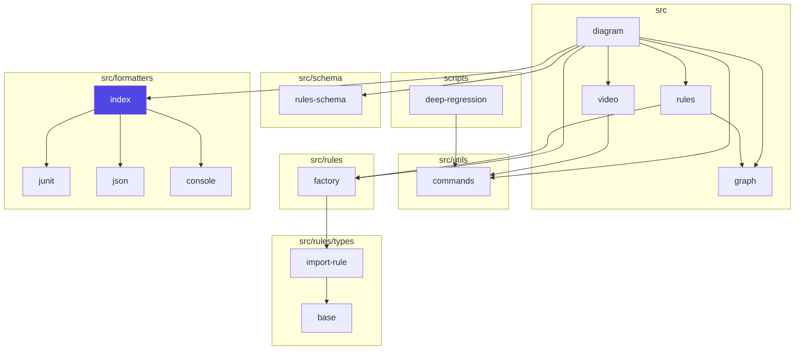
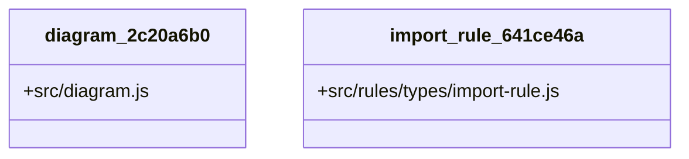
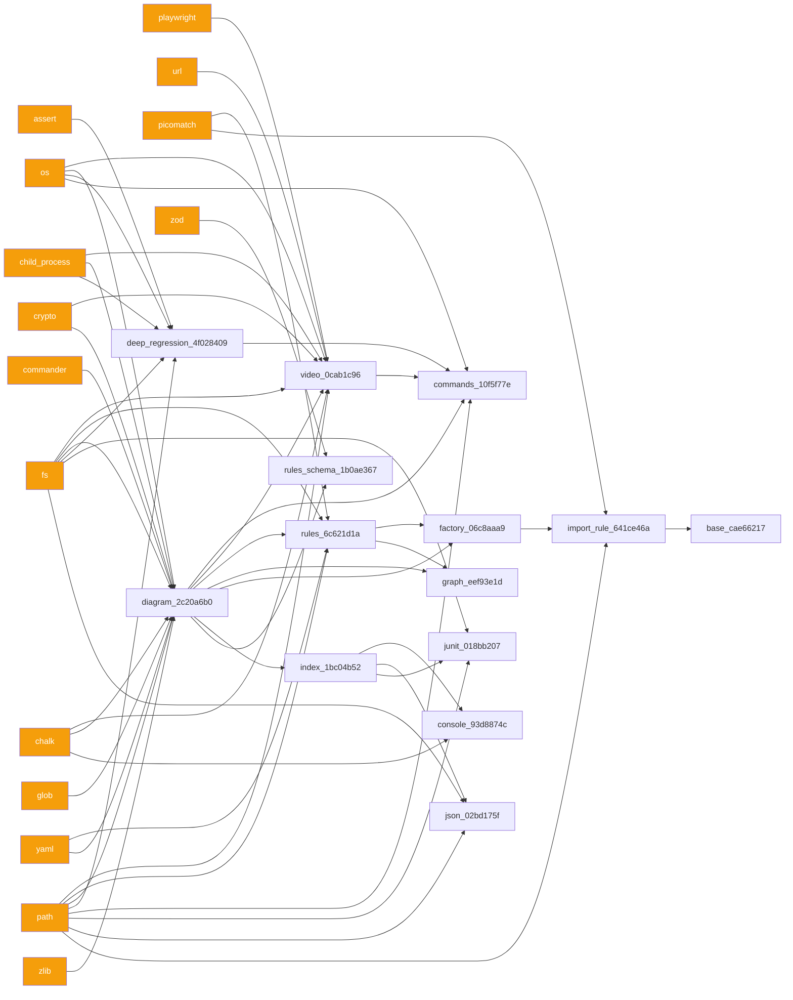
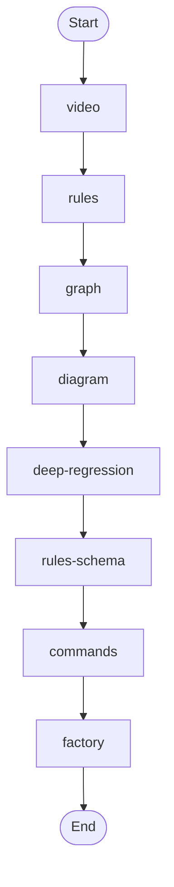
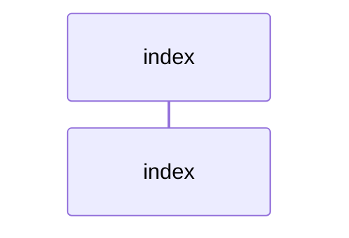

# Diagram Context Pack

Generated: 2026-02-27T23:03:57Z

## Agent-first index

| Diagram | Type | Path | Summary |
| --- | --- | --- | --- |
| architecture | module-graph | AI/diagrams/architecture.mmd | Module-level architecture graph showing repository structure and dependency direction. |
| class | class-model | AI/diagrams/class.mmd | Class/module model for the principal command and rule objects. |
| dependency | module-graph | AI/diagrams/dependency.mmd | Dependency map showing external packages and internal import boundaries. |
| flow | module-graph | AI/diagrams/flow.mmd | Command flow across major phases in the diagram CLI pipeline. |
| sequence | sequence-flow | AI/diagrams/sequence.mmd | Execution sequence for the current CLI surface and dependencies. |

## Detailed diagrams

## architecture

- Type: module-graph
- Path: AI/diagrams/architecture.mmd
- Summary: Module-level architecture graph showing repository structure and dependency direction.

## class

- Type: class-model
- Path: AI/diagrams/class.mmd
- Summary: Class/module model for the principal command and rule objects.

## dependency

- Type: module-graph
- Path: AI/diagrams/dependency.mmd
- Summary: Dependency map showing external packages and internal import boundaries.

## flow

- Type: module-graph
- Path: AI/diagrams/flow.mmd
- Summary: Command flow across major phases in the diagram CLI pipeline.

## sequence

- Type: sequence-flow
- Path: AI/diagrams/sequence.mmd
- Summary: Execution sequence for the current CLI surface and dependencies.

