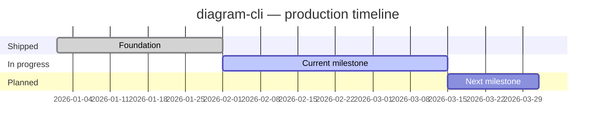

# FORJAMIE — diagram-cli

<!-- BRIEF: auto-updated by agents. Edit the static sections below manually. -->

## Table of Contents

- [Status](#status)
- [What this project does](#what-this-project-does)
- [Production timeline](#production-timeline)
- [What's done / what's not](#whats-done--whats-not)
- [Recent changes](#recent-changes)
- [Learnings & gotchas](#learnings--gotchas)
- [How to run locally](#how-to-run-locally)

## Status

<!-- STATUS_START — agents update this block -->
**Last updated:** 2026-04-07
**Production status:** LIVE
**Overall health:** 🟢 All CI green — PR #56 ready to merge

| Area | Status | Notes |
| --- | --- | --- |
| Build / CI | ✅ | All checks green — PR #56 ready to squash-merge |
| Tests | ✅ | 52/52 passing |
| Open PRs | 1 | #56 ci: full CI pipeline hardening (auth, node 24, lock file, scripts) |
| Blockers | None | |
<!-- STATUS_END -->

## What this project does

<!-- One paragraph. Written by a human or agent once, not auto-updated. -->

## Production timeline

<!-- GANTT_START — agents update this block -->

<!-- GANTT_END -->

## What's done / what's not

<!-- PROGRESS_START — agents update this block -->
| Feature | Done? | Notes |
| --- | --- | --- |
| Example feature | ✅ | Shipped in v1.2 |
| Example feature 2 | 🚧 In progress | ETA 2026-03-15 |
| Example feature 3 | 🔜 Planned | Not started |
<!-- PROGRESS_END -->

## Recent changes

<!-- CHANGES_START — agents prepend entries here, newest first -->

### 2026-04-07

- **CI full pipeline hardening (PR #56):** Comprehensive CI fixes:
  - Added `registry-url` + `NODE_AUTH_TOKEN: ${{ secrets.NPM_TOKEN }}` to all workflow `setup-node` steps across 4 workflow files
  - Bumped `@brainwav/coding-harness` from `^0.6.0` to `^0.12.0`, regenerated `package-lock.json`
  - Bumped `node-version` from `20` to `24` across all workflow files (CI now runs on Node 24; `engines.node` in package.json remains `>=18` for consumers)
  - Moved `CONTRACT_PATH` from `$RUNNER_TEMP` into `.harness/` inside workspace (harness flags out-of-cwd paths as path traversal)
  - Fixed `pnpm exec tsx src/cli.ts drift-gate` → `npx harness drift-gate` for both advisory and health drift-gate jobs
  - Added missing npm scripts `lint`, `typecheck`, `audit`, `check` required by harness-generated pipeline jobs
- **CodeQL remediation (merged PR #55):** All 6 open CodeQL scanning alerts resolved — 4× unused variable (`crypto` ×2, dead function, unused binding) removed; 2× TOCTOU race fixed with atomic `wx` flag write and `openSync`+`fstatSync(fd)` byte-size guard.

### 2026-03-09

- What changed and why

<!-- CHANGES_END -->

## Learnings & gotchas

<!-- Point to shared Learnings.md or add project-specific notes here -->
See also: `~/.codex/instructions/Learnings.md`

- {Project-specific gotcha, if any}

## How to run locally

```bash
# Add project-specific commands here
```

---
<!-- MACHINE_READABLE_START
project: diagram-cli
repo: ~/dev/diagram-cli
status: LIVE
health: green
last_updated: 2026-04-07
open_prs: 1
blockers: none
next_milestone: Merge PR #56 CI hardening
next_milestone_date: 2026-04-07
MACHINE_READABLE_END -->
