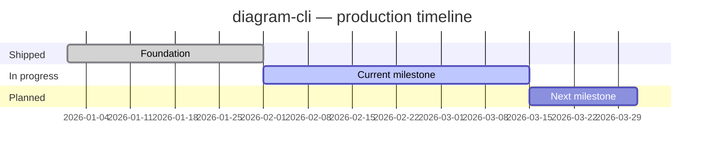

# FORJAMIE — diagram-cli

<!-- BRIEF: auto-updated by agents. Edit the static sections below manually. -->

## Status

<!-- STATUS_START — agents update this block -->
**Last updated:** 2026-03-09
**Production status:** LIVE
**Overall health:** 🟢 Healthy

| Area | Status | Notes |
| --- | --- | --- |
| Build / CI | ✅ | |
| Tests | ✅ | |
| Open PRs | 0 | |
| Blockers | None | |
<!-- STATUS_END -->

## What this project does

<!-- One paragraph. Written by a human or agent once, not auto-updated. -->

## Production timeline

<!-- GANTT_START — agents update this block -->

<!-- GANTT_END -->

## What's done / what's not

<!-- PROGRESS_START — agents update this block -->
| Feature | Done? | Notes |
| --- | --- | --- |
| Example feature | ✅ | Shipped in v1.2 |
| Example feature 2 | 🚧 In progress | ETA 2026-03-15 |
| Example feature 3 | 🔜 Planned | Not started |
<!-- PROGRESS_END -->

## Recent changes

<!-- CHANGES_START — agents prepend entries here, newest first -->

### 2026-03-09

- What changed and why

<!-- CHANGES_END -->

## Learnings & gotchas

<!-- Point to shared Learnings.md or add project-specific notes here -->
See also: `~/.codex/instructions/Learnings.md`

- {Project-specific gotcha, if any}

## How to run locally

```bash
# Add project-specific commands here
```

---
<!-- MACHINE_READABLE_START
project: diagram-cli
repo: ~/dev/diagram-cli
status: LIVE
health: green
last_updated: 2026-03-09
open_prs: 0
blockers: none
next_milestone: AI context refresh script
next_milestone_date: 2026-03-15
MACHINE_READABLE_END -->
