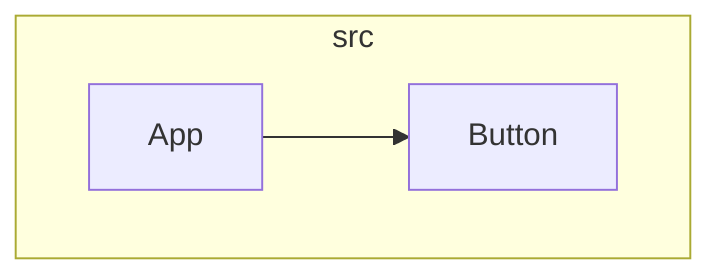

# diagram

Generate architecture diagrams from codebases. No AI needed—just run a command.

```bash
$ diagram generate .

📐 Mermaid Diagram:



🔗 Preview: https://mermaid.live/edit#pako:...
```

## Install

```bash
# Clone and link
git clone <repo>
cd diagram-cli
npm link

# Or use npx (no install)
npx diagram generate .
```

## Usage

### Quick Start

```bash
# Generate architecture diagram (default)
diagram generate .

# Analyze first
-diagram analyze .
```

### Commands

#### `analyze [path]`

Analyze codebase structure without generating diagrams.

```bash
diagram analyze ./my-project
diagram analyze . --json                    # Output as JSON
diagram analyze . --patterns "*.py,*.go"    # Custom file patterns
diagram analyze . --max-files 200           # Analyze more files
```

Options:
- `-p, --patterns <list>` - File patterns (default: `**/*.ts,**/*.tsx,**/*.js,**/*.jsx,**/*.py,**/*.go,**/*.rs`)
- `-e, --exclude <list>` - Exclude patterns 
- `-m, --max-files <n>` - Max files to analyze (default: 100)
- `-j, --json` - Output as JSON

#### `generate [path]`

Generate a single diagram.

```bash
# Architecture diagram (default)
diagram generate .

# Other types
diagram generate . --type sequence
diagram generate . --type dependency
diagram generate . --type class
diagram generate . --type flow

# Options
diagram generate . --focus src/api           # Focus on module
diagram generate . --output diagram.svg     # Save as SVG
diagram generate . --theme dark             # Use dark theme
diagram generate . --open                   # Open in browser
```

Options:
- `-t, --type <type>` - Diagram type: `architecture`, `sequence`, `dependency`, `class`, `flow` (default: `architecture`)
- `-f, --focus <module>` - Focus on specific module/directory
- `-o, --output <file>` - Save to file (SVG, PNG, or .mmd)
- `-m, --max-files <n>` - Max files to analyze
- `--theme <theme>` - Theme: `default`, `dark`, `forest`, `neutral`
- `--open` - Open preview in browser

#### `all [path]`

Generate all diagram types at once.

```bash
diagram all .
diagram all . --output-dir ./docs/diagrams
```

Options:
- `-o, --output-dir <dir>` - Output directory (default: `./diagrams`)

## Diagram Types

| Type | Description | Best For |
|------|-------------|----------|
| `architecture` | Component hierarchy with directory grouping | Overall structure |
| `sequence` | Service interaction flow | API/data flow |
| `dependency` | Package imports (internal + external) | Dependency analysis |
| `class` | OOP class structure | Object relationships |
| `flow` | Control/data flow | Process visualization |

## Examples

### React/Frontend Project

```bash
# Focus on components only
diagram generate . --type architecture --focus src/components

# Check external dependencies
diagram generate . --type dependency

# Full documentation
diagram all . --output-dir ./docs/architecture
```

### Backend/API Project

```bash
# API flow
diagram generate . --type sequence --focus src/routes

# Service dependencies
diagram generate . --type dependency --focus src/services
```

### Monorepo

```bash
# Per-package diagrams
for pkg in packages/*; do
  diagram generate "$pkg" --output "docs/$(basename $pkg).svg"
done
```

### CI/CD Integration

```yaml
# .github/workflows/docs.yml
- name: Generate diagrams
  run: |
    npm install -g diagram
    diagram all . --output-dir ./diagrams
- name: Upload
  uses: actions/upload-artifact@v3
  with:
    name: diagrams
    path: ./diagrams/
```

## How It Works

1. **Scan** - Finds source files matching your patterns
2. **Parse** - Extracts imports, exports, and component types
3. **Graph** - Builds dependency relationships
4. **Generate** - Outputs Mermaid diagram syntax
5. **Preview** - Provides live link to mermaid.live

## Supported Languages

- TypeScript / JavaScript
- Python
- Go
- Rust
- Java (basic)
- Ruby / PHP (basic)

## Output Formats

- **Terminal** - Mermaid code you can copy
- **.mmd files** - Save Mermaid syntax
- **SVG/PNG** - Rendered images (requires `@mermaid-js/mermaid-cli`)

Install mermaid-cli for image export:
```bash
npm install -g @mermaid-js/mermaid-cli
```

## Tips

- Use `--focus` for large codebases (1000+ files)
- Start with `diagram analyze .` to understand the structure
- The mermaid.live link lets you edit and download in any format
- Pipe JSON output to other tools: `diagram analyze . --json | jq ...`

## License

MIT
